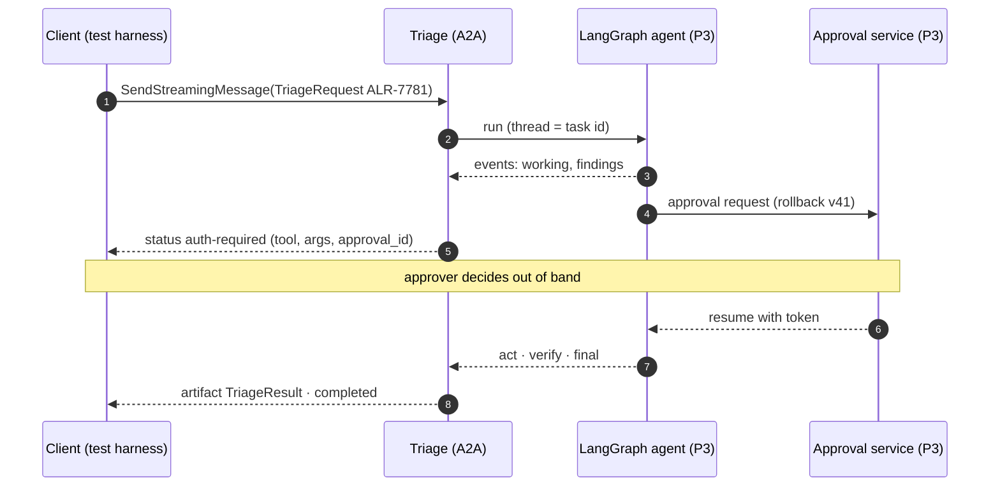

# F2: Triage Agent on A2A

| Milestone | Priority | Depends on | Effort | Unblocks |
|---|---|---|---|---|
| M1 | Must | F1 | 4 h | F7, F10, F14 |

**Goal:** Project 3's LangGraph Triage Agent served over A2A 1.0 on **JSON-RPC and HTTP+JSON**, with
streaming, **push notifications**, and human approval as an `auth-required` round trip through Project 3's
approval service.

## Diagram: auth-required round trip



## Deliverables / files
```
agents/triage/executor.py     # MeshExecutor subclass wrapping the P3 LangGraph adapter
agents/triage/card.yaml       # skill triage_incident; JSON-RPC + HTTP+JSON interfaces
agents/triage/push.py         # push sender config (per-task token)
```

## Tasks
- [ ] Wrap P3's LangGraph adapter; `thread_id` = A2A task id, so P3's checkpointer resumes after restart
- [ ] Map approvals to `auth-required` (F1 table); approval callback resumes the graph
- [ ] Push notifications: accept push config on `SendMessage`; send on every state change with the per-task token
- [ ] Mount both JSON-RPC and REST apps; card lists both in `supportedInterfaces`
- [ ] Cancel → interrupt the graph and mark the task canceled

## Acceptance criteria
- TCK passes on JSON-RPC and HTTP+JSON (or failures are documented with reasons)
- `auth-required` → approve → `completed` works with the scripted approver; deny → agent re-plans
- Restarting the triage container mid-task: `GetTask` still works and the task completes after restart

## Tests
- Stub-model run of 2 P3 golden scenarios through A2A; push receiver test double checks tokens and order

**Interview talking point:** *"Human approval maps directly onto A2A's `auth-required` state: the task
pauses, the approval happens out of band, and the task resumes without the caller ever handling a
credential."*
