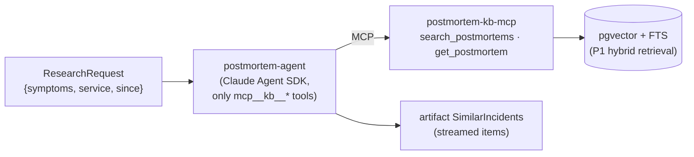

# F3: Postmortem KB & Research Agent

| Milestone | Priority | Depends on | Effort | Unblocks |
|---|---|---|---|---|
| M2 | Must | F1 | 4.5 h (3.5 in core: 40 postmortems, no planted injections) | F7, F10 |

**Goal:** A corpus of synthetic ShopLite postmortems behind an MCP server, and a read-only **Claude Agent
SDK** research agent on A2A with one skill: `find_similar_incidents`.

## Diagram: research path



## Deliverables / files
```
kb/corpus/*.md                # 40 core (60 full) postmortems generated from OpsSim root-cause types, then hand-edited
kb/ingest.py                  # chunk + embed (P1 code)
kb/server.py                  # FastMCP 4: search_postmortems, get_postmortem
agents/postmortem/executor.py # Claude Agent SDK run (P3 adapter, built-ins disabled)
agents/postmortem/card.yaml
```

## Tasks
- [ ] Corpus: templates per root cause; vary services, dates and wording; review for realism
- [ ] *(Full plan)* plant injections in 5 postmortems for attack A12
- [ ] KB MCP server over Project 1 retrieval
- [ ] Agent prompt: return only schema-valid `SimilarIncidents`; stream items as found
- [ ] Card with the skill, examples and schemas

## Acceptance criteria
- For 10 test queries, the top-3 results contain a matching root cause in ≥ 8
- TCK passes; the agent never calls non-KB tools (schema snapshot test)

## Tests
- Retrieval smoke test; stub-model A2A run

**Interview talking point:** *"The research agent is read-only by design: it can only reach one MCP server
with two read tools, so even if it were hijacked, the worst it could do is return bad data. And the
Commander treats its data as data."*
