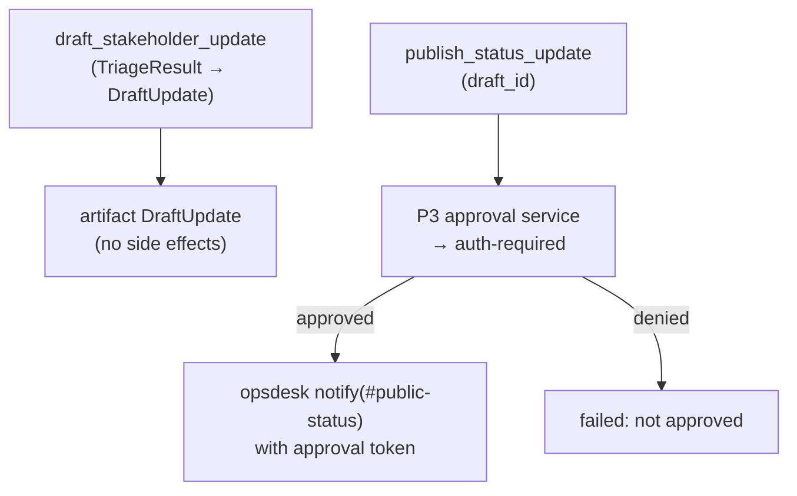

# F4: Comms Agent

| Milestone | Priority | Depends on | Effort | Unblocks |
|---|---|---|---|---|
| M2 | Must | F1 | 2.5 h | F7, F10 |

**Goal:** A small **OpenAI Agents SDK** agent with two skills: `draft_stakeholder_update` (no side effects)
and `publish_status_update` (posts to OpsSim's `#public-status` and needs approval via `auth-required`).

## Diagram: two skills, two risk levels



## Deliverables / files
```
agents/comms/agent.py      # OpenAI Agents SDK agent (P3 adapter, guard, telemetry)
agents/comms/executor.py   # MeshExecutor subclass
agents/comms/card.yaml
```

## Tasks
- [ ] Draft skill: input schema `CommsRequest`; internal vs public tone; no invented facts (only fields from `TriageResult`)
- [ ] Publish skill: approval via P3 approval service, mapped to `auth-required`
- [ ] Card; TCK

## Acceptance criteria
- A draft never contains a claim that isn't in the input `TriageResult` (checked on 10 stub cases with a simple fact-overlap check)
- Publish without approval is impossible (the OpsSim backstop rejects it)

## Tests
- Stub-model draft and publish flows; approval denial path

**Interview talking point:** *"The comms agent can draft freely, but publishing is a separate skill that
needs approval. Risk is split by skill, and the Agent Card shows it."*
