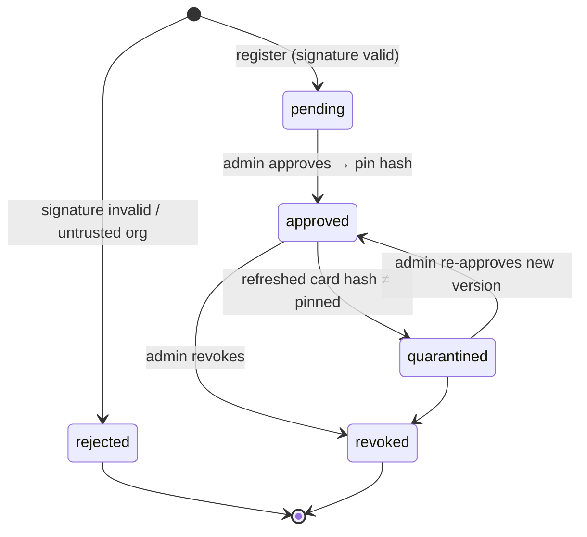

# F5: Agent Registry

| Milestone | Priority | Depends on | Effort | Unblocks |
|---|---|---|---|---|
| M2 | Must | F1 | 4 h | F7, F12 |

**Goal:** The only way the Commander finds agents. The registry fetches and **verifies signed cards**,
**pins** approved versions, **quarantines** changes and serves **per-tenant allow-lists**.

## Diagram: agent status lifecycle



## Deliverables / files
```
registry/app.py         # FastAPI: POST /agents, /approve, /revoke, GET /agents, /diff
registry/verify.py      # fetch card, JCS, detached JWS verify against trusted org JWKS
registry/refresh.py     # background refresh with ETag; hash compare; quarantine + audit
registry/models.py      # orgs, agents, card_versions, allow_rules (03 §3.6)
registry/cli.py         # `meshctl agents register|approve|diff|revoke`
```

## Tasks
- [ ] Data model and API from [03 §3.6](../03-low-level-design.md#36-registry-data-model-and-api)
- [ ] Verification: trusted org list; `kid` lookup; reject missing/invalid signatures
- [ ] Pinning and background refresh (5 min; configurable to seconds for tests)
- [ ] Allow-lists per tenant and skill; `GET /agents?tenant=&skill=` returns only approved + pinned + allowed
- [ ] Card diff view in the CLI
- [ ] Attack cases **A1–A4** in `evals/security/cases/`

## Acceptance criteria
- A1–A4 pass (unsigned, untrusted key, spoofed, rug pull → quarantined within one refresh)
- The Commander-facing endpoint never returns a quarantined or revoked agent

## Tests
- Unit: verification with test keys; refresh state machine; allow-list filtering
- Integration: real agent containers + a rogue card host

**Interview talking point:** *"Agents get the same treatment as MCP tools in Project 2: signed, pinned, and
quarantined automatically if their card changes after approval."*
