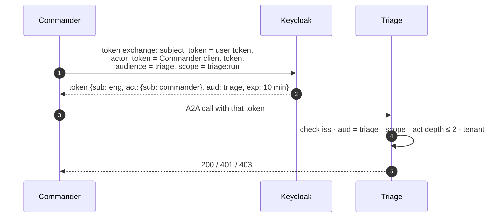

# F6: Identity: Token Exchange, `act` & Audit

| Milestone | Priority | Depends on | Effort | Unblocks |
|---|---|---|---|---|
| M2 | Must | F0 | 4 h | F7, F12, F16 |

**Goal:** Per-hop tokens that name the user (`sub`), the acting agent (`act`) and one audience. Agents
reject everything else, and every delegation is audited in a hash chain.

## Diagram: exchange at each hop



## Deliverables / files
```
keycloak/realm-mesh.json          # exchange permissions: only commander may exchange; audiences = registered agents
commander/tokens.py               # exchange + cache per (user, audience) until exp − 60 s
agents/common/auth.py             # (from F1) + act-depth and scope-per-skill checks
common/audit.py                   # P2 hash-chain writer, delegation event type
```

## Tasks
- [ ] Keycloak clients and exchange permissions; the delegation feature per the F0 spike (or the fallback mapper)
- [ ] Commander token cache; never log tokens
- [ ] Agent-side checks: audience, scope per skill, `act` depth limit, tenant
- [ ] Audit event per delegation: incident, task, caller, callee, `sub`, `act` chain, skill, decision
- [ ] Attack cases **A5–A7** plus the 2026 Keycloak variant (an `act` token pushed through standard exchange must be rejected)

## Acceptance criteria
- A5–A7 and the variant pass
- An audit query answers "who asked whom to do what, for which user" for one incident

## Tests
- Integration with a real Keycloak (testcontainers); unit tests for claim checks

**Interview talking point:** *"Every hop gets a new token for one audience that still names the user and
records who is acting. Remote agents can't mint tokens themselves, so a compromised agent can't turn its
access into someone else's."*
