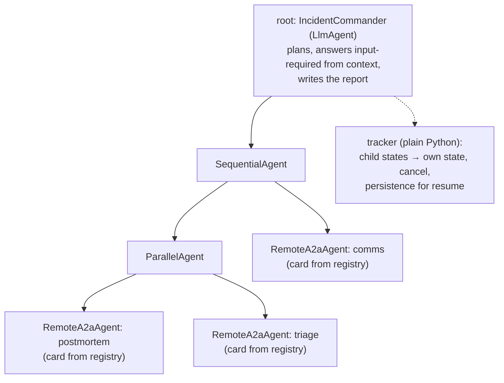
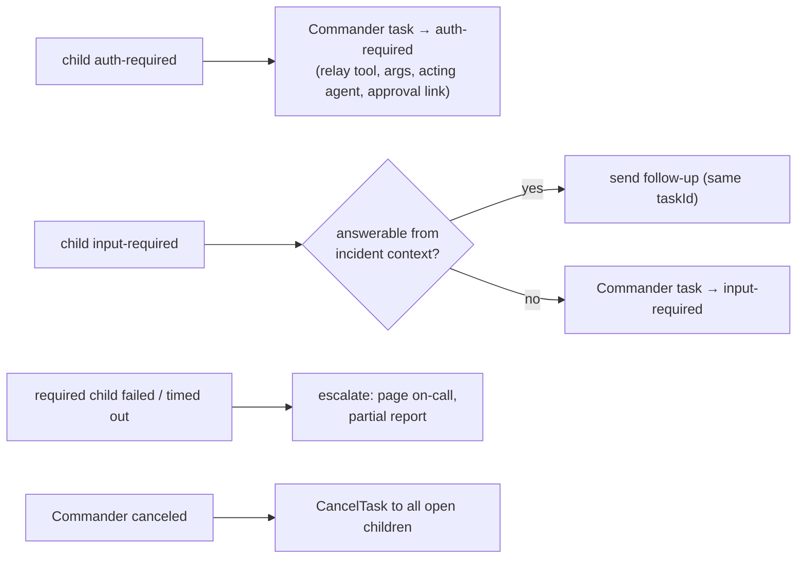

# F7: Incident Commander (Google ADK)

| Milestone | Priority | Depends on | Effort | Unblocks |
|---|---|---|---|---|
| M3 | Must | F2, F3, F4, F5, F6 | 7 h (6.5 in core) | F8, F9, F11, F16 |

**Goal:** The ADK orchestrator. It discovers peers from the registry, runs research ∥ triage → comms,
tracks child tasks, mirrors `auth-required` / `input-required`, cancels children, and returns an
`IncidentReport` with provenance. It is itself exposed as an A2A server.

## Diagram: ADK agent structure



## Diagram: state mirroring



## Deliverables / files
```
commander/agent.py        # ADK agents; RemoteA2aAgent built from registry card objects
commander/discovery.py    # registry client + verified card cache (ETag)
commander/tracker.py      # child task table, state mapping, cancel, persistence (Postgres)
commander/report.py       # IncidentReport assembly with provenance; artifact schema validation
commander/server.py       # A2A server facade (handle_incident skill)
commander/cli.py          # `mesh incident ALR-7781` (A2A client to the Commander)
```

## Tasks
- [ ] Build peers only from registry-verified card objects (no URLs in config)
- [ ] Token per peer via F6 before each call; refresh on 401 once
- [ ] Parallel research + triage; comms after triage with `TriageResult` as a data part
- [ ] Tracker: state mapping per the diagram; per-child time budgets; cancel propagation
- [ ] Artifact handling per [03 §3.7](../03-low-level-design.md#37-input-and-artifact-handling-data-not-instructions): validate, never put remote text in instructions, flag instruction-like content
- [ ] Commander as an A2A server (`handle_incident`), with a signed card registered like the others
- [ ] Apply the F0 spike outcome: a2a-sdk client tool for any 1.0 feature ADK doesn't expose

## Acceptance criteria
- One incident (S1-01 adapted) runs end to end with stub models, then with live models
- Cross-agent approval: the approve/deny/edit paths all work from the Commander's client side
- Cancelling the incident cancels all children within 5 s

## Tests
- Stub-model runs of 3 mesh scenarios; tracker state-mapping unit tests; cancel propagation test

**Interview talking point:** *"The Commander is an ADK agent whose sub-agents are remote A2A agents built
from registry-verified cards. It never uses a raw URL, and it mirrors each child's `auth-required` state
without ever touching the approval."*
