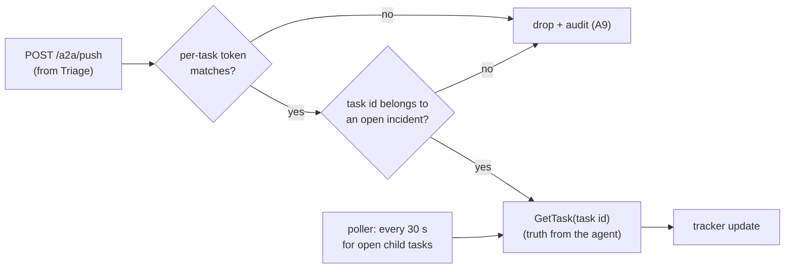
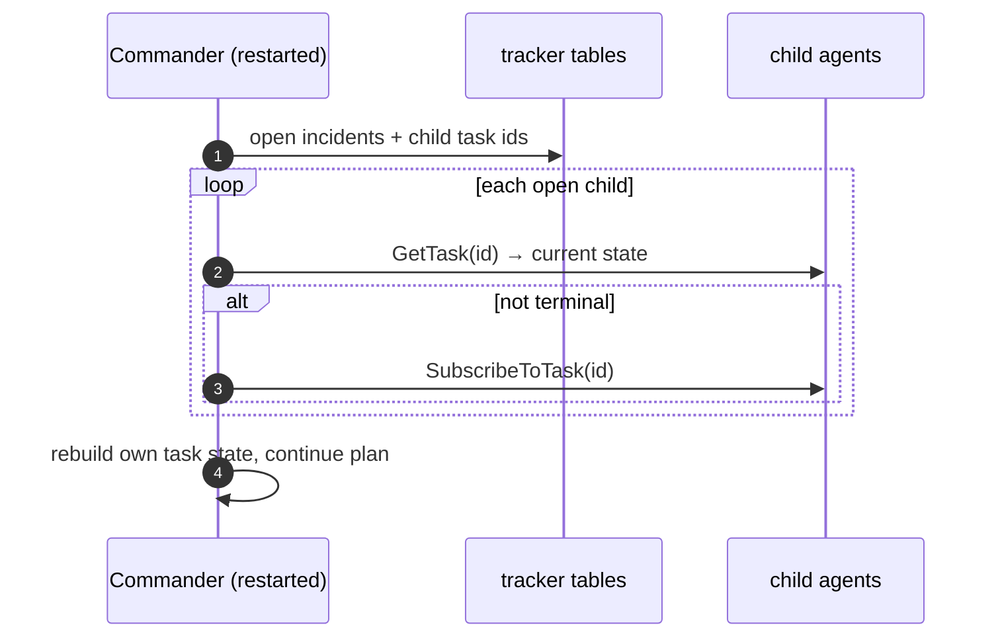

# F8: Push, Resume & Fault Profile

| Milestone | Priority | Depends on | Effort | Unblocks |
|---|---|---|---|---|
| M3 | Must | F7 | 3.5 h | F12, F13 |

**Goal:** Make long tasks robust:
- A push receiver that treats pushes as hints.
- A polling fallback.
- Commander resume after a crash.
- A Toxiproxy profile that the resilience suite uses to break the network on purpose.

## Diagram: push handling



## Diagram: resume after a Commander crash



## Deliverables / files
```
commander/push.py          # receiver, token check, ownership check, GetTask re-fetch
commander/poller.py        # fallback polling
commander/resume.py        # startup recovery
infra/toxiproxy.json       # proxies commander→{triage, comms, postmortem}
compose.resilience.yml     # routes Commander traffic through Toxiproxy
```

## Tasks
- [ ] Push receiver with URL registered per task; webhook URL allow-list for agents' push senders (A10)
- [ ] Poller and resume on startup
- [ ] Toxiproxy profile with helpers: add latency, reset connection, cut stream
- [ ] Attack cases **A9–A10**

## Acceptance criteria
- Killing the Commander mid-incident and restarting it completes the incident without re-delegating finished work
- A9 and A10 pass

## Tests
- Receiver unit tests (forged token, wrong task, replay); resume integration test

**Interview talking point:** *"A push is only a hint that something changed. The Commander always re-reads
the task from the agent before acting, so a forged or replayed push can't change the incident."*
