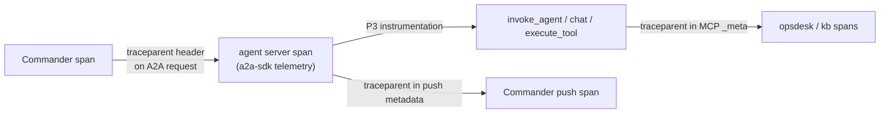

# F9: One Trace Across Hops

| Milestone | Priority | Depends on | Effort | Unblocks |
|---|---|---|---|---|
| M3 | Must | F7 | 2 h (1.5 in core) | F11, F17 |

**Goal:** One incident = one trace across the Commander, three agents and their MCP tools, with A2A
attributes on every hop.

## Diagram: propagation points



## Deliverables / files
```
common/telemetry.py     # OTel setup, A2A attribute helpers, enduser.id hashing
commander/tracing.py    # client spans per A2A call
```

## Tasks
- [ ] Client spans with `a2a.method`, `a2a.task_id`, `a2a.context_id`, `a2a.skill`, `a2a.state`, `a2a.binding`, callee
- [ ] Enable the a2a-sdk telemetry extra on the servers; join P3's agent spans under them
- [ ] `traceparent` in push metadata
- [ ] *(Full plan)* span events for each state change; a Langfuse dashboard filter per incident

## Acceptance criteria
- A screenshot of one incident trace showing all four frameworks (used in the README and video)

## Tests
- In-memory exporter test: an incident with stub models produces one trace with the expected span tree

**Interview talking point:** *"Four frameworks and five services, but one trace: you can click from the
Commander's decision down to the exact rollback call in the simulator."*
