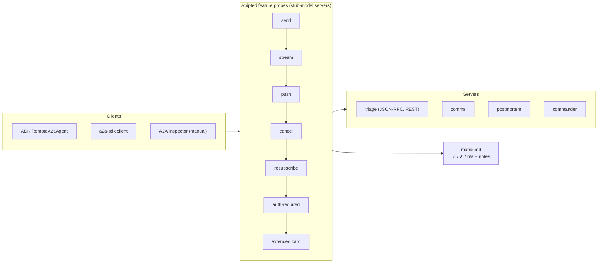

# F10: TCK & Interop Matrix

| Milestone | Priority | Depends on | Effort | Unblocks |
|---|---|---|---|---|
| M4 | Must | F2, F3, F4 | 3 h | F15, F17 |

**Goal:** Prove protocol correctness with the official **A2A TCK**, and show which client works with which
server for which feature. Gaps are recorded as findings.

## Diagram: interop test driver



## Deliverables / files
```
evals/interop/tck.sh            # runs a2a-tck per server and binding; stores reports
evals/interop/probes.py         # feature probes per client
evals/interop/stub_agents.py    # stub-model mode for all agents
reports/interop-matrix.md       # generated
reports/tck/*.html|json
```

## Tasks
- [ ] TCK runs for each server (JSON-RPC) and Triage (HTTP+JSON)
- [ ] Probes for ADK client and a2a-sdk client across all servers
- [ ] Manual spot-check with A2A Inspector; screenshots
- [ ] Record each ✗ with a reason (client gap, server gap, spec ambiguity); file upstream issues where it's clearly a bug

## Acceptance criteria
- TCK reports committed; the interop matrix is complete with notes

## Tests
- The probes and TCK are the tests; they run in CI (F15)

**Interview talking point:** *"I ran the official A2A compatibility kit against every agent and published
an interop matrix, including what didn't work and why. That's more useful to a team than 'it works on my
machine'."*
