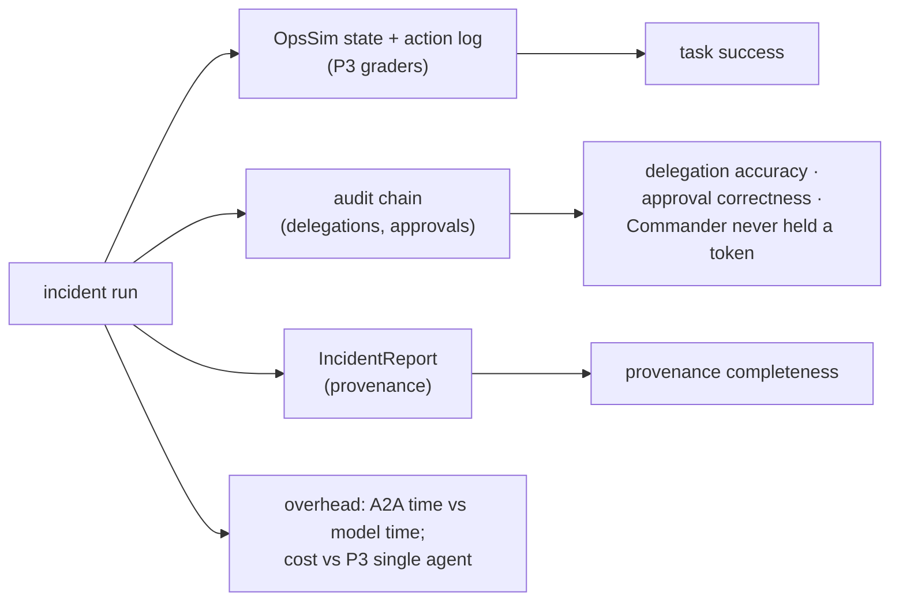

# F11: Mesh Scenarios

| Milestone | Priority | Depends on | Effort | Unblocks |
|---|---|---|---|---|
| M4 | Must | F7 | 4 h (3 in core: 10 scenarios) | F14, F17 |

**Goal:** Run real incidents through the whole mesh with live models, graded by Project 3's harness
from OpsSim state plus mesh-specific checks.

## Scenario set

| Group | Core | Full | Example |
|---|---|---|---|
| Standard delegation | 4 | 5 | Checkout latency after deploy: research ∥ triage → comms |
| Cross-agent approval | 2 | 3 | Rollback approved / denied / edited from the top |
| Input required | 1 | 2 | Triage asks which region; the Commander answers from the ticket |
| Degraded mesh | 2 | 3 | Comms down; research slow; card quarantined mid-incident |
| Partner tenant | 1 (same issuer, tenant B) | 2 | Tenant B's request uses only B-allowed skills |

## Diagram: grading



## Deliverables / files
```
evals/mesh/scenarios/*.yaml   # P3 scenario format + mesh block (expected delegations, degraded parts)
evals/mesh/graders.py         # mesh-specific graders on top of P3's
experiments/mesh.yaml         # 10 (15) scenarios × k=3
reports/mesh.md
```

## Tasks
- [ ] Adapt scenarios from OpsDesk; add the `mesh:` block (expected skills, degraded components)
- [ ] Graders: delegation accuracy, approval correctness from the audit chain, provenance completeness
- [ ] Run with cheap models first, then the chosen models; k = 3; pass^k with CIs (P3 stats)
- [ ] Compare cost/latency per incident with Project 3's single LangGraph agent on the same scenarios

## Acceptance criteria
- `reports/mesh.md` with success, pass^3, delegation accuracy, approval correctness and overhead, with CIs

## Tests
- Grader unit tests on hand-built audit chains; stub-model dry run of all scenarios in CI

**Interview talking point:** *"The mesh solved __% of incidents; the single agent from Project 3 solved __%.
The mesh cost __× more but __. That's the honest trade-off of splitting one agent into several."* (Fill in.)
