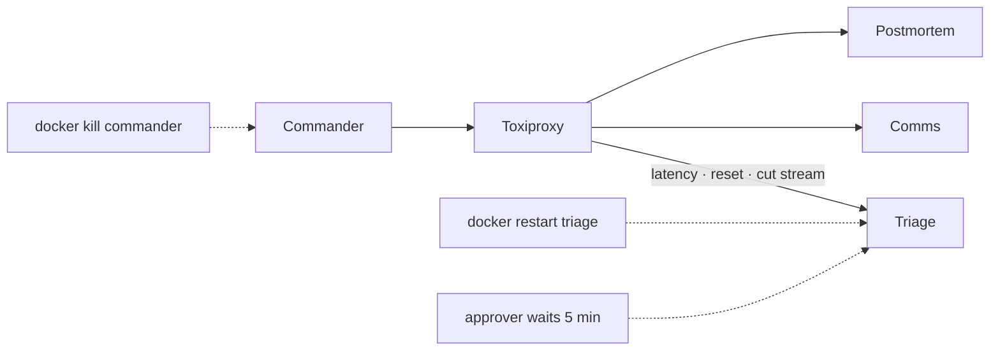

# F13: Resilience Suite

| Milestone | Priority | Depends on | Effort | Unblocks |
|---|---|---|---|---|
| M4 | Must | F8 | 2.5 h | F15, F17 |

**Goal:** Show the mesh degrades gracefully: streams recover, restarts don't lose work, cancellation
stops everything, and long approvals don't cascade into timeouts.

## Diagram: fault injection points



## Cases

| # | Fault | Pass condition |
|---|---|---|
| R1 | Stream cut mid-task → `SubscribeToTask` | No missing status/artifact events (sequence numbers) |
| R2 | Commander killed during triage | Restart completes the incident; no re-delegation of finished tasks |
| R3 | Triage restarted mid-task | Task readable; resumes via P3 checkpointer or fails cleanly |
| R4 | Comms down | Escalation within its timeout; partial report names the gap |
| R5 | 5-minute approval | No timeout cascade; final state arrives by stream or push |
| R6 | Incident canceled | All children canceled ≤ 5 s; no OpsSim action after cancel |
| R7 | 500 ms added latency on every hop | Incident still completes; overhead reported |

## Deliverables / files
```
evals/resilience/cases.py   evals/resilience/toxics.py   reports/resilience.md
```

## Tasks
- [ ] Implement R1–R7 with stub-model agents (deterministic, CI-friendly)
- [ ] Event sequence checker for R1
- [ ] One live-model run of R2 and R5 for the report

## Acceptance criteria
- R1–R7 pass in CI; `reports/resilience.md` committed

**Interview talking point:** *"I cut streams, killed the orchestrator mid-incident and made a human take
five minutes to approve. The mesh finished every time without redoing work, because tasks live in a
store and every client can re-attach."*
