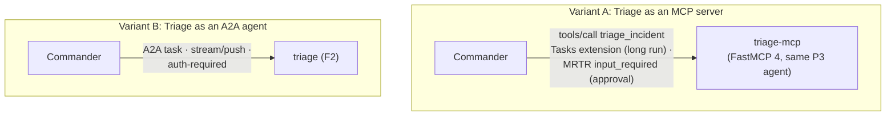

# F14: MCP vs A2A Comparison

| Milestone | Priority | Depends on | Effort | Unblocks |
|---|---|---|---|---|
| M4 | Must | F2, F11 | 4.5 h (3.5 in core: 10 scenarios) | F17 |

**Goal:** Answer "MCP tool or A2A agent?" with numbers. The same Triage Agent is exposed both ways and
driven by the same Commander on the same scenarios.

## Diagram: the two variants



## What is compared

| Dimension | Measure |
|---|---|
| Success, cost, latency | Same graders as F11 |
| Long approval (5 min) | Does the call survive? How is progress shown? |
| Approval propagation | Steps and glue code for the approval to reach the user |
| Commander restart | Can the work be recovered? |
| Progress visibility | Findings visible before completion? |
| Identity and discovery | What the caller knows about the callee (card vs tool description) |
| Glue code | `cloc` of each variant's wrapper and Commander side |

## Deliverables / files
```
agents/triage_mcp/server.py      # FastMCP 4 server wrapping the same P3 agent (Tasks extension)
commander/mcp_variant.py         # Commander calling triage as an MCP tool
experiments/mcp_vs_a2a.yaml
reports/mcp-vs-a2a.md            # table + rule of thumb
```

## Tasks
- [ ] MCP variant with the Tasks extension for long runs and MRTR for approval (patterns from Project 2)
- [ ] Commander switch: `--triage-transport mcp|a2a`
- [ ] Run 10 (15) scenarios × k=3 for both; R2 and R5 resilience cases for both
- [ ] Write the rule of thumb: one short paragraph, backed by the table

## Acceptance criteria
- Report with the table and a rule of thumb that cites its numbers

**Interview talking point:** *"I built the same delegation both ways. For __, MCP was simpler and just as
good; for long-running work with approvals owned by another team, A2A needed __ less glue and survived
__. So my rule is __."* (Fill in.)
