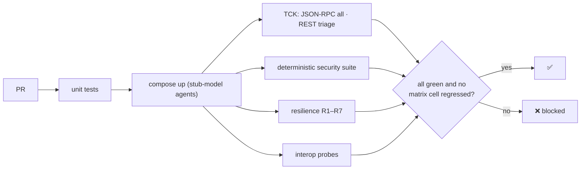

# F15: CI Gate

| Milestone | Priority | Depends on | Effort | Unblocks |
|---|---|---|---|---|
| M5 | Must | F10, F12, F13 | 1.5 h | F17 |

**Goal:** Protect the protocol and trust guarantees on every PR, at zero model cost.

## Diagram: pipeline

## Tasks
- [ ] CI job with Compose; stub-model mode for all agents
- [ ] Baseline interop matrix from `main`; fail on any regression
- [ ] **Demo:** a PR that makes the registry accept unsigned cards → blocked by A1

## Acceptance criteria
- The demo PR is blocked with a readable failure
- CI run time ≤ 15 minutes

**Interview talking point:** *"Every PR re-proves the trust model: if someone weakens card verification or
token checks, CI fails on the attack that control exists to stop."*
