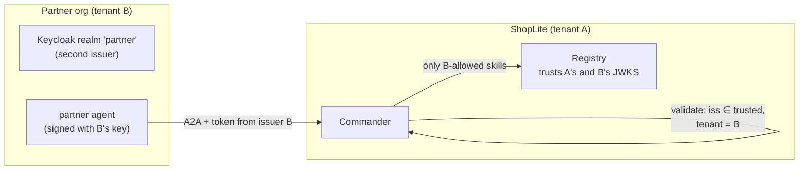

# F16: Partner Tenant (Second Issuer)

| Milestone | Priority | Depends on | Effort | Unblocks |
|---|---|---|---|---|
| M5 | Should · **deferred in the core plan** | F6, F7 | 2.5 h | Cross-organization trust story |

**Goal:** Simulate a second organization with its **own identity provider and signing key**. Its agent
calls the Commander over A2A, and the mesh must trust it only for what the allow-list says.

## Diagram: two trust domains

## Tasks
- [ ] Second Keycloak realm as a separate issuer; the Commander trusts both issuers, and maps tenant from `iss`
- [ ] Partner agent (tiny, a2a-sdk client) with a card signed by B's key, registered in the registry
- [ ] Allow-list: tenant B may use `find_similar_incidents` and `draft_stakeholder_update` only
- [ ] Scenarios: B's incident uses only allowed skills; A8 variant across issuers

## Acceptance criteria
- Tenant B can't trigger triage actions or see tenant A's tasks

**Interview talking point:** *"The partner's agent is trusted because its card is signed by a key the
registry trusts and its token comes from an issuer we accept. Even then it can only use two skills."*
