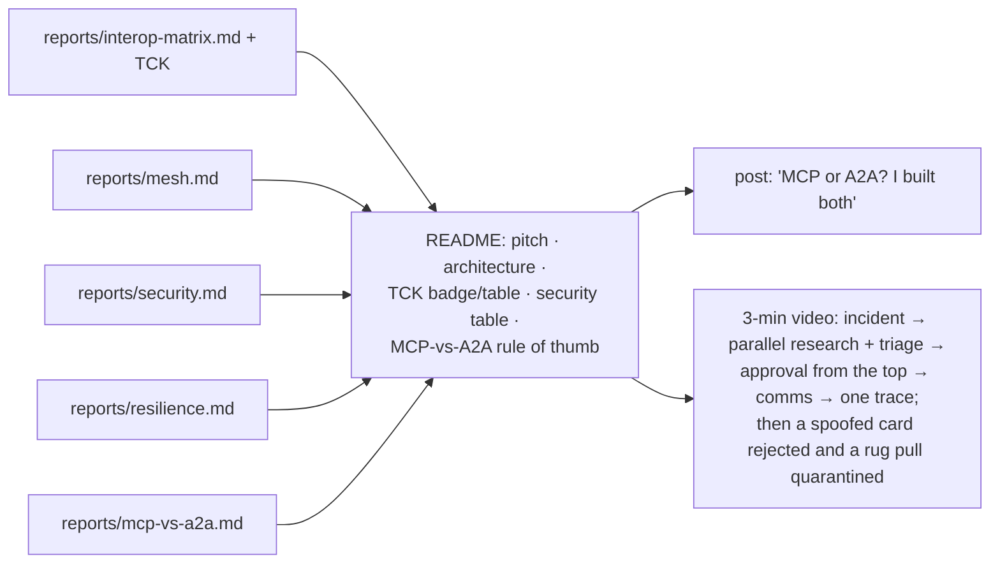

# F17: Reports, Blog & Video

| Milestone | Priority | Depends on | Effort | Unblocks |
|---|---|---|---|---|
| M5 | Must | F11–F15 | 3 h (2.5 in core) | Job applications |

**Goal:** Turn the results into a README, one post and a 3-minute video.

## Diagram: what gets published where

## Tasks
- [ ] README with the diagrams, headline numbers, and links to every report
- [ ] Post built around the MCP-vs-A2A finding (one table, one chart)
- [ ] Video (local recording; Azure only if F19 is done)
- [ ] Update the résumé bullet template in `03-projects.md` with real numbers

## Acceptance criteria
- Every number in the README links to its report and commit
- A reader can run the mesh locally from the README in under 10 minutes

**Interview talking point:** *"The post answers the question every agent interview asks, MCP or A2A,
with measurements from building both."*
