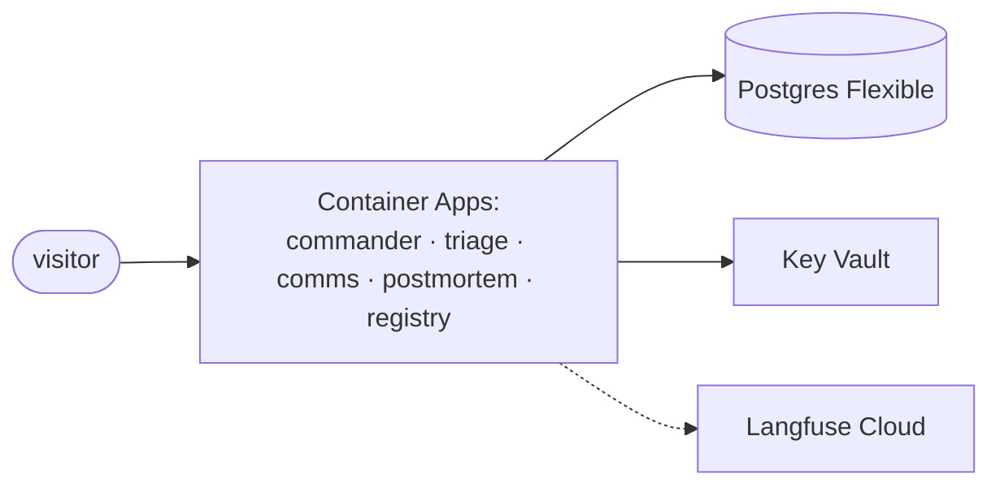

# F18–F20: Optional Extensions

Only after M5. Each is independent.

## F18: gRPC binding on the Triage Agent (2 h)
- **What:** Add the a2a-sdk `grpc` extra; list gRPC third in `supportedInterfaces`; run the TCK on gRPC.
- **Why:** Completes all three A2A 1.0 bindings on one agent.
- **Done when:** TCK gRPC report committed; the interop matrix gains a gRPC column for the a2a-sdk client.

## F19: Azure deployment (3 h)
- **What:** Container Apps per agent, Postgres Flexible and Key Vault (signing keys, client secrets),
  reusing the Terraform modules from Projects 1–3. Keycloak runs as a container app, or Entra ID is used
  as a documented alternative.
- **Why:** A public, clickable demo; real HTTPS hostnames for the cards.
- **Done when:** A visitor can run one scripted incident (cheap models, daily cap) and view the trace.

## F20: OpenAI Agents SDK as an A2A client (1.5 h)
- **What:** An OpenAI Agents SDK agent that calls the mesh's agents as tools through A2A. Add it as a
  client row in the interop matrix.
- **Why:** Shows interop in the other direction: a vendor SDK consuming A2A agents, not only serving.
- **Done when:** The client row is filled in, with notes.
