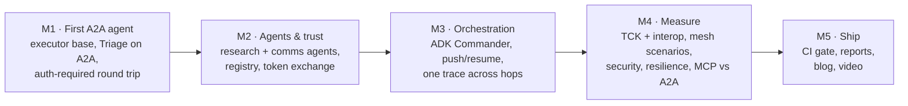
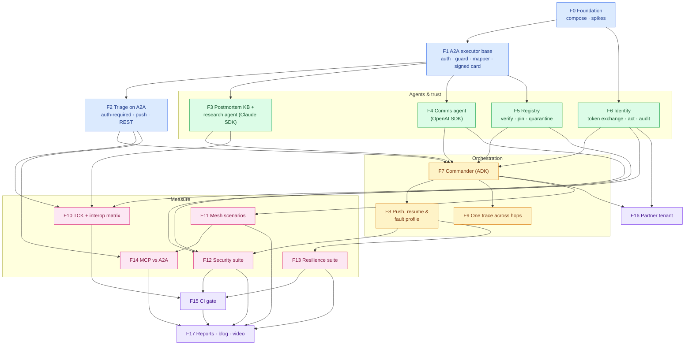
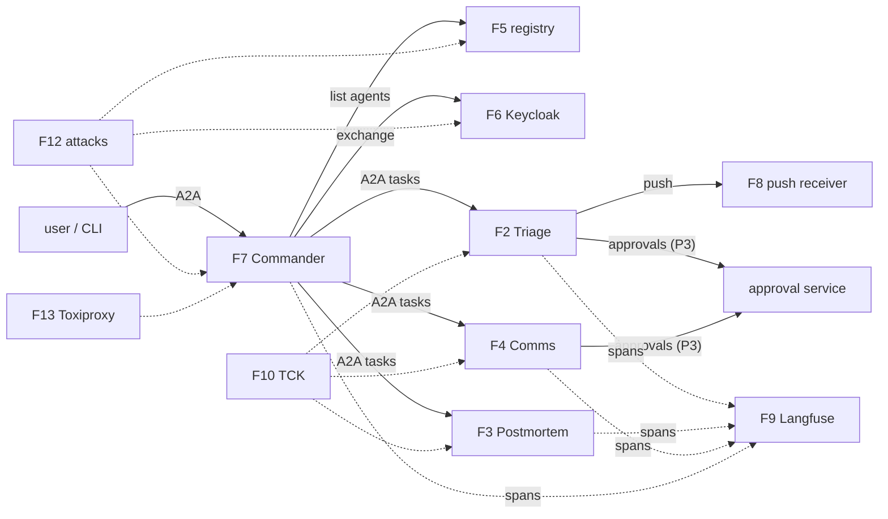
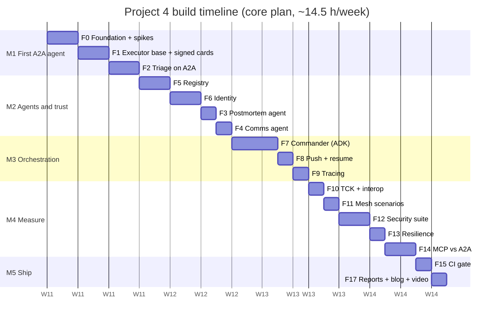

# 9. Build Plan: Feature by Feature

This plan splits Project 4 into **18 features** (F0–F17), grouped into **5 milestones**, plus 3 optional
features (F18–F20). Every feature has its own page with diagrams, files, tasks, acceptance criteria, tests,
an estimate and an interview talking point.

**Prerequisite:** Project 3 is finished (OpsSim, approval service, harness, Triage Agent) and Project 2's
Keycloak realm is available. Nothing here rebuilds them.

## 9.1 Build strategy: one agent on A2A first, then trust, then orchestration, then proof

Five rules:
1. **Prove the protocol on one agent before building a mesh.** The Triage Agent must pass the TCK and do an
   `auth-required` round trip before any other agent exists.
2. **Trust before orchestration.** The Commander is built against the registry and token exchange from its
   first commit. It never gets a "just use the URL" shortcut to remove later.
3. **Every trust control lands with its attack test** in the same PR (A1–A14 grow feature by feature;
   F12 adds the LLM-in-the-loop cases and the report).
4. **Stub models for protocol tests.** Protocol, trust and resilience tests never call a real model, so
   they run in CI for free.
5. **Each feature ends with a PR, green CI and a `CHANGELOG.md` entry.** From M2, the deterministic
   security cases must stay at 100%.

## 9.2 Master diagram: how the features connect

Arrows mean **"is required by"** (build the source first). Colours show milestones.

**Legend:** blue = M1 First A2A agent · green = M2 Agents & trust · amber = M3 Orchestration ·
pink = M4 Measure · purple = M5 Ship. **F16 is deferred in the chosen core plan** (§9.5).

## 9.3 Runtime integration map

## 9.4 Feature index

| ID | Feature | Milestone | Priority | Depends on | Effort (h) | Page |
|---|---|---|---|---|---|---|
| F0 | Foundation & spikes | M1 | Must | — | 3.5 | [F00](F00-foundation.md) |
| F1 | A2A executor base & signed cards | M1 | Must | F0 | 5 | [F01](F01-executor-base.md) |
| F2 | Triage Agent on A2A | M1 | Must | F1 | 4 | [F02](F02-triage-a2a.md) |
| F3 | Postmortem KB & research agent | M2 | Must | F1 | 4.5 (3.5 in core) | [F03](F03-postmortem-agent.md) |
| F4 | Comms agent | M2 | Must | F1 | 2.5 | [F04](F04-comms-agent.md) |
| F5 | Agent registry | M2 | Must | F1 | 4 | [F05](F05-registry.md) |
| F6 | Identity: token exchange, `act`, audit | M2 | Must | F0 | 4 | [F06](F06-identity.md) |
| F7 | Incident Commander (ADK) | M3 | Must | F2–F6 | 7 (6.5 in core) | [F07](F07-commander.md) |
| F8 | Push, resume & fault profile | M3 | Must | F7 | 3.5 | [F08](F08-push-resume.md) |
| F9 | One trace across hops | M3 | Must | F7 | 2 (1.5 in core) | [F09](F09-tracing.md) |
| F10 | TCK & interop matrix | M4 | Must | F2, F3, F4 | 3 | [F10](F10-tck-interop.md) |
| F11 | Mesh scenarios | M4 | Must | F7 | 4 (3 in core: 10 scenarios) | [F11](F11-mesh-scenarios.md) |
| F12 | Security suite | M4 | Must | F5, F6, F8 | 5 (4 in core: A12 deferred) | [F12](F12-security-suite.md) |
| F13 | Resilience suite | M4 | Must | F8 | 2.5 | [F13](F13-resilience.md) |
| F14 | MCP vs A2A comparison | M4 | Must | F2, F11 | 4.5 (3.5 in core) | [F14](F14-mcp-vs-a2a.md) |
| F15 | CI gate | M5 | Must | F10, F12, F13 | 1.5 | [F15](F15-ci-gate.md) |
| F16 | Partner tenant (second issuer) | M5 | Should · **deferred** | F6, F7 | 2.5 | [F16](F16-partner-tenant.md) |
| F17 | Reports, blog & video | M5 | Must | F11–F15 | 3 (2.5 in core) | [F17](F17-reports-blog.md) |
| | **Total: full plan / core plan (chosen)** | | | | **~66 h / ~58 h** | |

**Optional** (not in either total): F18 gRPC binding on Triage (2 h), F19 Azure deployment (3 h), F20 OpenAI
Agents SDK as an A2A *client* in the interop matrix (1.5 h). See [F18–F20](F18-optional-extensions.md).

## 9.5 Timeline: Option B (core plan) chosen

The roadmap originally had **2 weeks** for Project 4 (weeks 24–25). As with Projects 1–3, the design is larger than
that:

| Option | Scope | Effort | Weeks |
|---|---|---|---|
| A. Full plan | All 18 features | ~66 h | ~4.5–5 |
| **B. Core plan ✅ chosen** | Everything that makes the headline: four frameworks over A2A 1.0, TCK + interop, signed + pinned cards, token exchange with `act`, cross-agent approval, push/resume, security (A1–A11, A13, A14), resilience, **measured MCP vs A2A**. **Deferred:** F16 partner tenant, A12 poisoned-KB attack. **Slimmed:** 10 mesh scenarios, 40-postmortem corpus | **~58 h** | **4 at ~14.5 h/week** |
| C. Lean | B without the Comms agent (the Commander drafts updates itself), without the REST binding, pinning, LLM-in-the-loop attacks or Toxiproxy; `act` via a custom mapper; MCP vs A2A as a written comparison (not measured) | ~45 h | ~3 |

**Why B:** the pieces that make this project different from A2A tutorials are **trust** (signed and pinned
cards, `act` chains, approvals the Commander can't intercept) and the **measured MCP-vs-A2A answer**. C
drops both. A's extras (partner tenant, poisoned KB) add depth but no new headline.

**Roadmap impact (applied):** P4 grows from 2 to 4 weeks (roadmap weeks 24–27), which adds **2 weeks** and
takes the [roadmap](../../../../04-roadmap.md) from ~37 to **~39 weeks (about 9 months)**.

**Core plan, week by week** (roadmap weeks 24–27)

| Week | Roadmap week | Milestone | Features | Exit check |
|---|---|---|---|---|
| 1 | 24 | M1 → M2 | F0 Foundation + spikes · F1 executor base · F2 Triage on A2A · F5 registry (start) | **Triage passes the TCK (JSON-RPC)** and completes an `auth-required` round trip with the P3 approval service |
| 2 | 25 | M2 → M3 | F5 (finish) · F6 identity · F3 research agent · F4 comms agent · F7 (start) | Three signed agents registered and pinned; token exchange issues `act`; A1–A7 pass |
| 3 | 26 | M3 → M4 | F7 Commander · F8 push/resume · F9 tracing · F10 TCK + interop · F11 (start) | **One incident through four frameworks, one trace, one cross-agent approval** |
| 4 | 27 | M4 → M5 | F11 (finish) · F12 security · F13 resilience · F14 MCP vs A2A · F15 CI · F17 reports | Security + resilience reports; MCP-vs-A2A report; post published |

*(Dates are illustrative: Project 4 starts after Project 3's 8 weeks. One "d" is one working session of
about 2–2.5 hours.)*

**Deferred in B (~8 h)**

| Item | Effort | Value when added |
|---|---|---|
| F16 Partner tenant with a second issuer | 2.5 h | Cross-organization trust story |
| A12 poisoned-postmortem attack + corpus to 60 | 2 h | Knowledge-poisoning result |
| Mesh scenarios 11–15, MCP-vs-A2A on all 15 | 2 h | Tighter confidence intervals |
| Polish (Commander facade, extra trace attributes, report extras) | 1.5 h | — |

## 9.6 Milestone exit criteria

| Milestone | Done when |
|---|---|
| **M1 First A2A agent** | The Triage Agent serves a signed card, passes the TCK on JSON-RPC (and REST), streams, pushes, and completes an `auth-required` approval round trip; tasks survive an agent restart. |
| **M2 Agents & trust** | Postmortem and Comms agents on A2A; the registry verifies, pins and quarantines; Keycloak issues per-agent tokens with `act`; the agents reject wrong-audience, wrong-issuer and too-deep tokens. Deterministic attacks A1–A7 at 100%. |
| **M3 Orchestration** | The ADK Commander handles an incident end to end (research ∥ triage → comms), relays `auth-required`, cancels children, resumes after a restart, and the whole incident is one trace. |
| **M4 Measure** | TCK reports and the interop matrix are published; the mesh scenarios are graded with pass^k; security (controls off vs on), resilience and MCP-vs-A2A reports are committed. |
| **M5 Ship** | CI blocks a deliberately broken change (e.g. registry accepts an unsigned card); README with results; post; 3-minute video. |

## 9.7 Definition of done (every feature)

- [ ] Code merged via PR; CI green (lint, types, tests, TCK where relevant)
- [ ] Protocol and trust tests use stub-model agents (no model cost)
- [ ] New trust behaviour has its attack case(s) in the security suite
- [ ] New A2A paths carry `traceparent` and the A2A span attributes
- [ ] No tokens or approval credentials in logs or traces (log-scanning test from Project 2)
- [ ] Docs updated (this plan's checkboxes, the setup guide, `CHANGELOG.md`)

## 9.8 Risk register

| Risk | Impact | Mitigation |
|---|---|---|
| ADK's A2A client lacks a 1.0 feature (`auth-required`, push, `SubscribeToTask`) | Commander workarounds | Spike in F0; fallback: a Commander tool using the a2a-sdk client directly ([08 §8.6](../08-tech-stack.md#86-things-to-verify-in-the-first-week-of-building)) |
| Keycloak delegation exchange (`act`) is experimental or buggy | Identity story weaker | Spike in F0; pin a fixed version; fallback custom mapper, stated in the report |
| a2a-sdk signing helpers don't match the spec's JCS + detached JWS | Interop of signed cards | joserfc + rfc8785, with property tests |
| Project 3 not finished on time | P4 blocked | P4 needs only P3's Triage Agent, OpsSim and approval service (M1–M2 of P3), not its experiments |
| TCK gaps or bugs in a young kit | Conformance claims | Report exactly which tests ran; file issues upstream (a good open-source contribution) |
| Wrapping P3 agents inside executors causes event-loop or subprocess conflicts | Delays in F2–F4 | One process per agent container; Claude SDK subprocess handled as in P3 |
| Scope creep (gRPC, AP2, public registry, UI) | Timeline | Optional features only after M5; out-of-scope list in [01 §1.8](../01-requirements.md#18-scope) is binding |
| Plan longer than the roadmap slot | Later projects slip | **Option B chosen** (4 weeks); roadmap updated; deferred items added only while interviewing |
