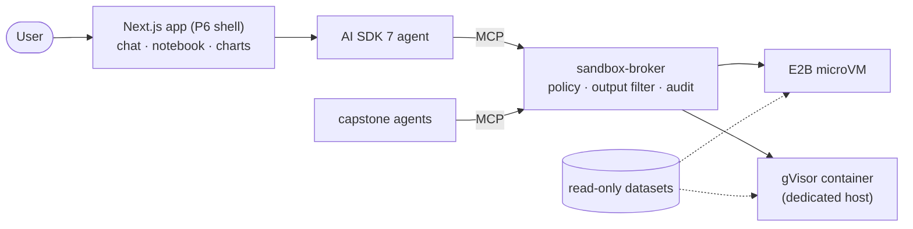

# Project 5: Sandboxed Data-Analyst Agent (Analyst)

> **Analyst** answers data questions by writing and running Python/SQL in an **isolated sandbox**, and
> returns answers, tables and interactive charts with the code behind every number. The sandbox runs
> behind a broker (exposed over MCP) on **two isolation technologies**: E2B's Firecracker microVMs and
> self-hosted gVisor. Both are attacked with the same **escape/abuse suite**, and nothing that comes out
> of them is ever run or rendered as active content.

**Target roles:** Agent Engineer, AI Full-stack Engineer (and security-minded AI roles)
**Gaps it closes:** sandboxed code execution, isolation technologies (microVM vs gVisor), output-handling
security, generative UI with safe charts, code-writing agents with self-repair, data-agent evaluation
**Status:** 🟡 System design done (no code yet). Tech stack, build plan and setup guide come next.
**Builds on:** [Project 6](../06-ai-saas-nextjs/README.md) (Next.js shell, AI SDK 7, auth) ·
[Project 2](../02-mcp-hub/README.md) (MCP server patterns, OAuth) · [Project 3](../03-agent-reliability-harness/README.md) (runner, statistics)

> **New here?** Start with [0 · Start here](docs/00-start-here.md): the project in plain English, one
> question's journey, and which document to read next.

## Design documents

| # | Document | What it answers |
|---|---|---|
| 0 | [Start Here](docs/00-start-here.md) | The project in plain English, a question's journey, reading paths, FAQ |
| 1 | [Requirements](docs/01-requirements.md) | Components, use cases, functional and non-functional requirements, AnalystBench categories, scope |
| 2 | [High-Level Architecture](docs/02-architecture.md) | Context, containers, answering a question, safe chart rendering, reuse by other agents, deployment |
| 3 | [Low-Level Design](docs/03-low-level-design.md) | MCP tools, session states, sandbox configuration per provider, harness, output filter, agent result, Vega-Lite subset, datasets, audit |
| 4 | [Evaluation Design](docs/04-evaluation-design.md) | AnalystBench-50, DABstep, escape/abuse suite (E1–E21), CSV injection, provider benchmark, UI safety, CI gate |
| 5 | [Security & Threat Model](docs/05-security-threat-model.md) | The 2026 escape lesson applied, output paths, threats → controls → tests, gVisor vs Firecracker, OWASP mapping |
| 6 | [Non-Functional Design](docs/06-non-functional.md) | Latency budget, cost, observability, failure modes, scaling |
| 7 | [Architecture Decision Records](docs/07-decisions.md) | 10 decisions with alternatives and consequences |
| 11 | [Glossary](docs/11-glossary.md) | Sandboxing, output-safety and analysis terms in plain English |

Numbers 8–10 and 12 are reserved for the tech stack, build plan, setup guide and market review, matching
Projects 1–6.

## The system at a glance

## Planned deliverables
1. The **sandbox-broker** (MCP) with E2B and gVisor providers, and a hardened sandbox image
2. The Analyst web app: chat, notebook panel, safe interactive charts and tables
3. **AnalystBench-50** results and a **DABstep** leaderboard submission
4. An **escape/abuse report**: every attack × both providers, with the layer that stopped it
5. A provider comparison (cold start, cost, isolation) and an injection report
6. A 3-minute video and a post: "What it takes to run AI-written code safely"

## Résumé bullet template
"Built a sandboxed data-analyst agent (AI SDK 7, MCP sandbox broker, E2B Firecracker + gVisor) with
safe generative-UI charts; __% on a 50-question benchmark, __% on DABstep; blocked __/21 escape and abuse
attacks on both isolation technologies."
