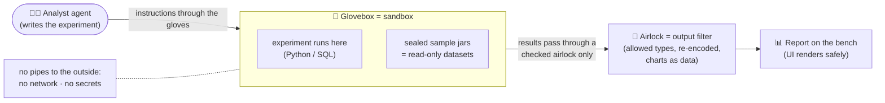

# 0. Start Here: the project in plain English

New to these docs, or preparing for an interview? Read this page first. Unfamiliar terms are explained in
the [glossary](11-glossary.md).

## 0.1 The project in three sentences

1. **Analyst** answers questions about data ("which products lost the most revenue?") by **writing and
   running Python or SQL**, fixing its own mistakes, and showing the answer as text, tables and
   interactive charts, **with the code that produced them**.
2. The code runs in a **locked box**: no internet, no secrets, read-only data, strict time and memory
   limits, thrown away afterwards. The box is built two ways (a managed microVM service, E2B, and a
   self-hosted gVisor container), and both are attacked with the same 20+ escape attempts.
3. Nothing that comes out of the box is trusted. Charts are data (Vega-Lite specs), files are checked by
   type, and nothing from inside is ever run or rendered as a web page. Accuracy is measured on a
   50-question benchmark and on the public DABstep leaderboard.

## 0.2 Which path should you read?

| You want to… | Read, in this order | Time |
|---|---|---|
| Explain the project in an interview | This page → [Security](05-security-threat-model.md) → [Decisions](07-decisions.md) | 30 min |
| Understand the design | [Requirements](01-requirements.md) → [Architecture](02-architecture.md) → [Low-level design](03-low-level-design.md) | 45 min |
| Understand how it's measured | [Evaluation design](04-evaluation-design.md) | 15 min |
| Understand speed and cost | [Non-functional design](06-non-functional.md) | 10 min |
| Understand the technology choices | [Tech stack](08-tech-stack.md) | 15 min |
| Start building | This page → [Setup guide](10-setup-guide.md) → [Build plan](09-build-plan/README.md) → the feature page you're on | 30 min |

## 0.3 The mental model: a lab with a glovebox

| Lab idea | Real component | Why it matters |
|---|---|---|
| Glovebox | gVisor container or Firecracker microVM | Whatever happens inside stays inside |
| Sealed sample jars | Read-only dataset snapshots | Experiments can't alter the source data |
| No pipes out | No network, no DNS, no credentials | Even fully hijacked code has nothing to steal and nowhere to send it |
| Airlock | Broker output filter + chart validator | The classic 2026 escape was "the outside ran what the inside made" |
| Lab notebook | Notebook panel + audit log | Every number is traceable to the code that computed it |

## 0.4 One question's journey

| Step | What happens |
|---|---|
| 1 | You ask: "Top 10 products by revenue lost from 2010 to 2011, as a chart" |
| 2 | The agent looks at the table's schema and a 5-row sample (marked as data, not instructions) |
| 3 | It writes pandas code; the broker creates a sandbox (~1 s) and runs it; a `KeyError` comes back |
| 4 | It fixes the code (revenue = quantity × price, excluding returns and cancelled invoices) and re-runs |
| 5 | A result file comes out; the broker checks its type and size |
| 6 | The agent returns a typed result: answer + key numbers + a Vega-Lite bar chart + caveats ("returns excluded") |
| 7 | The page shows two notebook cells (the failed one too), the table and the chart. Every number links to its cell |
| 8 | After 15 idle minutes, the sandbox is destroyed |

## 0.5 What makes this project stand out in interviews

- **Security judgement with evidence:** two isolation technologies, one attack suite, and published
  results including which layer stopped each attack. It fits your M.Tech in Information Security.
- **The 2026 lesson, applied:** the design covers the "trusted component runs the sandbox's output" class
  of escapes, not just the sandbox wall.
- **A reusable platform piece:** the sandbox is an MCP service that the capstone's agents reuse.
- **An external benchmark:** a DABstep leaderboard submission next to your own benchmark.

## 0.6 FAQ

**Why not just use Docker?**
Normal Docker containers share the host kernel, so one kernel bug can mean an escape. gVisor puts a
user-space kernel in between, and Firecracker gives each sandbox its own tiny VM. ([ADR-003](07-decisions.md))

**Why no internet in the sandbox?**
Without a network, stolen data has nowhere to go and malware can't phone home. The analysis doesn't need
it: data and packages are already inside. ([ADR-005](07-decisions.md))

**Why Vega-Lite instead of letting the code draw charts?**
Charts drawn as HTML or SVG can carry scripts. A Vega-Lite spec is JSON that our code validates and
renders, so the sandbox never gets to put code in your browser. ([ADR-006](07-decisions.md))

**Is this the code?**
Not yet. These are the design documents, the [tech-stack rationale](08-tech-stack.md) and the
[build plan](09-build-plan/README.md), written before any code.
