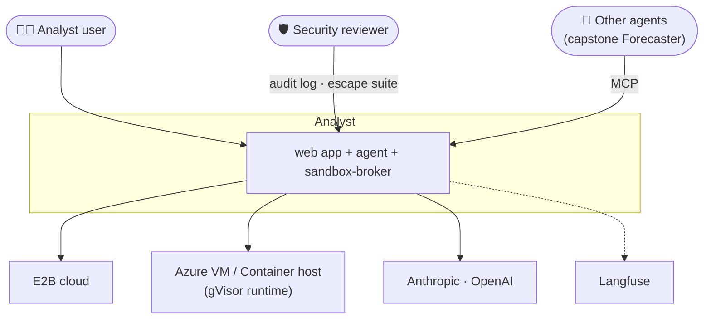
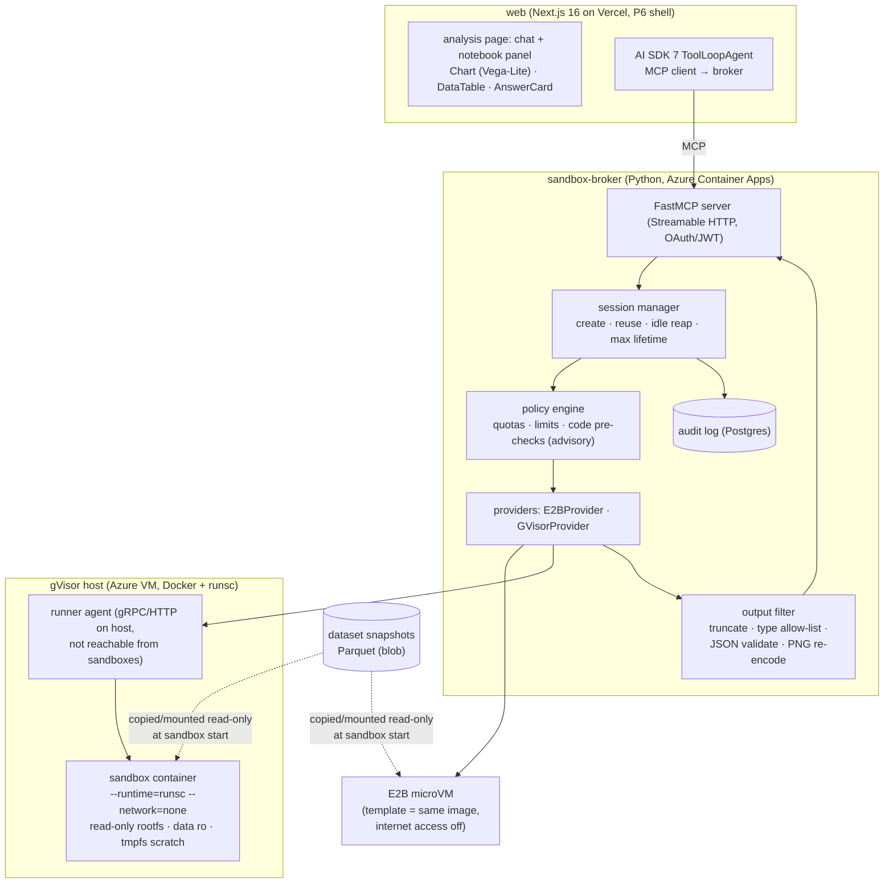
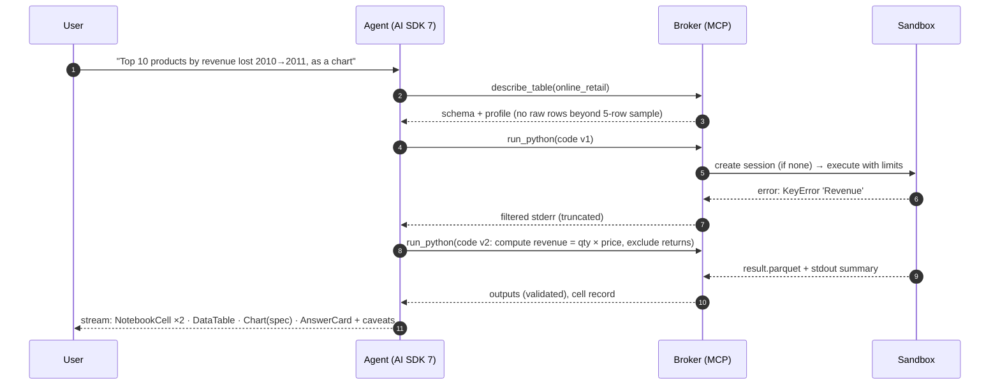
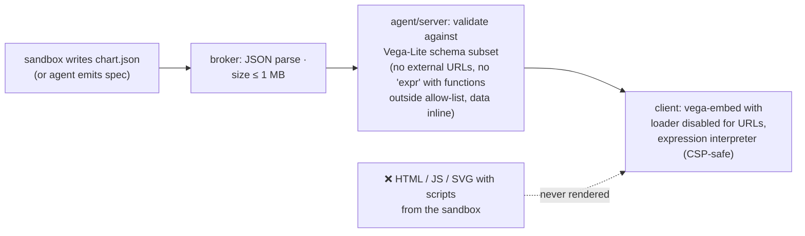
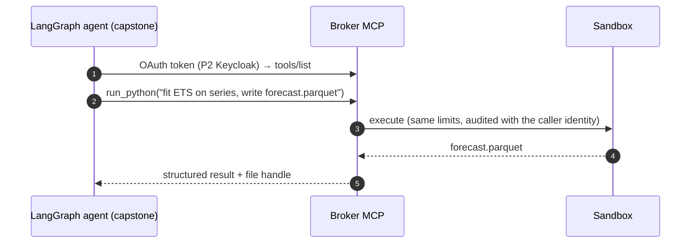
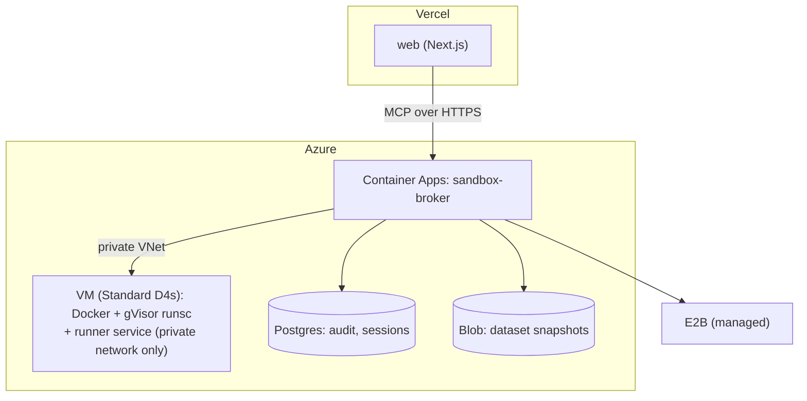

# 2. High-Level Architecture

## 2.1 Design principles

1. **The sandbox is hostile.** Treat everything that comes out of it as untrusted data: stdout, files,
   chart specs, even error messages. Nothing from inside is executed, rendered as active content, or
   used as instructions outside.
2. **Nothing valuable inside.** No network, no secrets, no user tokens, read-only data. An attacker with
   full control of the sandbox should find nothing to steal and nowhere to send it.
3. **Defence in layers, each tested.** The layers are: the isolation technology (microVM or gVisor), the
   runtime policy (limits, no network), the broker's output filters, the UI's rendering rules, and the
   agent's prompt rules. Every layer has its own attack tests.
4. **Charts are data.** The agent returns a Vega-Lite spec that is schema-validated and rendered by our
   code. It never returns HTML or JavaScript.
5. **One broker, many callers.** The sandbox is a service with an MCP interface, so the web agent, the
   capstone's LangGraph agents and the eval harness all use the same controlled path.
6. **Provider-neutral.** Isolation is compared, not assumed: E2B (Firecracker) and gVisor run the same
   image, limits and tests.

## 2.2 System context (C4 level 1)



## 2.3 Containers (C4 level 2)



| Container | Responsibility |
|---|---|
| **web** | UI, auth (P6), the agent loop, rendering typed outputs safely |
| **sandbox-broker** | The only component allowed to create sandboxes; MCP interface; quotas, limits, filters, audit |
| **gVisor host** | A dedicated VM running Docker with the `runsc` runtime; a small runner service that the broker calls; sandboxes can't reach it |
| **E2B** | Managed Firecracker microVMs from a custom template with internet access disabled |
| **Dataset store** | Versioned Parquet snapshots; copied into the sandbox read-only at start |

## 2.4 Data flow A: answering a question



## 2.5 Data flow B: chart rendering (why it's safe)



Vega-Lite specs can contain expressions and data URLs. Our validator therefore allows only:
- a subset of the schema;
- inline data;
- no remote loaders.

The client renders with Vega's **CSP-safe expression interpreter**, so no `eval` is needed.

## 2.6 Data flow C: another agent using the broker



## 2.7 Deployment view



The gVisor VM doesn't need nested virtualization (gVisor's default `systrap` platform doesn't use
KVM). It runs on its own VM, never on the same host as the broker or database, so a full escape
lands on a machine with nothing else on it ([ADR-004](07-decisions.md)).

## 2.8 Proposed repository layout

```
analyst/
├─ apps/web/                  # Next.js (P6 shell packages): analysis pages, agent, renderers
├─ services/broker/           # FastAPI + FastMCP: sessions, policy, filters, providers, audit
│  └─ providers/e2b.py  providers/gvisor.py
├─ services/runner/           # tiny service on the gVisor host (creates/destroys runsc containers)
├─ sandbox-image/             # Dockerfile + E2B template (same packages, no network tools)
├─ datasets/                  # snapshot builder, schema docs, profiles
├─ evals/                     # AnalystBench-50, DABstep runner, provider bench
├─ redteam/                   # escape/abuse suite, CSV-injection cases
├─ infra/                     # Terraform: VM + broker + storage
└─ docs/
```
