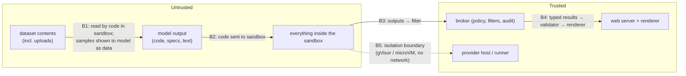

# 5. Security & Threat Model

This is the project's centre of gravity. The agent **writes code that we then run**, so we assume the
code is malicious, either because the model was steered by the data or because a user is hostile.

## 5.1 Assets

| Asset | Why it matters |
|---|---|
| Host machines (gVisor VM, E2B's infrastructure) | An escape here is the worst outcome |
| Other users' sessions and datasets | Cross-tenant data exposure |
| Secrets (model keys, DB credentials, tokens) | Must never be reachable from code the model writes |
| The user's browser | Sandbox outputs are shown there, so XSS is a risk |
| Cost | Compute and model spend can be abused |
| Audit log | Evidence of what ran, for whom |

## 5.2 Trust boundaries

## 5.3 The key lesson from 2026 escapes, applied

Recent research on AI-agent sandbox escapes found that the agent usually **didn't need to break the
sandbox**. It wrote something a **trusted component outside** later ran, loaded, scanned or rendered.
This design lists every path by which something produced inside the sandbox can leave it, and neutralizes
each one:

| Output path | What could go wrong | Control |
|---|---|---|
| stdout/stderr → model | Instructions that steer the next step | Truncated, spotlighted as data; the prompt rule; an execution budget |
| stdout → UI | Terminal escape sequences, HTML | Control chars stripped; rendered as escaped text |
| Files → UI | HTML/SVG/JS, polyglot files | Type allow-list by magic bytes; PNG re-encoded; no HTML/SVG ever |
| Chart specs → UI | Remote data loads, links, expression abuse | Validated Vega-Lite subset; loader disabled; interpreter mode; strict CSP |
| Files → other tools | Pickle/joblib loaded later by trusted code | Pickle never accepted; Parquet/CSV read with pyarrow only |
| Code cells → "re-run" | User re-runs code that looks harmless | Re-run goes back into the sandbox, never runs outside |
| Anything → CI/dev machines | Eval artifacts opened on your laptop | Eval outputs stored as data (JSON/Parquet); no notebooks with outputs executed locally |

## 5.4 Threats → controls → tests

| # | Threat | Control | Test |
|---|---|---|---|
| T1 | **Sandbox escape** to the host | gVisor user-space kernel or Firecracker microVM; non-root; no capabilities; no-new-privileges; dedicated host | E6, E17, E21 |
| T2 | **Network exfiltration / C2** | No network interface; no DNS; metadata unreachable | E1–E4 |
| T3 | **Secret theft** | No secrets in the sandbox; env cleared; the model is called outside | E7 |
| T4 | **Data tampering** | Read-only datasets; per-session copies | E5 |
| T5 | **Resource exhaustion** | CPU/memory/PID/disk/time limits in two layers (runtime + harness); broker quotas | E8–E12 |
| T6 | **Cross-session leakage** | One sandbox per session; destroyed on end; no shared writable volumes | E18, E19 |
| T7 | **XSS / active content via outputs** | §5.3 output rules; CSP without `unsafe-eval`; escaped rendering | E13–E16, UI tests |
| T8 | **Prompt injection via data** | Data as data; spotlighted samples; nothing the sandbox can reach is worth stealing; outputs validated | §4.5 cases |
| T9 | **Unsafe deserialization** | Pickle banned; typed readers only | E15 |
| T10 | **Supply chain** (malicious package in the image) | Pinned, hashed requirements; image built in CI and scanned (Trivy); no runtime `pip install` | Image scan in CI |
| T11 | **Abuse of the broker by other callers** (MCP) | OAuth/JWT per caller; per-caller quotas; audit with caller identity | Auth tests |
| T12 | **Cost abuse** | Quotas on sandbox-minutes and concurrency; execution budget per question | Quota tests |

## 5.5 Why two isolation technologies

| | gVisor (`runsc`) | Firecracker microVM (E2B) |
|---|---|---|
| Boundary | User-space kernel intercepts syscalls; the host kernel sees a small syscall surface | A separate guest kernel inside a minimal VMM with KVM |
| Strength | Big reduction of kernel attack surface; runs on ordinary VMs | Hardware virtualization boundary |
| Weakness | Syscall compatibility gaps; performance overhead on I/O | Needs KVM (managed here by E2B); you trust the provider's operations |
| Operated by | You (patching, host hardening) | E2B |

Running both, with the same tests, turns "we used a sandbox" into a **comparison with evidence**. That is
the kind of judgement a security-minded agent engineer is hired for.

## 5.6 Mapping to OWASP

| OWASP item | Covered by |
|---|---|
| LLM01 Prompt injection | T8 |
| LLM02 Sensitive information disclosure | T2, T3, T6 |
| LLM05 Improper output handling | T7, T9 (§5.3) |
| LLM06 Excessive agency | Code runs only inside the sandbox; no tools that act outside |
| LLM10 Unbounded consumption | T5, T12 |
| Agentic ASI05 Unexpected code execution | The whole design: isolation, output handling, no runtime installs |

## 5.7 Residual risks

- **Zero-day escapes** in gVisor or Firecracker can't be excluded. The mitigations are a dedicated host
  with nothing on it, patch cadence and monitoring.
- **Side channels** (timing, cache) between tenants on shared hardware are out of scope.
- **Wrong answers are a safety issue too.** A confident wrong number can mislead a business decision.
  That's why every answer shows its code and caveats, and why accuracy is measured.
- **Uploaded datasets** could contain personal data. The demo discourages uploads, and uploads are
  org-scoped and deletable.
