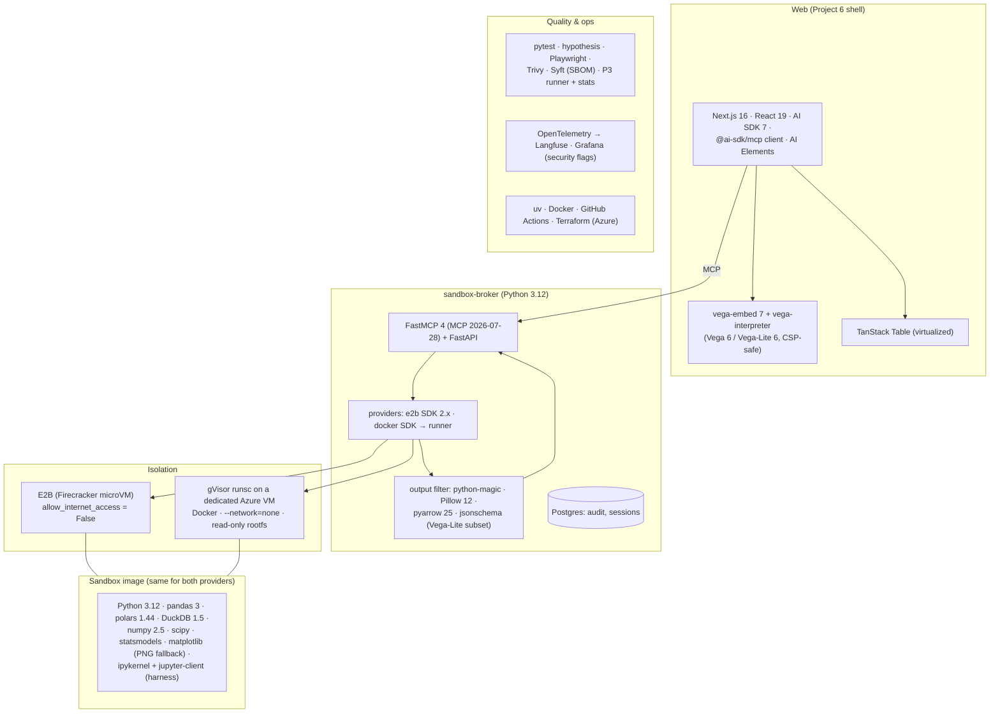

# 8. Tech Stack: What We Use and Why

For every technology in this project, this document answers five questions:
1. **What does it do in this system?**
2. **Why was it chosen?**
3. **What alternatives were considered, and why weren't they chosen?**
4. **What does it add to your profile?**
5. **When would we replace it?**

Selection criteria (adjusted for a security-first project):

| # | Criterion | Meaning |
|---|---|---|
| C1 | **Isolation strength** | How strong the boundary is between AI-written code and anything that matters |
| C2 | **Verifiability** | Can each control be tested with an attack (§4.4 of the evaluation design)? |
| C3 | **Market value** | Sandboxing and code execution appear in 2026 Agent Engineer JDs (see [01-market-analysis](../../../01-market-analysis.md)) |
| C4 | **Reuse** | Reuses Projects 2, 3 and 6 |
| C5 | **Cost** | Development and demo within ~$15–25/month |

---

## 8.1 The stack at a glance

## 8.2 Summary table

| Layer | Choice | One-line reason | Main alternative (not chosen) |
|---|---|---|---|
| Managed sandbox | **E2B** (SDK 2.x, code-interpreter 2.x) | Firecracker microVMs, stateful Python kernels, templates, per-second billing; network can be switched off | Daytona (faster cold start, container isolation by default), Modal (GPUs, containers), Vercel Sandbox |
| Self-hosted sandbox | **gVisor (`runsc`)** under Docker on a **dedicated Azure VM** | User-space kernel; runs on ordinary VMs; `--network=none` | Plain Docker/runc (not a boundary for untrusted code), Kata Containers / AKS Pod Sandboxing (strong, heavier setup), Firecracker self-hosted (needs KVM hosts) |
| Broker | **Python 3.12 + FastMCP 4 + FastAPI** | Same MCP stack as Project 2; easy to reach from TS and Python agents | TypeScript broker (the Python ecosystem for data files and image checks is better) |
| Runner (gVisor host) | **Small FastAPI service + Docker SDK** | Keeps the Docker socket on the host, reachable only from the broker | Exposing the Docker API over the network (dangerous) |
| Sandbox Python | **pandas 3, polars, DuckDB 1.5, numpy, scipy, statsmodels, matplotlib** | What analysts actually use; DuckDB for fast SQL over Parquet | Spark (overkill) |
| Kernel | **ipykernel + jupyter-client** (inside the harness) | Stateful cells, interrupts, clean restarts | `exec()` in a loop (no isolation of state or interrupts) |
| Output checks | **python-magic, Pillow 12, pyarrow 25, jsonschema** | Real type detection, image re-encoding, safe Parquet/CSV reads, spec validation | Trusting file extensions |
| Agent | **AI SDK 7** `ToolLoopAgent` + **@ai-sdk/mcp** client | Reuses Project 6; typed outputs; MCP tools from the broker | LangGraph agent in Python (duplicate UI work) |
| Charts | **Vega-Lite 6 via vega-embed 7 + vega-interpreter** | Charts as JSON; the interpreter renders without `eval`, so a strict CSP is possible | Plotly (its JSON can include HTML in some fields; bigger bundle), sandbox-rendered HTML (unsafe) |
| Tables | **TanStack Table** (virtualized) | Same as Project 6 | — |
| Web shell | **Project 6 packages** (Next.js 16, Better Auth, AI Elements, shadcn/ui) | Auth, orgs and UI are reused | New app from scratch |
| Datasets | **Parquet snapshots in Azure Blob**, manifest + checksums | Fast to copy, typed, versioned | CSV (slow, loses types) |
| Audit | **Postgres** (append-only table) | Queryable; same as other projects | Log files only |
| Supply chain | **Pinned + hashed requirements (uv), Trivy scan, Syft SBOM** | Reproducible, scanned image | Unpinned `pip install` |
| Tests | **pytest, hypothesis, Playwright**, Project 3's runner + stats | Filters, attacks, UI safety, benchmark | — |
| Observability | **OTel → Langfuse; Grafana panel for security flags** | Same traces as before, plus a probe dashboard | — |
| Infra | **Terraform → Azure** (VM for gVisor, Container Apps for the broker, Blob, Postgres) | Reuses modules; VM can be stopped | AKS with a sandbox runtime (future scaling path) |

---

## 8.3 Detailed rationale

### Isolation

#### E2B (Firecracker microVMs)
- **Role:** The default provider. Each session is a microVM created from a **custom template** built from
  the same Dockerfile as the gVisor image. The Python kernel keeps state between cells.
- **Why:**
  - Hardware-virtualization isolation (C1).
  - Stateful code interpreter.
  - Fast starts from snapshots.
  - Per-second pricing, with a free Hobby tier for development (C5).
- **Watch (important):**
  - **Internet access is on by default** in E2B. The broker creates every sandbox with internet access disabled (`allow_internet_access=False` in Python; `allowInternetAccess` in JS), and the escape suite checks it on **every** run (E1–E3).
  - `updateNetwork` could re-enable egress, so only the broker holds the API key, and it never calls that method.
  - Set a hard sandbox timeout at creation, so leaked sandboxes die even if the reaper fails.
- **Not chosen as default:**
  - Daytona: faster cold starts, but container isolation by default.
  - Modal: great for GPUs; containers.
  - Vercel Sandbox: close to Project 6's stack, a good third provider later (FR-11).
- **Profile:** "Ran untrusted AI-written code in Firecracker microVMs with egress disabled and verified by tests."
- **Revisit:** If costs or limits don't fit, move the default to gVisor. The interface stays the same.

#### gVisor (`runsc`) on a dedicated Azure VM
- **Role:** The self-hosted provider. Docker with the `runsc` runtime creates one container per session:
  - `--network=none` and a read-only rootfs;
  - `/data` read-only; tmpfs scratch;
  - `--cap-drop=ALL`, no-new-privileges, non-root;
  - CPU/memory/PID limits.
- **Why:** Strong isolation you operate yourself (C1). It runs on ordinary VMs, with no nested
  virtualization. Operating it (patching gVisor, hardening the host, keeping the runner off the network)
  is itself part of the lesson (C3).
- **Not chosen:**
  - Plain Docker/runc: shares the host kernel; the 2026 consensus is that it's not enough for AI-generated code.
  - Kata Containers or **AKS Pod Sandboxing**: VM-per-pod isolation, strong, the right scale-up path on Azure, but more setup than this project needs.
  - Self-hosted Firecracker: needs KVM-capable hosts and more tooling.
- **Watch:**
  - The runner service holds the Docker socket. It listens only on the private network interface, requires the broker's mTLS certificate, and exposes only create/exec/destroy for one fixed image.
  - Pin and patch gVisor releases.
- **Revisit:** Move to AKS Pod Sandboxing if concurrency grows beyond one VM ([06 §6.5](06-non-functional.md#65-scaling-path)).

### Broker and harness

#### FastMCP 4 + FastAPI (sandbox-broker)
- **Role:**
  - MCP tools (`list_datasets`, `describe_table`, `run_sql`, `run_python`, `get_file`).
  - A session manager and reaper.
  - Quotas, output filters, audit.
  - A provider interface with two implementations.
- **Why:**
  - It is the same MCP server stack as Project 2, on the 2026-07-28 protocol (C4).
  - Python has the best libraries for checking files (magic bytes, Pillow, pyarrow).
  - Both the TypeScript web agent and the capstone's Python agents can call it.
- **Watch:** The broker never runs user code itself. It only talks to providers and inspects returned
  bytes with safe parsers.

#### Harness inside the sandbox: ipykernel + jupyter-client
- **Role:**
  - Runs cells in a persistent kernel with interrupts and restarts.
  - Sets `resource` limits as a second layer.
  - Caps output.
  - Lists output files.
- **Why:** It gives notebook-like behaviour without Jupyter's web server. The harness is **untrusted** (it
  runs inside the sandbox), so the broker re-checks everything it returns.

#### Output checks: python-magic, Pillow 12, pyarrow 25, jsonschema
- **Role:**
  - Detect real file types; re-encode PNGs and strip metadata.
  - Read Parquet/CSV safely with caps.
  - Validate Vega-Lite specs against our **restricted subset** schema ([03 §3.7](03-low-level-design.md#37-vega-lite-validation-subset)).
- **Why:** It addresses the main 2026 escape pattern ("something outside trusted what the sandbox made")
  (C1, C2).

### Sandbox image

- **Contents:**
  - Python 3.12, pandas 3, polars, DuckDB 1.5, numpy 2.5, scipy, statsmodels, matplotlib (PNG only, as a fallback).
  - The harness.
  - No compilers beyond what the wheels need; no `curl`, `wget`, `ssh`, `git` or package managers at run time.
- **Build:** uv with hashed pins. The image is built in CI, scanned with **Trivy**, and an **SBOM** is
  generated with **Syft**. The same image digest is used for the E2B template and gVisor.
- **Scanner hygiene:** The March 2026 LiteLLM compromise started from a hijacked Trivy CI component. Pin
  every scanner action to a **commit SHA** (or install the binary from a checksummed release), and run the
  scan in a job with **no secrets and read-only permissions** (see [Project 7 §8.3](../../07-llm-gateway-router/docs/08-tech-stack.md#supply-chain-the-stacks-own-defences)).
- **Watch:** **pandas 3.0** changed defaults (copy-on-write, the string dtype). The agent's prompt
  examples and the benchmark's reference code use pandas 3 idioms, and DuckDB handles most aggregation
  anyway.

### Agent and UI

#### AI SDK 7 + @ai-sdk/mcp
- **Role:** A `ToolLoopAgent` with broker tools loaded through the MCP client, an execution-count guard,
  and a typed `AnalysisResult` output ([03 §3.6](03-low-level-design.md#36-agent-loop-and-typed-result)).
- **Why:** Reuses Project 6's agent patterns and UI parts (C4). The typed result means the page renders
  structured components, never free-form HTML.

#### Vega-Lite 6 via vega-embed 7 + vega-interpreter
- **Role:** Every interactive chart.
- **Why:**
  - Charts are **JSON specs**, validated before rendering.
  - `vega-interpreter` evaluates expressions without `eval`, so the page can keep a CSP without `unsafe-eval`.
  - Remote data loading is disabled in the loader.
- **Not chosen:** Plotly (heavier; more places for HTML in labels); Recharts (would need the agent to
  produce React props, a larger surface); HTML/SVG from the sandbox (unsafe by design).
- **Revisit:** If a chart type is missing, add it to the allowed subset with a test, rather than loosening
  the validator.

### Data, infra and quality

- **Datasets:** Parquet snapshots in Azure Blob with a manifest (version, schema, checksum, data
  dictionary). E2B templates bake in the demo snapshots. The gVisor host keeps a local read-only copy.
- **Postgres:** audit and session tables (append-only audit, as in earlier projects).
- **Terraform (Azure):**
  - A VM for gVisor (Standard D4s-class, stop when idle) on a private VNet.
  - Container Apps for the broker.
  - Blob and Postgres Flexible.
- **Tests:**
  - pytest + hypothesis for filters and validators.
  - The escape suite as pytest cases parameterized by provider.
  - Playwright for UI safety (CSP violations, external requests).
  - Project 3's runner and statistics for AnalystBench.
- **Observability:** OTel GenAI + MCP conventions into Langfuse. Broker metrics and **security flags**
  (network attempts, PID-limit hits, dropped outputs) on a Grafana panel.

---

## 8.4 What this stack adds to your profile

| New on your profile after this project | Evidence produced |
|---|---|
| Sandboxed execution of AI-written code (Firecracker microVMs, gVisor) | Escape suite results per provider |
| Output-handling security (the 2026 escape class) | Filter + validator + UI safety tests |
| Hardened container operations (runsc, no network, caps, read-only, runner isolation) | Terraform + configs + host hardening notes |
| Secure generative UI (validated Vega-Lite, CSP without `unsafe-eval`) | Chart renderer + tests |
| Code-writing agent with self-repair, evaluated | AnalystBench-50 + DABstep |
| Supply-chain hygiene for runtime images (pins, SBOM, Trivy) | CI pipeline |
| MCP service reused across agents | Capstone integration |

**Deliberately not in this project:**
- GPUs.
- Internet-enabled sandboxes (they would need an egress proxy; future work).
- Kubernetes sandbox runtimes (the documented scale path).
- Billing (Project 6).

## 8.5 Version baseline (September 2026)

| Component | Version | Needed for |
|---|---|---|
| e2b / e2b-code-interpreter (Python) | 2.51 / 2.10 | Sandboxes, internet-access flag, templates, timeouts |
| gVisor | latest release, pinned (check `runsc --version`) | `runsc` runtime, systrap platform |
| Docker Engine / docker SDK (Python) | current / 7.2 | Runner |
| FastMCP | 4.0 | MCP 2026-07-28 server |
| pandas / polars / DuckDB | 3.0 / 1.44 / 1.5 | Analysis in the sandbox |
| numpy / scipy / statsmodels | 2.5 / 1.18 / 0.15 | Analysis |
| pyarrow / Pillow / python-magic | 25 / 12.3 / 0.4 | Output checks |
| ipykernel / jupyter-client | 7.3 / 8.10 | Harness |
| vega / vega-lite / vega-embed / vega-interpreter | 6.4 / 6.4 / 7.3 / 2.3 | Charts |
| ai / @ai-sdk/mcp | 7.0 / 2.0 | Agent + MCP client |

## 8.6 Things to verify in the first week of building

| Item | Why | Fallback |
|---|---|---|
| E2B sandboxes with internet access disabled can't reach DNS, the internet or metadata (E1–E3) | Core assumption | If any path is open, block it at the template level or make gVisor the default |
| E2B template from our Dockerfile runs the harness and keeps the kernel between calls | Stateful sessions | Stateless mode (ADR-008 alternative) |
| gVisor `runsc` on the chosen Azure VM size: pandas/DuckDB compatibility and I/O performance | Provider parity | Adjust the platform setting; larger VM; document gaps |
| Runner reachable only from the broker (mTLS, private NIC) | Protects the Docker socket | Put the runner behind a private endpoint only |
| vega-embed + vega-interpreter under a strict CSP renders the chart types in the subset | Safe charts | Reduce the subset; PNG fallback via the sandbox (re-encoded) |
| @ai-sdk/mcp client with FastMCP 4 on 2026-07-28 (auth, streaming results) | Agent ↔ broker | Direct HTTP tool wrappers with the same schemas |
| pandas 3 behaviour in reference solutions | Correct gold answers | Write reference solutions in DuckDB SQL |
