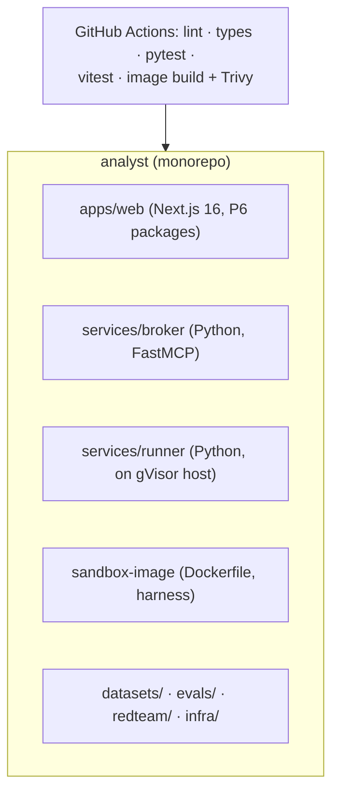
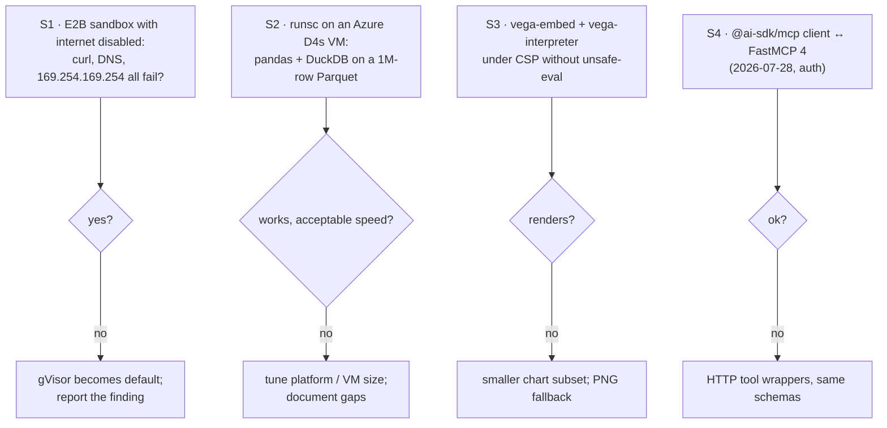

# F0: Foundation & Spikes

| Milestone | Priority | Depends on | Effort | Unblocks |
|---|---|---|---|---|
| M1 | Must | — | 3.5 h | Everything |

**Goal:** A monorepo with the web app (using Project 6's shell packages), the broker, the runner and the
sandbox image, plus CI. Four spikes settle the risky assumptions.

## Diagram: repository

## Diagram: spikes (≈ 1.5 h total, results in `docs/notes/spikes.md`)

## Tasks
- [ ] Monorepo (pnpm + uv); import Project 6's shell packages (auth, UI, AI Elements)
- [ ] CI: web and Python checks; image build + Trivy + Syft SBOM (scanner actions pinned by commit SHA; scan job has no secrets)
- [ ] Spikes S1–S4 with written decisions

## Acceptance criteria
- CI green on an empty PR; spike notes committed with a decision per spike

**Interview talking point:** *"Before building anything, I checked the one assumption the whole design
rests on: that a sandbox really can't reach the network. I tested DNS and the cloud metadata endpoint
too, not just 'curl google.com'."*
