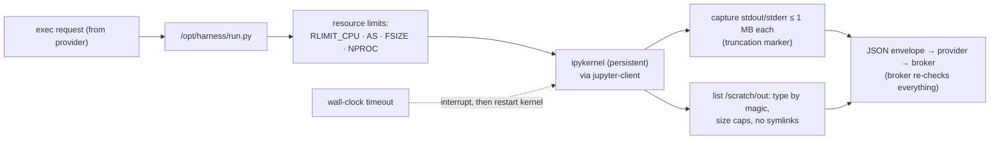

# F1: Sandbox Image & Harness

| Milestone | Priority | Depends on | Effort | Unblocks |
|---|---|---|---|---|
| M1 | Must | F0 | 4 h | F2, F3, F6 |

**Goal:** One minimal, pinned, scanned image used by both providers, and a harness inside it that runs
cells in a persistent kernel with a second layer of limits and capped output.

## Diagram: harness



## Deliverables / files
```
sandbox-image/Dockerfile          # python:3.12-slim base, non-root uid 10001, no curl/wget/git/ssh/pip at runtime
sandbox-image/requirements.lock   # uv-compiled with hashes: pandas 3, polars, duckdb, numpy, scipy, statsmodels, matplotlib, pyarrow, ipykernel, jupyter-client
sandbox-image/harness/run.py      # the harness
sandbox-image/harness/limits.py
.github/workflows/image.yml       # build → Trivy (fail on high/critical) → Syft SBOM → push by digest
```

## Tasks
- [ ] Minimal image; remove package managers and network tools from the final stage
- [ ] Harness with persistent kernel, interrupts, limits, capped output, file listing
- [ ] Image pipeline with scan + SBOM; publish by digest
- [ ] Local run with plain Docker for development only (never for untrusted code)

## Acceptance criteria
- Trivy: no high/critical findings (or documented exceptions)
- Harness tests: CPU burn killed, memory bomb killed, 1 GB print truncated, symlink in outputs refused

## Tests
- pytest for the harness (run inside the image in CI)

**Interview talking point:** *"The image has no package manager, no curl and no git at run time, and
every package is pinned by hash. If the agent wants a new library, that's a pull request, not a
`pip install` inside the sandbox."*
