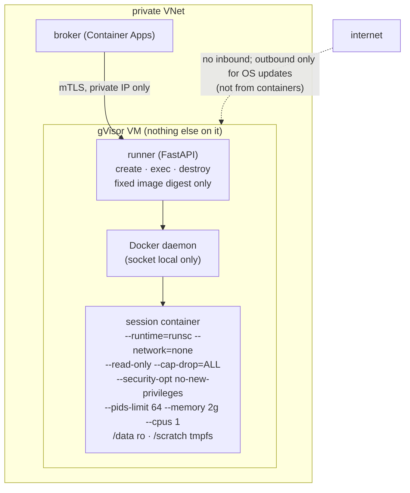

# F2: gVisor Host & Runner

| Milestone | Priority | Depends on | Effort | Unblocks |
|---|---|---|---|---|
| M1 | Must | F1 | 4.5 h | F4, F9, F13 |

**Goal:**
- A dedicated Azure VM running Docker with the gVisor `runsc` runtime.
- A tiny **runner** service that the broker (and nothing else) can call over mTLS on a private network.
- The runner exposes only create, exec and destroy, for one image.

## Diagram: host layout



## Deliverables / files
```
infra/terraform/gvisor-host/   # VM, NSG (inbound: broker subnet → runner port only), managed identity none
infra/gvisor/install.sh        # Docker + runsc (pinned), daemon.json runtime entry
services/runner/app.py         # create/exec/destroy; validates image digest and flags; no arbitrary docker args
services/runner/mtls/          # cert config (broker client cert)
scripts/vm-start.sh / vm-stop.sh
```

## Tasks
- [ ] Terraform VM + NSG; SSH only via Azure Bastion or disabled
- [ ] Install Docker + pinned gVisor; register `runsc`; verify with `docker run --runtime=runsc`
- [ ] Runner: a fixed set of flags (the diagram), dataset bind mount read-only, reaper for orphans
- [ ] mTLS between broker and runner; runner bound to the private IP
- [ ] First attack tests: E1–E4 (network, DNS, metadata, broker/DB reachability) against gVisor

## Acceptance criteria
- A session container runs a pandas cell; E1–E4 blocked
- The runner rejects any request with a different image or extra flags

## Tests
- Runner unit tests (flag allow-list); integration tests on the VM (E1–E4)

**Interview talking point:** *"The Docker socket never leaves the host. The broker can only ask the runner
to start one specific image with one fixed set of hardening flags, over mutual TLS on a private
network."*
