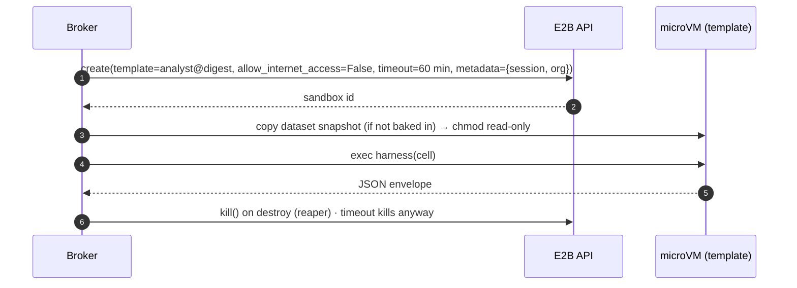

# F3: E2B Provider

| Milestone | Priority | Depends on | Effort | Unblocks |
|---|---|---|---|---|
| M1 | Must | F1 | 3 h | F4, F9, F13 |

**Goal:** E2B sandboxes built from the **same image**, created with internet access **off** and a hard
timeout, running the same harness.

## Diagram: E2B session



## Deliverables / files
```
sandbox-image/e2b.toml               # template config from the same Dockerfile
services/broker/providers/e2b.py     # create, exec, destroy, health; never calls updateNetwork
```

## Tasks
- [ ] Build the E2B template from the image; demo datasets baked into the template
- [ ] Provider with `allow_internet_access=False`, hard timeout, metadata tags
- [ ] E1–E4 against E2B
- [ ] The broker is the only holder of the E2B API key (Key Vault)

## Acceptance criteria
- Same cell results on E2B and gVisor for a fixed test notebook
- E1–E4 blocked on E2B

## Tests
- Provider contract tests shared with gVisor (one test suite, two providers)

**Interview talking point:** *"E2B turns internet on by default. The broker always creates sandboxes with it
off, and the network attacks run against every build to prove it."*
