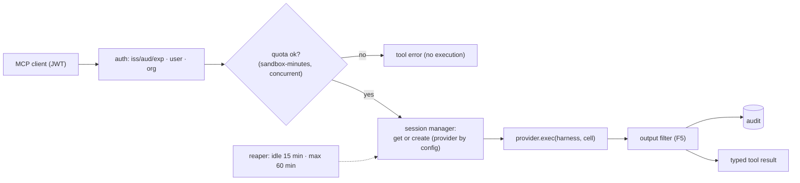

# F4: Broker Core (MCP, Sessions, Quotas, Audit)

| Milestone | Priority | Depends on | Effort | Unblocks |
|---|---|---|---|---|
| M1 | Must | F2, F3 | 5 h | F5, F7, F9, F13, F14 |

**Goal:** The sandbox-broker as a FastMCP 4 server:
- the five tools;
- the session state machine with a reaper;
- per-user and per-org quotas;
- provider selection and failover;
- an audit record for every execution.

## Diagram: request path



## Deliverables / files
```
services/broker/app.py            # FastMCP 4 server + FastAPI health/admin
services/broker/tools.py          # list_datasets, describe_table, run_sql, run_python, get_file
services/broker/sessions.py       # state machine (03 §3.2), Postgres-backed
services/broker/quotas.py         # Redis/Postgres counters
services/broker/providers/base.py # Provider protocol: create, exec, destroy, health
services/broker/audit.py          # append-only records (03 §3.9)
```

## Tasks
- [ ] Tools with input/output schemas and annotations; JWT auth (web app key and P2 Keycloak issuer)
- [ ] Sessions with reuse per conversation; reaper; hard lifetime
- [ ] Quotas and concurrency limits; clear tool errors
- [ ] Provider selection (config) and failover
- [ ] Audit records; security flags from provider signals

## Acceptance criteria
- MCP Inspector lists and calls all tools on both providers
- Killing the broker leaves no orphan sandboxes after restart (reaper reconciles)

## Tests
- Unit: state machine, quotas; integration: both providers via a shared contract suite

**Interview talking point:** *"Every sandbox execution in the system goes through one broker that checks
who's asking, enforces quotas, filters the output and writes an audit record, whether the caller is the
web app or another agent."*
