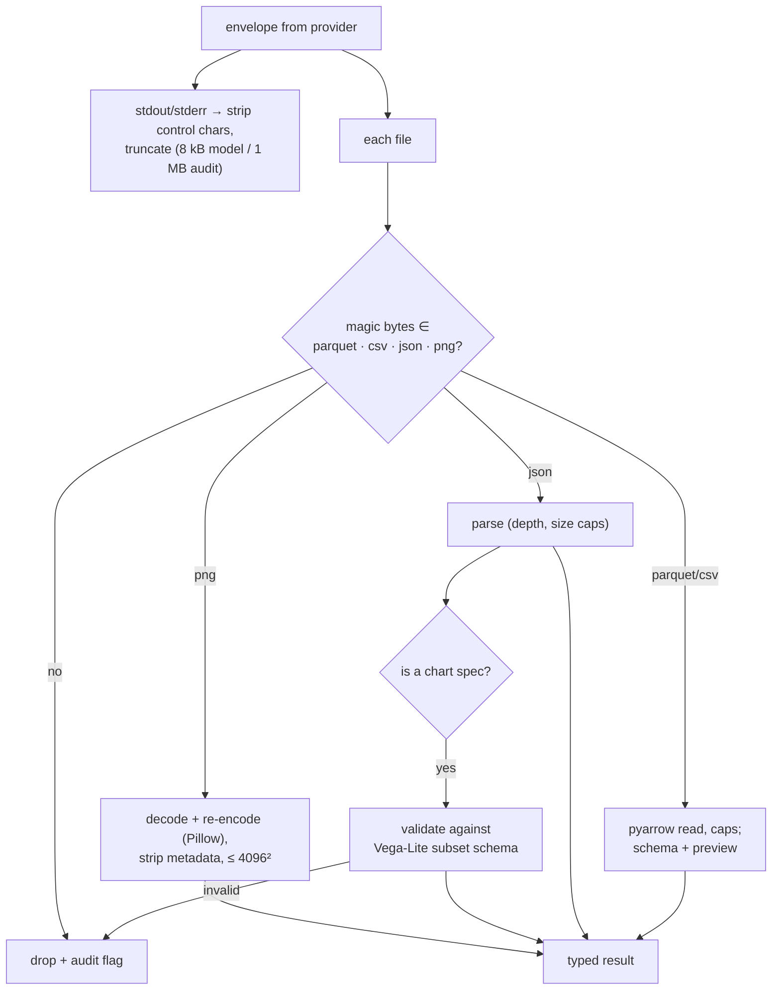

# F5: Output Filter & Chart Validator

| Milestone | Priority | Depends on | Effort | Unblocks |
|---|---|---|---|---|
| M1 | Must | F4 | 3.5 h | F7, F8, F9 |

**Goal:** The "airlock":
- Everything leaving a sandbox is typed, capped and re-checked.
- Charts are Vega-Lite specs validated against a restricted subset before anyone renders them.

## Diagram: filter decisions



## Deliverables / files
```
services/broker/filter/text.py   filter/files.py   filter/images.py   filter/tables.py
services/broker/filter/vegalite_subset.schema.json   # derived from Vega-Lite 6 schema, restricted (03 §3.7)
services/broker/filter/vegalite.py                   # validator + extra string checks (no '<', no javascript:, no data: URLs)
apps/web/lib/charts/validate.ts                      # same checks client-side (defence in depth)
```

## Tasks
- [ ] Type detection by magic bytes; per-type caps; symlink and device-file refusal
- [ ] PNG re-encoding; JSON caps; Parquet/CSV safe reading
- [ ] Vega-Lite subset schema + validator (server) and the same checks in the web app
- [ ] Filter unit tests for every row of E12–E16

## Acceptance criteria
- HTML, SVG, pickle, polyglot and oversized files are dropped and flagged
- Malicious specs (remote `data.url`, `href`, script-like strings) are rejected on both sides

## Tests
- pytest + hypothesis (random bytes never crash the filter; never pass as an allowed type unless they parse)

**Interview talking point:** *"The 2026 sandbox escapes mostly weren't through the wall. They were the
outside trusting what the sandbox produced. So the airlock only lets out four file types, re-encodes
images, and treats a chart as a JSON spec validated against a restricted schema."*
