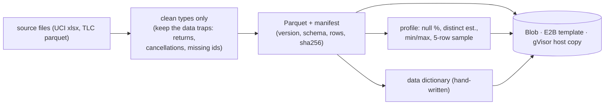

# F6: Datasets & Catalog

| Milestone | Priority | Depends on | Effort | Unblocks |
|---|---|---|---|---|
| M2 | Must | F1 | 3 h (4.5 with uploads) | F7, F11 |

**Goal:** Versioned, read-only Parquet snapshots of **UCI Online Retail II** and an **NYC TLC taxi**
sample, with manifests, profiles and data dictionaries that feed `describe_table`.

## Diagram: snapshot pipeline



## Deliverables / files
```
datasets/build.py                 # download → Parquet → manifest → profile
datasets/online_retail_ii/        # dictionary.md, manifest.json
datasets/nyc_taxi_sample/         # dictionary.md, manifest.json
services/broker/catalog.py        # list_datasets / describe_table backing data
NOTICE.md                         # attributions (UCI CC BY 4.0, NYC TLC)
```

## Tasks
- [ ] Build snapshots with checksums; **keep** realistic data-quality issues (they are benchmark traps)
- [ ] Profiles and dictionaries; samples marked as untrusted data for the model
- [ ] Distribute to E2B template, gVisor host and Blob
- [ ] *(Full plan)* uploads: CSV/Parquet ≤ 50 MB, sniffed, converted, profiled, org-scoped

## Acceptance criteria
- `describe_table` returns the profile in < 100 ms; snapshot checksums verified at sandbox start

**Interview talking point:** *"I kept the messy parts of the data (returns, cancelled invoices, missing
customers) because that's where analysts, human or AI, get the wrong answer."*
