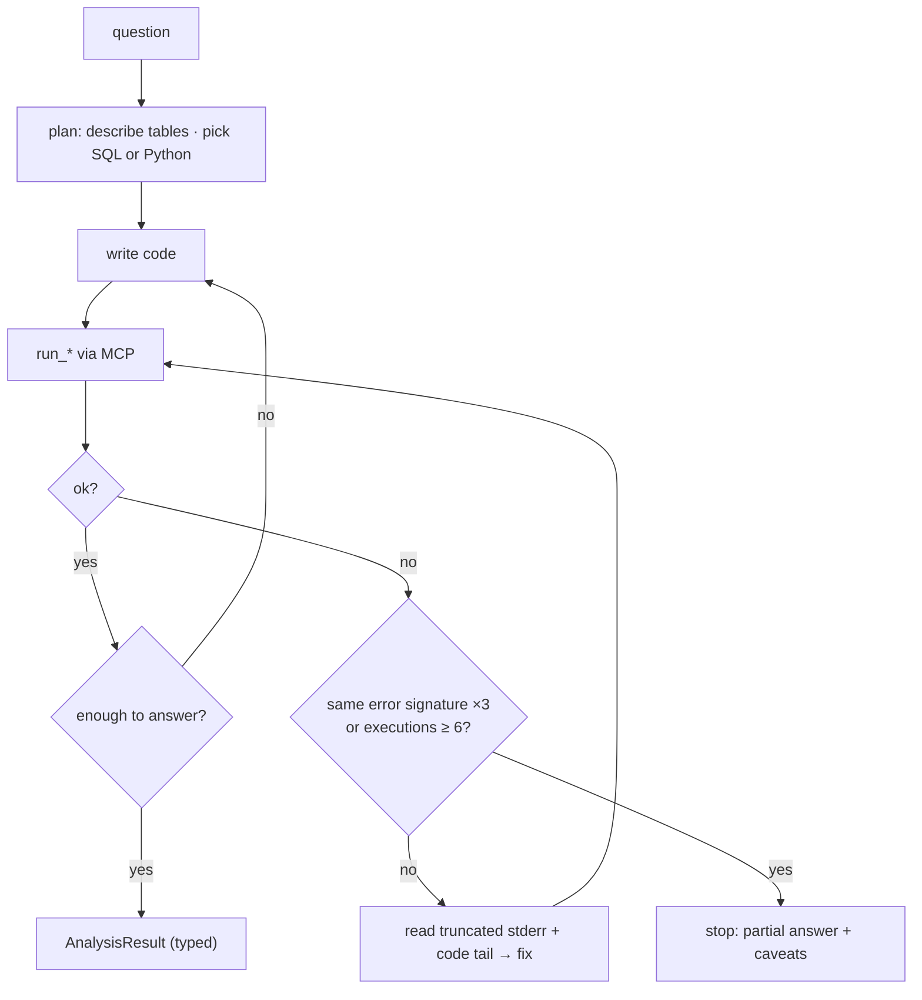

# F7: Analyst Agent

| Milestone | Priority | Depends on | Effort | Unblocks |
|---|---|---|---|---|
| M2 | Must | F4, F5, F6 | 5 h | F8, F10, F11 |

**Goal:** The AI SDK 7 agent that plans, writes code, runs it through the broker, repairs errors within a
budget, and returns a typed `AnalysisResult`.

## Diagram: repair loop



## Deliverables / files
```
apps/web/lib/analyst/agent.ts       # ToolLoopAgent; @ai-sdk/mcp tools; stop conditions
apps/web/lib/analyst/prompt.md      # data is untrusted; show code; state assumptions; impossible → say so
apps/web/lib/analyst/result.ts      # Zod AnalysisResult (03 §3.6)
apps/web/lib/analyst/guards.ts      # execution count, identical-error signature
```

## Tasks
- [ ] MCP client to the broker (JWT per user/org); tools loaded dynamically
- [ ] Prompt with pandas 3 / DuckDB idioms; clarification and impossibility rules
- [ ] Guards; typed result with validated chart spec
- [ ] Cells field: every number traceable to an execution id

## Acceptance criteria
- Solves 8/10 smoke questions on the cheap model; failures end with a partial answer, not a crash

## Tests
- Stub-model tests of the loop (error → fix → success; three identical errors → stop)

**Interview talking point:** *"The agent can fix its own errors, but not forever. After three identical
errors it has to change approach, and after six executions it stops and tells you what it has."*
