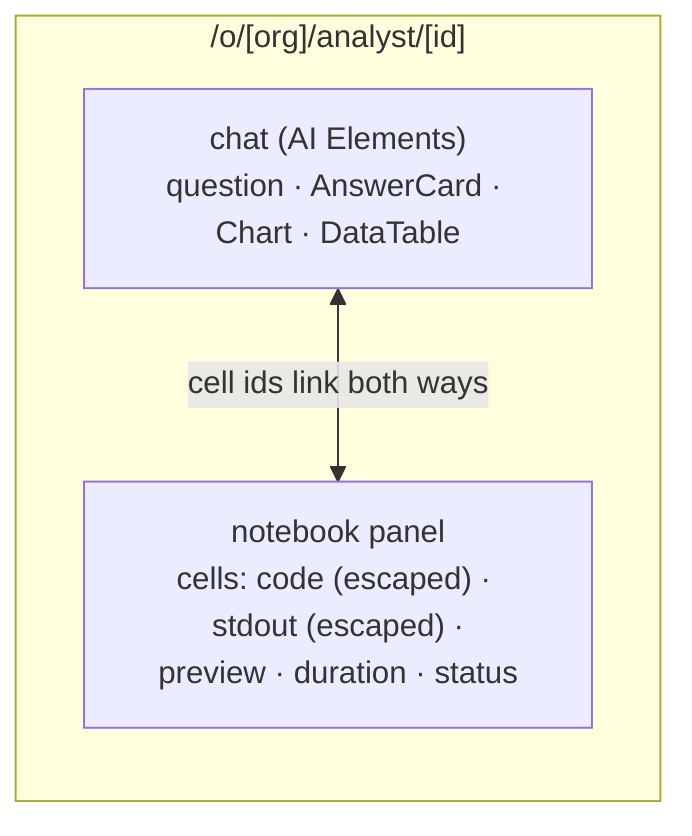
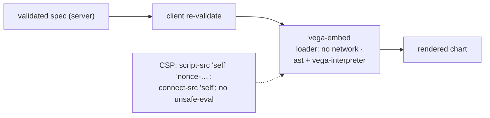

# F8: Analysis UI

| Milestone | Priority | Depends on | Effort | Unblocks |
|---|---|---|---|---|
| M2 | Must | F7 | 4.5 h (5.5 with exports) | F10, F15 |

**Goal:** The analysis page on Project 6's shell:
- chat on the left, a **notebook panel** on the right, with streaming cells;
- `DataTable`, `Chart` (Vega-Lite via vega-interpreter) and `AnswerCard`;
- a strict CSP.

## Diagram: page layout



## Diagram: chart rendering path



## Deliverables / files
```
apps/web/app/o/[org]/analyst/[id]/page.tsx
apps/web/components/analyst/NotebookCell.tsx  DataTable.tsx  Chart.tsx  AnswerCard.tsx
apps/web/proxy.ts                               # CSP for analyst routes (nonce-based)
apps/web/app/api/analyst/files/[id]/route.ts    # org-checked access to broker file handles
```

## Tasks
- [ ] Notebook panel with streaming cells; code and stdout rendered as text only
- [ ] Chart component with vega-interpreter and a disabled network loader; "view spec"
- [ ] DataTable from broker file handles (org-checked route, previews capped)
- [ ] CSP for the analyst routes
- [ ] *(Full plan)* exports: PNG/SVG from Vega, CSV, `.py` script of cells

## Acceptance criteria
- A question shows the failed + fixed cells, the table and the chart; no CSP violations in the console

## Tests
- Component tests (escaping); Playwright happy path

**Interview talking point:** *"Every chart is drawn by our code from a JSON spec, with a CSP that forbids
`eval` and outside connections. The sandbox never gets to put code in your browser."*
