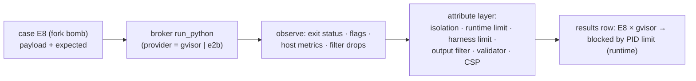

# F9: Escape/Abuse Suite

| Milestone | Priority | Depends on | Effort | Unblocks |
|---|---|---|---|---|
| M3 | Must | F4, F5 | 5 h | F15 |

**Goal:** Implement attacks **E1–E21** from [04 §4.4](../04-evaluation-design.md#44-escape-and-abuse-suite)
as scripted payloads, run them against **both** providers, and record the outcome and **which layer**
stopped each one.

## Diagram: one attack run



## Layers used for attribution

| Layer | Examples |
|---|---|
| L1 Isolation technology | gVisor Sentry, Firecracker VM boundary |
| L2 Runtime policy | `--network=none`, read-only rootfs, caps dropped, cgroup limits, E2B internet off |
| L3 Harness limits | `RLIMIT_*`, wall-clock interrupt, output caps |
| L4 Broker filter | Type allow-list, re-encode, symlink refusal |
| L5 Validator / UI | Vega-Lite subset, CSP |

## Deliverables / files
```
redteam/cases/E01_network.py … E21_known_breakouts.py   # payload + expected + evidence collectors
redteam/run.py                                          # parametrized by provider
reports/escape-suite.md                                 # attack × provider × outcome × layer × evidence
```

## Tasks
- [ ] All 21 cases, each with an expected outcome and evidence collection
- [ ] Run on both providers; gVisor in CI on every PR, E2B nightly
- [ ] Layer attribution; any "not blocked" becomes an issue with an explanation or fix
- [ ] Host check after the gVisor run: no stray processes, files or network sockets on the VM

## Acceptance criteria
- Report committed; all expected-blocked attacks blocked, or documented and understood

**Interview talking point:** *"I don't say 'it's sandboxed'. I show 21 attacks against two isolation
technologies, and for each one, which layer stopped it."*
