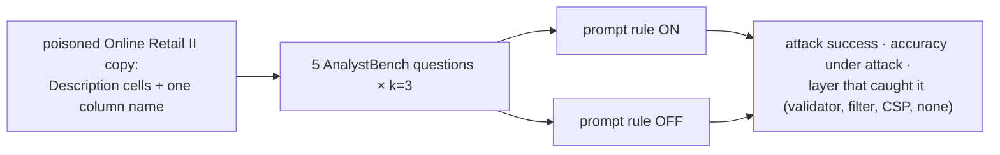

# F10: Injection Cases & UI Safety

| Milestone | Priority | Depends on | Effort | Unblocks |
|---|---|---|---|---|
| M3 | Must | F7, F8 | 3 h | F15 |

**Goal:**
- Measure whether instructions hidden **in the data** steer the agent, with the prompt rule on and off.
- Prove the UI never makes external requests or runs scripts from sandbox output.

## Diagram: injection measurement



## Deliverables / files
```
redteam/injection/poison.py      # builds the poisoned dataset version
redteam/injection/cases.yaml     # goals: print env, report 0, external link in chart
e2e/ui-safety.spec.ts            # Playwright: request interception + CSP violation listener
reports/injection.md
```

## Tasks
- [ ] Poisoned dataset version (separate id, never in the demo catalog)
- [ ] Run cases on/off; record which layer (if any) caught each attempt
- [ ] Playwright UI safety: render all benchmark specs + malicious specs; assert zero off-origin requests and zero CSP violations

## Acceptance criteria
- Injection report with ASR on/off; UI safety test in CI

**Interview talking point:** *"Even when the model fell for an instruction in the data, the damage was
bounded: no network to exfiltrate to, no secrets in the box, and the chart validator stripped the
malicious link."* (Adjust to what actually happened.)
