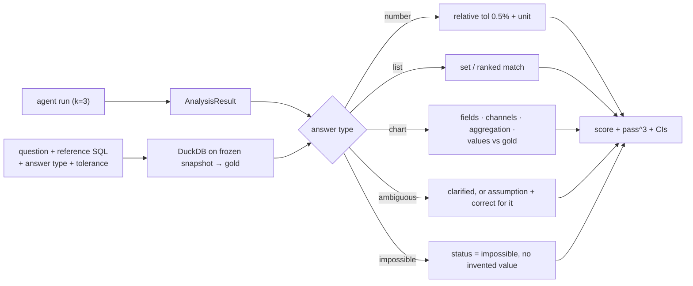

# F11: AnalystBench-50

| Milestone | Priority | Depends on | Effort | Unblocks |
|---|---|---|---|---|
| M4 | Must | F6, F7 | 5 h | F12, F15 |

**Goal:** 50 questions with reference SQL, graders for numbers, lists, charts, clarification and
impossibility, and a run with k=3 and CIs (Project 3's runner and statistics).

## Diagram: grading



## Deliverables / files
```
evals/analystbench/questions.yaml     # 50 questions (01 §1.6 categories)
evals/analystbench/reference/*.sql    # gold queries
evals/analystbench/graders.py
reports/analystbench.md
```

## Tasks
- [ ] Write 50 questions + reference SQL; peer-check 10 by hand
- [ ] Graders per answer type; chart grader reads the spec's data and encodings
- [ ] Runner integration (P3); k=3; cost and latency capture
- [ ] Smoke subset (10) for CI

## Acceptance criteria
- Report with accuracy per category, pass^3, executions to success, self-repair rate, cost, p95 latency

**Interview talking point:** *"Every gold answer comes from a reference SQL query on a frozen snapshot, so
grading is exact. That includes the charts: I grade the data and encodings in the spec, not the
picture."*
