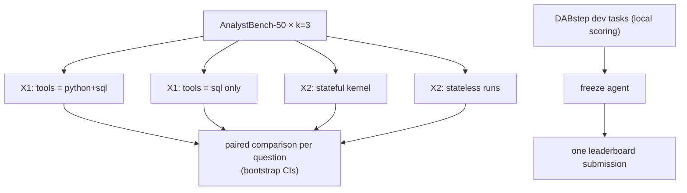

# F12: Experiments & DABstep

| Milestone | Priority | Depends on | Effort | Unblocks |
|---|---|---|---|---|
| M4 | Must | F11 | 3 h (4 with X3, X4) | F15 |

**Goal:**
- Answer the design questions with numbers: X1 (Python+SQL vs SQL-only) and X2 (stateful vs stateless).
- Get one external number from **DABstep**.

## Diagram: experiment matrix



## Deliverables / files
```
experiments/x1_tools.yaml   experiments/x2_state.yaml
evals/dabstep/run.py        # dev set locally; submission file for the leaderboard
reports/experiments.md      reports/dabstep.md
```

## Tasks
- [ ] X1 and X2 on AnalystBench (reuse F11 runs as one arm where possible)
- [ ] DABstep: load tasks and context docs, adapt the agent's output format, run dev locally
- [ ] Freeze the agent version (tag) → one leaderboard submission → record the score with the model named
- [ ] *(Full plan)* X3 execution budget 3 vs 6; X4 model A vs B

## Acceptance criteria
- Experiments report with paired differences and CIs; DABstep dev score and leaderboard entry

**Interview talking point:** *"Code execution is a risk, so I measured what it buys: Python plus SQL
versus SQL-only on the same 50 questions. The difference was __ points, mostly on __."* (Fill in.)
