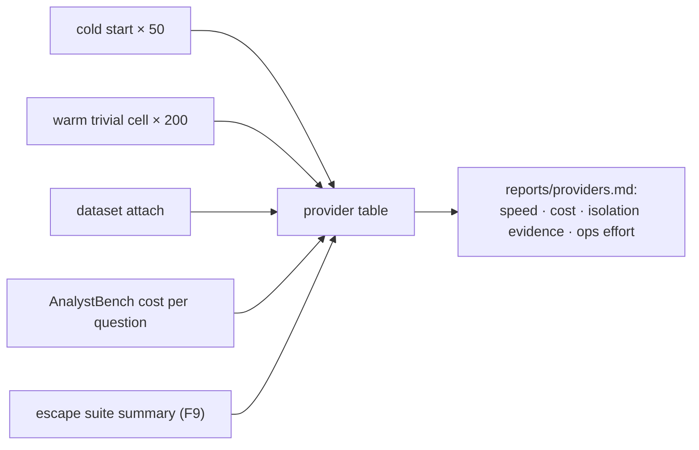

# F13: Provider Benchmark & Observability

| Milestone | Priority | Depends on | Effort | Unblocks |
|---|---|---|---|---|
| M4 | Must | F4 | 2.5 h (3 with concurrency ramp) | F15 |

**Goal:**
- Compare E2B and gVisor on cold start, warm overhead, dataset attach and cost per question.
- Make broker behaviour and security flags visible.

## Diagram: comparison output

## Tasks
- [ ] Benchmarks with fixed seeds and times of day noted
- [ ] Cost: E2B per-second billing; gVisor VM cost amortized at measured throughput
- [ ] OTel spans (broker, provider) to Langfuse; Grafana panel for flags (network attempts, PID-limit hits, dropped outputs)
- [ ] *(Full plan)* concurrency ramp on the gVisor VM

## Acceptance criteria
- `reports/providers.md` with a recommendation ("when I'd choose which"), backed by the table

**Interview talking point:** *"Managed microVMs were __ faster to start; self-hosted gVisor was cheaper at
__ questions a day but cost me __ hours of operations. The table shows where the break-even is."* (Fill in.)
