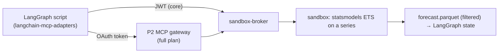

# F14: Capstone Hook (LangGraph MCP Client)

| Milestone | Priority | Depends on | Effort | Unblocks |
|---|---|---|---|---|
| M5 | Should | F4 | 1 h (1.5 via the P2 gateway) | Capstone Forecaster |

**Goal:** Prove the broker is a reusable platform piece. A small LangGraph agent calls `run_python` through
MCP to fit a forecast in the sandbox, which is exactly what the capstone's Forecaster will do.

## Diagram: reuse path

## Tasks
- [ ] Example script in `examples/langgraph_forecaster.py`
- [ ] Audit shows the caller identity as `mcp:<client>`
- [ ] *(Full plan)* register the broker as an upstream in the Project 2 gateway

## Acceptance criteria
- The script produces a forecast file through the broker; the audit record shows the caller

**Interview talking point:** *"The sandbox isn't tied to one app. Any agent that speaks MCP can use it,
with the same limits and audit. The capstone's forecasting agent does exactly that."*
