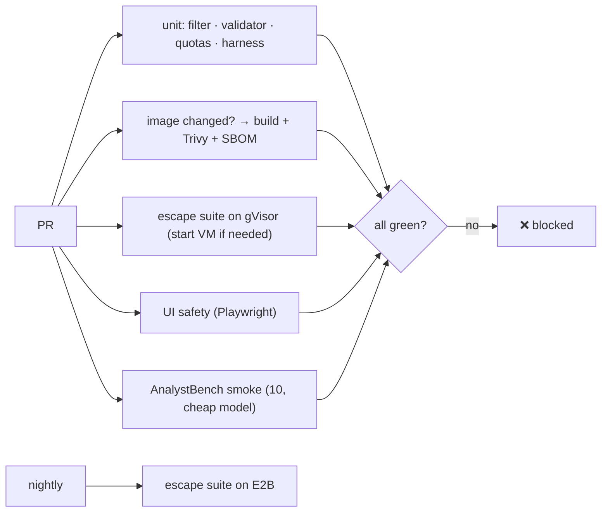

# F15: CI Gate, Demo, Report & Video

| Milestone | Priority | Depends on | Effort | Unblocks |
|---|---|---|---|---|
| M5 | Must | F9–F13 | 3.5 h (4 full) | Job applications |

**Goal:** A CI gate that protects every control, a public demo (E2B), and a README, post and video built
around the isolation evidence.

## Diagram: CI gate

## Tasks
- [ ] CI jobs above; demo a PR that re-enables networking in the runner config → blocked by E1
- [ ] Public demo: Online Retail II + taxi sample on E2B; per-user daily quota; cheap model
- [ ] README: pitch, architecture, the escape table, provider comparison, AnalystBench + DABstep numbers
- [ ] Post: "What it takes to run AI-written code safely"; 3-minute video (question → cells → chart → an attack being blocked)
- [ ] Update the résumé bullet template in `03-projects.md` with real numbers

## Acceptance criteria
- The demo PR is blocked; every README number links to its report and commit

**Interview talking point:** *"If someone accidentally turns the sandbox network back on, CI fails on
the network attack before the change can merge."*
