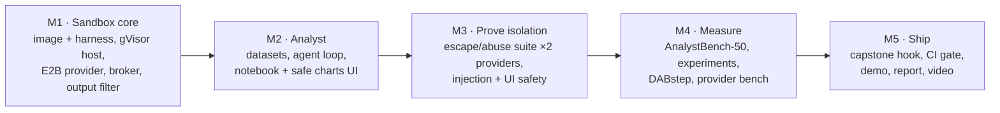
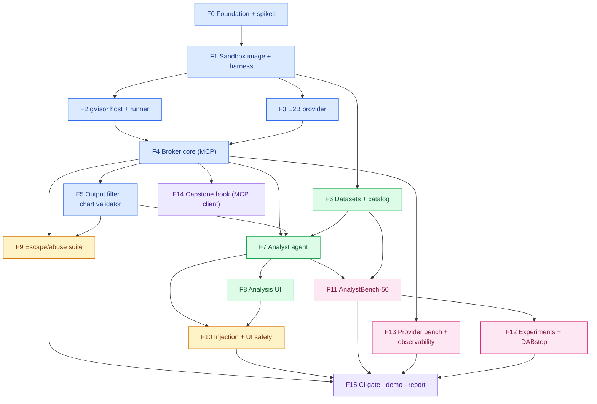
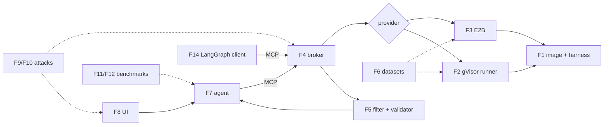
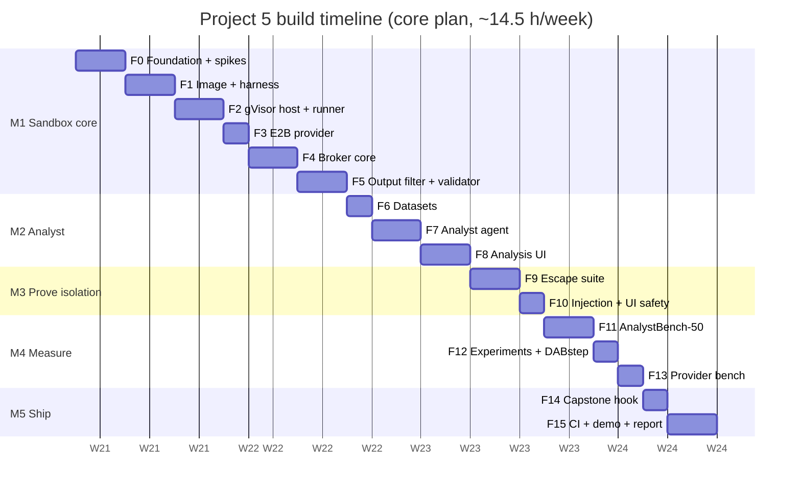

# 9. Build Plan: Feature by Feature

This plan splits Project 5 into **16 features** (F0–F15), grouped into **5 milestones**. Every feature has
its own page with diagrams, files, tasks, acceptance criteria, tests, an estimate and an interview
talking point.

**Prerequisite:** Project 6's shell packages (auth, AI Elements, layout) exist. Project 2's FastMCP
patterns and Project 3's runner and statistics are reused.

## 9.1 Build strategy: the box first, then the airlock, then the analyst, then the attacks

Five rules:
1. **Isolation before intelligence.** The sandbox, its limits and the output filter exist and are tested
   before any model writes code into them.
2. **The first attack test lands with the first sandbox.** E1–E3 (no network, no DNS, no metadata) run
   in CI from F2/F3 onwards. The full suite (F9) grows from there.
3. **Same image, same limits, same tests for both providers.** Any difference is a finding, recorded in
   the provider comparison.
4. **Nothing leaves the sandbox unchecked.** Every new output type needs a filter rule and a test before
   the UI can show it.
5. **Each feature ends with a PR, green CI and a `CHANGELOG.md` entry.**

## 9.2 Master diagram: how the features connect

Arrows mean **"is required by"** (build the source first). Colours show milestones.

**Legend:** blue = M1 Sandbox core · green = M2 Analyst · amber = M3 Prove isolation · pink = M4 Measure ·
purple = M5 Ship.

## 9.3 Runtime integration map

## 9.4 Feature index

| ID | Feature | Milestone | Priority | Depends on | Effort (h) | Page |
|---|---|---|---|---|---|---|
| F0 | Foundation & spikes | M1 | Must | — | 3.5 | [F00](F00-foundation.md) |
| F1 | Sandbox image & harness | M1 | Must | F0 | 4 | [F01](F01-image-harness.md) |
| F2 | gVisor host & runner | M1 | Must | F1 | 4.5 | [F02](F02-gvisor-runner.md) |
| F3 | E2B provider | M1 | Must | F1 | 3 | [F03](F03-e2b-provider.md) |
| F4 | Broker core (MCP, sessions, quotas, audit) | M1 | Must | F2, F3 | 5 | [F04](F04-broker-core.md) |
| F5 | Output filter & chart validator | M1 | Must | F4 | 3.5 | [F05](F05-output-filter.md) |
| F6 | Datasets & catalog | M2 | Must | F1 | 3 (4.5 with uploads) | [F06](F06-datasets.md) |
| F7 | Analyst agent | M2 | Must | F4, F5, F6 | 5 | [F07](F07-analyst-agent.md) |
| F8 | Analysis UI | M2 | Must | F7 | 4.5 (5.5 with exports) | [F08](F08-analysis-ui.md) |
| F9 | Escape/abuse suite | M3 | Must | F4, F5 | 5 | [F09](F09-escape-suite.md) |
| F10 | Injection cases & UI safety | M3 | Must | F7, F8 | 3 | [F10](F10-injection-ui-safety.md) |
| F11 | AnalystBench-50 | M4 | Must | F6, F7 | 5 | [F11](F11-analystbench.md) |
| F12 | Experiments & DABstep | M4 | Must | F11 | 3 (4 with X3, X4) | [F12](F12-experiments-dabstep.md) |
| F13 | Provider benchmark & observability | M4 | Must | F4 | 2.5 (3 with concurrency ramp) | [F13](F13-provider-bench.md) |
| F14 | Capstone hook (LangGraph MCP client) | M5 | Should | F4 | 1 (1.5 via P2 gateway) | [F14](F14-capstone-hook.md) |
| F15 | CI gate, demo, report & video | M5 | Must | F9–F13 | 3.5 (4 full) | [F15](F15-ship.md) |
| | **Total: full plan / core plan (recommended)** | | | | **~64 h / ~59 h** | |

## 9.5 Timeline: three options

The roadmap gives Project 5 **2 weeks** (weeks 34–35). Once again, the design is larger than that:

| Option | Scope | Effort | Weeks |
|---|---|---|---|
| A. Full plan | All features at full scope | ~64 h | ~4.5 |
| **B. Core plan (recommended)** | Both providers with the full escape suite, output filter + safe charts, the analyst agent with notebook UI, AnalystBench-50, X1 + X2 experiments, a DABstep dev run **and** one leaderboard submission, provider benchmark, capstone hook. **Deferred:** dataset uploads, UI exports, X3/X4, the concurrency ramp, fronting the broker with the P2 gateway | **~59 h** | **4 at ~14.5 h/week** |
| C. Lean | B with **E2B only** (gVisor deferred), 30 benchmark questions, no DABstep, no capstone hook | ~47 h | ~3.5 |

**Why B:**
- The headline of this project is **isolation compared with evidence**: two technologies, one attack
  suite, and which layer stopped what.
- C removes the self-hosted provider, which is the part that shows you can operate isolation, not just
  buy it. It's also what makes this project different from a typical "used E2B" demo.
- The DABstep submission is cheap and gives an external number.

**Roadmap impact (to update once you choose):** P5 grows from 2 to 4 weeks with B, which adds **2 weeks**
and takes the roadmap from ~42 to **~44 weeks (about 10 months)**. With C it adds 1.5 weeks (~43.5
weeks).

**Core plan, week by week** (would be roadmap weeks 34–37)

| Week | Roadmap week | Milestone | Features | Exit check |
|---|---|---|---|---|
| 1 | 34 | M1 | F0 foundation + spikes · F1 image + harness · F2 gVisor host + runner · F3 (start) | A cell runs in gVisor with **E1–E3 blocked** (no network, DNS or metadata) |
| 2 | 35 | M1 → M2 | F3 E2B (finish) · F4 broker core · F5 output filter · F6 datasets · F7 (start) | Broker MCP tools work on **both** providers; filter drops HTML/SVG/pickle |
| 3 | 36 | M2 → M3 | F7 agent · F8 analysis UI · F9 escape suite · F10 (start) | **Question → notebook cells → safe chart**; full escape suite green on both providers |
| 4 | 37 | M3 → M5 | F10 (finish) · F11 AnalystBench · F12 experiments + DABstep · F13 provider bench · F14 capstone hook · F15 ship | Reports committed; DABstep submitted; demo + post + video |

Week 4 is the heaviest (~16.5 h). If it slips, F14 and the DABstep submission move into week 5.

*(Dates are illustrative: Project 5 starts after Project 6's 6 weeks. One "d" is one working session of
about 2–2.5 hours.)*

**Deferred in B (~5 h)**

| Item | Effort | Value when added |
|---|---|---|
| Dataset uploads (CSV/Parquet, profiling) | 1.5 h | Use your own data in the demo |
| UI exports (PNG/SVG, CSV, `.py`) | 1 h | Nicer demo |
| X3 (execution budget) + X4 (model comparison) | 1 h | Two more findings |
| gVisor concurrency ramp | 0.5 h | Capacity numbers |
| Broker behind the P2 gateway; polish | 1 h | Full platform story |

## 9.6 Milestone exit criteria

| Milestone | Done when |
|---|---|
| **M1 Sandbox core** | One image runs on gVisor and E2B; the harness enforces limits; the broker's MCP tools create, reuse, reap and audit sessions on both providers; the output filter and Vega-Lite validator have unit tests; E1–E3 blocked on both. |
| **M2 Analyst** | Asking a question in the web app streams notebook cells, a table and a validated chart; the agent repairs a failing cell; every number is linked to a cell. |
| **M3 Prove isolation** | E1–E21 run against both providers with layer attribution; injection cases measured with the prompt rule on/off; UI safety tests show no external requests or CSP violations. |
| **M4 Measure** | AnalystBench-50 (k=3) with CIs; X1/X2 results; DABstep dev score and one leaderboard submission; provider cold-start/cost table. |
| **M5 Ship** | A LangGraph script uses the broker via MCP; CI blocks a PR that weakens a control; public demo (E2B); reports, post and video. |

## 9.7 Definition of done (every feature)

- [ ] PR with green CI (lint, types, tests, image scan when the image changes)
- [ ] New output type or tool → filter rule + test first
- [ ] New sandbox capability → escape-suite case(s) updated
- [ ] Audit events for new execution paths
- [ ] No secrets in the image, env or logs (scanner + test)
- [ ] Docs updated (this plan's checkboxes, the setup guide, `CHANGELOG.md`)

## 9.8 Risk register

| Risk | Impact | Mitigation |
|---|---|---|
| E2B network setting doesn't fully block DNS/metadata | Core assumption fails | Spike in F0; E1–E3 in CI; switch the default to gVisor if needed |
| gVisor compatibility/performance issues with pandas/DuckDB | Provider parity | Spike in F0; platform tuning; document gaps honestly |
| Runner on the gVisor host becomes an attack path | Host compromise | mTLS, private NIC only, fixed-image API, no generic Docker access |
| Vega-Lite subset too restrictive for useful charts | Weaker UI | Start with the chart types AnalystBench needs; PNG fallback |
| Agent loops on errors | Cost, latency | Execution budget + identical-error guard |
| Azure VM cost if left running | Budget | Stop/start scripts; budget alert |
| Scope creep (internet access, GPUs, arbitrary packages) | Timeline, risk | Out-of-scope list in [01 §1.8](../01-requirements.md#18-scope) is binding |
| Plan longer than the roadmap slot | Later projects slip | Options A/B/C; roadmap updated once an option is chosen |
