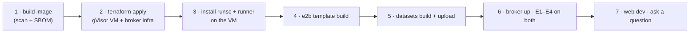

# 10. Setup Guide: accounts, keys and the first run

> **Status:** No code exists yet. This page is the **target setup**: commands become real as F0–F8 are
> built and may change slightly. Keep it in sync with the repo.

## 10.1 What you need, and when

| Needed from | Tool / account | Used for | Cost |
|---|---|---|---|
| **M1** | Everything from Project 6's setup (Node 24 + pnpm, uv, Docker, Vercel, Neon/Postgres) | Web shell, broker DB | As in Project 6 |
| M1 | **E2B** account + API key, **E2B CLI** (template builds) | Managed provider | Hobby tier free for development |
| M1 | **Azure** subscription, Azure CLI, **Terraform** | gVisor VM, broker, Blob | VM ≈ $0.2/h while running; stop when idle |
| M1 | **Trivy** and **Syft** (CI images or local installs) | Image scan, SBOM | Free |
| **M2** | Anthropic and/or OpenAI keys | Agent | Pay per use (cheap tier for development) |
| M2 | Langfuse (existing account) | Traces | Free tier |
| **M4** | Hugging Face account | DABstep dataset and leaderboard submission | Free |

## 10.2 Environment variables

```bash
# --- Broker (services/broker/.env) ---
DATABASE_URL=postgresql://broker:…@…/analyst
E2B_API_KEY=                                  # broker only; never in the web app or the image
E2B_TEMPLATE=analyst@sha256:…
GVISOR_RUNNER_URL=https://10.0.2.4:8443       # private IP
GVISOR_RUNNER_CA=./certs/ca.pem
GVISOR_RUNNER_CLIENT_CERT=./certs/broker.pem
GVISOR_RUNNER_CLIENT_KEY=./certs/broker.key
DEFAULT_PROVIDER=e2b                          # or gvisor
BROKER_JWT_KEYS='{"2027-05":"<random 32 bytes, base64>"}'
DATASET_STORE=https://<account>.blob.core.windows.net/datasets
QUOTA_SANDBOX_MINUTES_PER_DAY=60

# --- Web (apps/web/.env.local), in addition to Project 6's variables ---
BROKER_MCP_URL=https://broker.<env>/mcp
BROKER_JWT_KEYS='{"2027-05":"<same key ring>"}'
ANTHROPIC_API_KEY=
OPENAI_API_KEY=
```

The **sandbox image and the sandboxes receive no environment variables with secrets**. E7 checks this
on every run.

## 10.3 First run



```bash
make image                       # docker build + trivy + syft
cd infra/terraform && terraform apply
scripts/vm-start.sh && ssh-via-bastion 'sudo bash infra/gvisor/install.sh'
e2b template build --config sandbox-image/e2b.toml
uv run python datasets/build.py --upload
uv run uvicorn services.broker.app:app      # or deploy to Container Apps
uv run pytest redteam -k "E01 or E02 or E03 or E04" --provider gvisor --provider e2b
pnpm --filter web dev                       # http://localhost:3000 → /o/<org>/analyst
scripts/vm-stop.sh                          # when done: stop paying for the VM
```

## 10.4 Keeping costs safe

| Control | Setting |
|---|---|
| gVisor VM | Stop when idle (`vm-stop.sh`); budget alert on the resource group |
| E2B | Hard sandbox timeout at creation; reaper; the Hobby tier while developing |
| Quotas | `QUOTA_SANDBOX_MINUTES_PER_DAY` per user; execution budget per question |
| Models | Cheap tier for development and smoke tests; the main model only for recorded benchmark runs |
| Escape suite on E2B | Nightly, not per PR |

## 10.5 Troubleshooting

| Symptom | Likely cause | Fix |
|---|---|---|
| E1 (network) passes on E2B, i.e. the network is reachable | Sandbox created without disabling internet access | Check the provider's create call; the test must fail the build |
| `runsc` containers fail to start | Runtime not registered or wrong platform | Check `/etc/docker/daemon.json`; `runsc --version`; the gVisor docs for the platform flag |
| pandas very slow on gVisor | I/O-heavy operations under gVisor | Use DuckDB for aggregations; check the gVisor platform setting; larger VM |
| Broker can't reach the runner | mTLS cert mismatch or NSG rule | Check certs and that the broker subnet is allowed on the runner port |
| Charts don't render | CSP blocks the interpreter or the spec fails validation | Check the console; "view spec" shows validator errors |
| Orphaned sandboxes / E2B bill growing | Reaper not running | Hard timeouts should kill them anyway; check the reaper logs |
