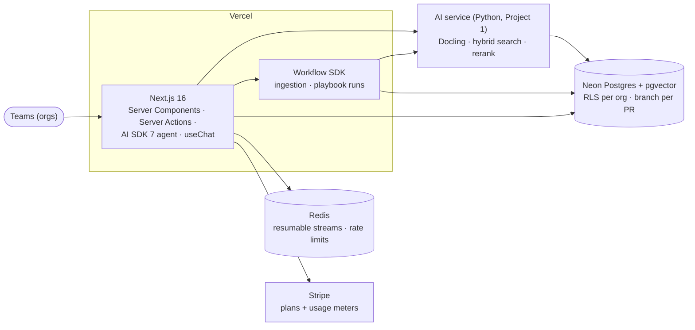

# Project 6: AI SaaS on Next.js (ClauseDesk)

> **ClauseDesk** is a multi-tenant contract-review SaaS. Teams upload contracts, chat with cited answers,
> and run **playbooks** that fill a **clause register** with risk flags. It is built on **Next.js 16** and
> **AI SDK 7**, with durable workflows, Postgres row-level security, Stripe usage billing and a Python AI
> service reused from Project 1. Extraction quality is measured on the public **CUAD** dataset.

**Target roles:** AI Full-stack Engineer (primary), GenAI Engineer
**Gaps it closes:** Next.js (App Router, Server Components/Actions, caching, `proxy.ts`), Vercel AI SDK
(agents, generative UI parts, tool approvals, resumable streams), durable workflows, multi-tenant SaaS
(RLS, RBAC), usage-based billing, preview environments, E2E testing
**Status:** 🟡 System design and tech stack done (no code yet). Build plan and setup guide come next.
**Builds on:** [Project 1](../01-rag-eval-lab/README.md) (parsing, retrieval, citation checks, evals) ·
[Project 3](../03-agent-reliability-harness/README.md) (statistics code)

> **New here?** Start with [0 · Start here](docs/00-start-here.md): the project in plain English, one
> user's journey, and which document to read next.

## Design documents

| # | Document | What it answers |
|---|---|---|
| 0 | [Start Here](docs/00-start-here.md) | The project in plain English, a user's journey, reading paths, FAQ |
| 1 | [Requirements](docs/01-requirements.md) | Why contract review, components, functional and non-functional requirements, success criteria, scope |
| 2 | [High-Level Architecture](docs/02-architecture.md) | Context, containers, routes, chat + resumable stream, playbook workflow, approvals, billing flow, deployment |
| 3 | [Low-Level Design](docs/03-low-level-design.md) | Data model, RLS, roles, agent tools, playbooks and extraction, workflows, credits and quotas, APIs, UI parts |
| 4 | [Evaluation Design](docs/04-evaluation-design.md) | CUAD extraction evals, chat evals, E2E on previews, isolation suite, billing accuracy, performance, CI gate |
| 5 | [Security & Threat Model](docs/05-security-threat-model.md) | Tenant isolation, Server Actions, stream hijack, prompt injection, uploads, billing abuse, OWASP LLM mapping |
| 6 | [Non-Functional Design](docs/06-non-functional.md) | Latency budget, rendering strategy, cost, observability, failure modes, scaling, testing |
| 7 | [Architecture Decision Records](docs/07-decisions.md) | 13 decisions with alternatives and consequences |
| 8 | [Tech Stack](docs/08-tech-stack.md) | Every technology (Next.js 16.3, AI SDK 7, Workflow SDK, Better Auth, Drizzle + Neon, Stripe…), why, alternatives, versions, week-1 checks |
| 11 | [Glossary](docs/11-glossary.md) | Next.js, AI SDK, SaaS and contract terms in plain English |

Numbers 9, 10 and 12 are reserved for the build plan, setup guide and market review, matching Projects 1–4.

## The system at a glance

## Planned deliverables
1. A deployed SaaS with sign-up, organizations and roles, a document library and viewer, chat with
   citations, playbooks and the clause register, and billing in Stripe test mode
2. Durable ingestion and playbook workflows that survive deploys
3. An **extraction report** on CUAD (per clause type, two models, with and without human review)
4. An **isolation report** (zero cross-tenant leaks across every path) and a billing reconciliation report
5. E2E tests and Lighthouse budgets on every PR's preview deployment
6. A 3-minute video and a post

## Résumé bullet template
"Built and deployed a multi-tenant AI SaaS (Next.js 16, AI SDK 7, FastAPI, Postgres RLS + pgvector) with
durable extraction workflows, resumable streaming, tool approvals and Stripe usage billing; __ F1 on CUAD
clause extraction, 0 cross-tenant leaks, LCP __ s."
