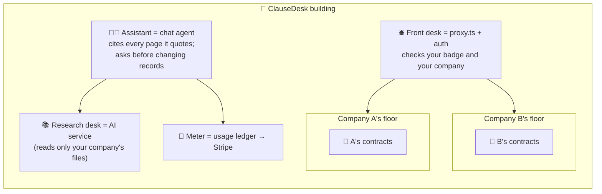

# 0. Start Here: the project in plain English

New to these docs, or preparing for an interview? Read this page first. Unfamiliar terms are explained in
the [glossary](11-glossary.md).

## 0.1 The project in three sentences

1. **ClauseDesk** is a contract-review web app for teams. You upload contracts, ask questions and get
   answers with clickable sources, and you run a "playbook" that fills in a table of key terms (renewal,
   liability cap, notice period…) for every contract, with risk flags.
2. It's built like a **real SaaS**:
   - sign-up and teams with roles;
   - each customer's data walled off in the database;
   - usage-based billing with Stripe;
   - answers that keep streaming after a page refresh;
   - long jobs that survive restarts.
3. It's **measured like a real product**:
   - extraction accuracy on a public, lawyer-labelled contract dataset (CUAD);
   - end-to-end browser tests on every pull request;
   - a tenant-isolation test suite;
   - speed budgets.

## 0.2 Which path should you read?

| You want to… | Read, in this order | Time |
|---|---|---|
| Explain the project in an interview | This page → [Architecture](02-architecture.md) → [Decisions](07-decisions.md) | 30 min |
| Understand the design | [Requirements](01-requirements.md) → [Architecture](02-architecture.md) → [Low-level design](03-low-level-design.md) | 1 h |
| Understand how it's measured | [Evaluation design](04-evaluation-design.md) | 15 min |
| Understand the security story | [Security & threat model](05-security-threat-model.md) | 15 min |
| Understand speed and cost | [Non-functional design](06-non-functional.md) | 10 min |
| Understand the technology choices | [Tech stack](08-tech-stack.md) | 20 min |
| Start building | This page → [Setup guide](10-setup-guide.md) → [Build plan](09-build-plan/README.md) → the feature page you're on | 45 min |

## 0.3 The mental model: a shared office building with one law library

| Building idea | Real component | Why it matters |
|---|---|---|
| Floors per company, locked doors | Postgres **row-level security** | Even a code bug can't show company B's files to company A |
| Front desk | `proxy.ts` + Better Auth | Knows who you are and which company you're working for |
| Assistant who cites pages | AI SDK agent + citation check | Every claim links to the exact spot in a contract |
| Night-shift clerks who finish big jobs | Durable **workflows** | A 40-contract review keeps going through restarts |
| Electricity meter | Usage ledger + Stripe meters | Customers pay for what they use, and can't overspend |

## 0.4 One user's journey

| Step | What happens | Tech |
|---|---|---|
| 1 | Priya signs up, creates "Acme Procurement", invites Omar as a member | Better Auth + organization plugin |
| 2 | She uploads 40 vendor contracts | Direct-to-blob upload; **ingestion workflow** parses and indexes each one, with statuses streaming in |
| 3 | She runs the "Vendor review" playbook | **Playbook workflow**: 40 documents × 10 clause types, structured outputs with citations |
| 4 | The register shows 6 contracts that auto-renew with > 60 days' notice, flagged **high** | Risk rules on structured values |
| 5 | She asks in chat: "Which of these renew before March?" | Agent calls `query_register` → table part renders in chat |
| 6 | She refreshes the tab mid-answer; the answer continues | **Resumable stream** (Redis) |
| 7 | The agent suggests correcting a notice period; she approves | **Tool approval** + audit event |
| 8 | Acme passes its free credits; she upgrades to Pro | Stripe Checkout; webhook; metered usage from now on |

## 0.5 What makes this project stand out in interviews

- **Current stack, used properly:** Next.js 16 (Server Components, Server Actions, `"use cache"`,
  `proxy.ts`), AI SDK 7 (agents, typed UI parts, tool approvals), durable workflows.
- **SaaS depth most AI portfolios skip:** multi-tenancy with RLS, roles, metering and billing,
  preview environments with database branches.
- **A polyglot architecture with reasons:** a TypeScript product plus a Python AI service reused from
  Project 1.
- **Numbers:** CUAD extraction F1, resumable-stream success rate, zero-leak isolation suite,
  Core Web Vitals.

## 0.6 FAQ

**Why keep a Python service instead of doing everything in Next.js?**
Document parsing and the evaluated retrieval pipeline already exist in Python (Project 1). Rewriting them
would lose the evidence. The service boundary also shows how tenancy is enforced across services.
([ADR-008](07-decisions.md))

**Why is RLS needed if the code already filters by organization?**
Because one missed filter is enough to leak a customer's contracts. RLS makes the database refuse, so
it's a second, independent lock. ([ADR-006](07-decisions.md))

**Why workflows? Can't a background promise do it?**
On serverless platforms, work started inside a request can be cut off, and a deploy kills it. Durable
workflows save progress after each step and resume. ([ADR-004](07-decisions.md))

**Is this legal advice?**
No. It extracts and highlights what contracts say, and every page says so.

**Is this the code?**
Not yet. These are the design documents, the [tech-stack rationale](08-tech-stack.md) and the
[build plan](09-build-plan/README.md), written before any code.
