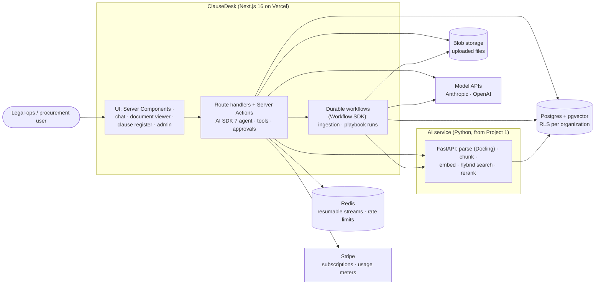

# 1. Requirements

## 1.1 Problem statement

Many "AI apps" in portfolios are a chat box on a demo page. The **AI Full-stack Engineer** roles in 2026
ask for something else: a product that real teams can sign up for and pay for, and that keeps each
customer's data separate. It has to stream answers that survive a page refresh, run long AI jobs
reliably, show structured results instead of walls of text, and hold up under tests.

**Goal:** Build **ClauseDesk**, a multi-tenant contract-review SaaS on **Next.js 16** and **AI SDK 7**,
reusing Project 1's retrieval as a Python service. It should look and behave like a real product and be
measured like one:

1. **Chat with citations** across a workspace's contracts, with a document preview that highlights the
   cited text.
2. **Extraction playbooks:** run a set of clause questions (renewal, liability cap, termination notice…)
   over many contracts as a **durable background workflow**, producing a reviewable **clause register**
   with risk flags.
3. **SaaS foundations:** organizations, roles, invitations, per-tenant isolation (row-level security),
   usage metering, Stripe billing, rate limits and quotas.
4. **Production quality:** resumable streams, preview environments per PR, end-to-end tests, Core Web
   Vitals budgets, and evals of extraction quality on a public expert-labelled dataset (**CUAD**).

## 1.2 What gets built

| # | Component | What it is |
|---|---|---|
| C1 | **Web app** | Next.js 16 App Router: marketing page, sign-up, workspace dashboard, document library, contract viewer, chat, clause register, playbooks, members, billing and usage pages |
| C2 | **Chat agent** | AI SDK 7 agent in a route handler: tools for search, reading clauses and the register; structured tool results rendered as UI components; **tool approval** for anything that writes |
| C3 | **Durable workflows** | Workflow SDK (`"use workflow"` / `"use step"`): document ingestion, and playbook runs over many documents with progress, retries and resume after deploys |
| C4 | **AI service** | Project 1's Python code as an internal FastAPI service: parsing, chunking, embeddings, hybrid retrieval, reranking, clause segmentation |
| C5 | **Tenancy & auth** | Better Auth with the organization plugin: orgs, members, roles, invitations; Postgres RLS keyed on the active organization |
| C6 | **Billing & metering** | Stripe subscriptions + usage meters (AI credits); per-org quotas and rate limits enforced before any model call |
| C7 | **Quality** | Playwright E2E on preview deployments, CUAD extraction evals, chat citation evals (Project 1 metrics), RLS isolation tests, Lighthouse budgets |

### Why contract review?

| Reason | Detail |
|---|---|
| **Real B2B SaaS shape** | Teams, roles, shared documents, audit, and per-seat plus usage pricing all make sense here |
| **Public, expert-labelled data** | **CUAD**: 510 commercial contracts, 41 clause types, labelled by trained law students (CC BY 4.0). It serves as demo data and as ground truth for extraction evals |
| **Needs structured UI** | A clause register, risk flags and highlighted sources show generative UI better than chat alone |
| **Reuses Project 1** | Parsing, chunking, hybrid search, reranking and citation checks already exist |
| **Different from Project 1** | Project 1 is a RAG *lab* (single user, evals). This is a *product* (tenants, billing, workflows, UX) |

## 1.3 Users & use cases

| Actor | Use case |
|---|---|
| **Workspace owner** | Signs up, creates an organization, picks a plan, invites teammates, sees usage and invoices |
| **Reviewer** (member) | Uploads contracts; asks "Which vendor contracts auto-renew in the next 90 days?"; runs the "Vendor review" playbook over 40 contracts; reviews and corrects the clause register |
| **Viewer** | Reads documents, chats, exports the register; can't upload, run playbooks or change data |
| **Admin** | Manages members and roles, playbook templates, and data retention; reads the audit log |
| **Developer (you)** | Ships behind preview environments; sees evals, E2E and performance budgets per PR |

## 1.4 Functional requirements

### Documents and ingestion

| ID | Requirement | Priority |
|---|---|---|
| FR-1 | Upload PDF/DOCX (≤ 20 MB, ≤ 200 pages) with type sniffing and size checks; direct-to-blob upload with a signed URL | Must |
| FR-2 | **Ingestion workflow:** parse → chunk → embed → index → clause segmentation, with per-document status streamed to the UI; retries per step | Must |
| FR-3 | Document viewer: rendered pages with **highlighted source spans** for any citation | Must |
| FR-4 | Seed a demo workspace with ~50 CUAD contracts | Must |
| FR-5 | Delete a document and all its derived data (chunks, embeddings, register rows) | Must |

### Chat

| ID | Requirement | Priority |
|---|---|---|
| FR-6 | Streaming chat scoped to the workspace or to selected documents; **every claim cites a source span** or says it can't find one | Must |
| FR-7 | Tools: `search_contracts`, `get_clause`, `query_register` (structured filters, e.g. "auto-renews before 2027-03-01"), `open_document` | Must |
| FR-8 | Tool results rendered as **typed UI parts** (citation cards, mini clause tables, date timeline) | Must |
| FR-9 | **Resumable streams:** refresh or reconnect mid-answer and the answer continues | Must |
| FR-10 | Persistent chat history per user and organization; rename, delete | Must |
| FR-11 | Write tools (`update_register_entry`, `flag_for_legal`) require **user approval** in the UI | Should |
| FR-12 | Stop generation; regenerate; model picker (two models) | Should |

### Playbooks and the clause register

| ID | Requirement | Priority |
|---|---|---|
| FR-13 | Playbook = named set of clause questions, each with an output schema (e.g. `{auto_renews: bool, renewal_term_months: int, notice_days: int}`) and optional risk rules | Must |
| FR-14 | Built-in playbooks mapped to CUAD clause types (e.g. "Vendor review": 10 types) | Must |
| FR-15 | **Playbook run workflow:** fan out over N documents, extract with structured outputs and citations, write register rows, compute risk flags; progress, cancel, resume after deploy | Must |
| FR-16 | Clause register: table with filters, confidence, citation link, risk flag; **human review** (accept / edit / reject), with edit history | Must |
| FR-17 | Export register as CSV | Must |
| FR-18 | Custom playbooks (user-defined questions + schema) | Should |

### Tenancy, auth, billing

| ID | Requirement | Priority |
|---|---|---|
| FR-19 | Sign up / sign in (email + password, Google OAuth), email verification; optional passkeys | Must |
| FR-20 | Organizations with roles `owner`, `admin`, `member`, `viewer`; invitations; switch active org | Must |
| FR-21 | **Tenant isolation**: every tenant table has `org_id` and a Postgres RLS policy; the app sets the org per transaction; the AI service enforces the same | Must |
| FR-22 | Plans: Free (limited credits), Pro, Team; Stripe Checkout + Customer Portal | Must |
| FR-23 | **Usage metering**: AI credits from model tokens and pages ingested, recorded per org and reported to Stripe meters; usage page | Must |
| FR-24 | Quotas and rate limits checked **before** each model call or workflow start; clear upgrade prompts | Must |
| FR-25 | Audit log: sign-ins, member changes, uploads, deletions, playbook runs, approvals, exports | Should |
| FR-26 | Data retention setting per org (auto-delete documents after N days) | Could |

## 1.5 Non-functional requirements (targets)

| Area | Target |
|---|---|
| Chat latency | Time to first token p95 ≤ 1.5 s (excluding cold starts); first UI paint of a tool result ≤ 300 ms after the tool returns |
| Page performance | Core Web Vitals on the dashboard and viewer: LCP ≤ 2.5 s, INP ≤ 200 ms, CLS ≤ 0.1 (Lighthouse CI on previews) |
| Resumability | ≥ 99% of refreshed/reconnected streams complete with the full answer (E2E test) |
| Workflows | A 50-document playbook run completes despite one forced deploy/restart mid-run; no duplicate register rows |
| Isolation | 0 cross-tenant reads in the isolation test suite (API, RLS, AI service, blob URLs, stream resume) |
| Billing accuracy | Metered credits match provider-reported usage within 1% on a test month |
| Extraction quality | Reported per clause type on CUAD (precision, recall, F1) with CIs; target set after the baseline |
| Cost | Demo ≤ $20/month; CI evals ≤ $2 per PR |

## 1.6 Success criteria

1. A stranger can sign up on the public demo, create a workspace, run a playbook on demo contracts and
   chat with citations, **all in under 5 minutes**.
2. The E2E suite runs on every PR's preview deployment and covers sign-up, upload, chat (including a
   refresh mid-stream), playbook run, approval and billing in Stripe test mode.
3. The isolation suite proves no cross-tenant access through any path.
4. The extraction report shows CUAD F1 per clause type, and what human review changed.
5. The README shows the architecture, the numbers and a 3-minute video.

## 1.7 Scope

**In scope:**
- The web app, the chat agent, durable workflows, and reuse of the Project 1 service.
- Tenancy, auth, billing and metering.
- Evals, E2E tests, preview environments and the demo.

**Out of scope:**
- Real legal advice (a disclaimer on every page).
- Contract drafting or redlining.
- E-signatures.
- SSO/SAML (Better Auth supports it, but it's a Could).
- Mobile apps.
- An LLM gateway (that's [Project 7](../../../03-projects.md)).
- Sandboxed code execution (that's Project 5).

**Time box:** 6 weeks, roadmap weeks 28–33 (core plan, [build plan §9.5](09-build-plan/README.md#95-timeline-option-b-core-plan-chosen)).
