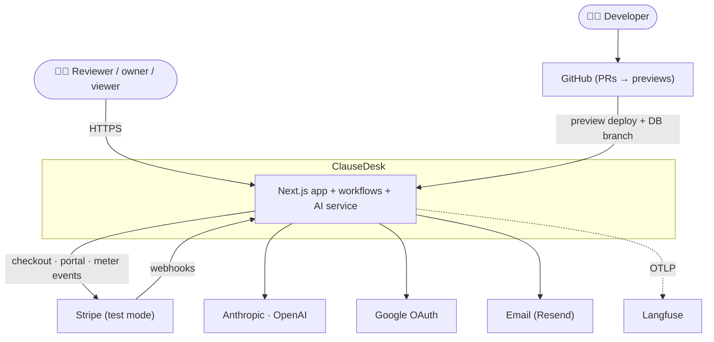
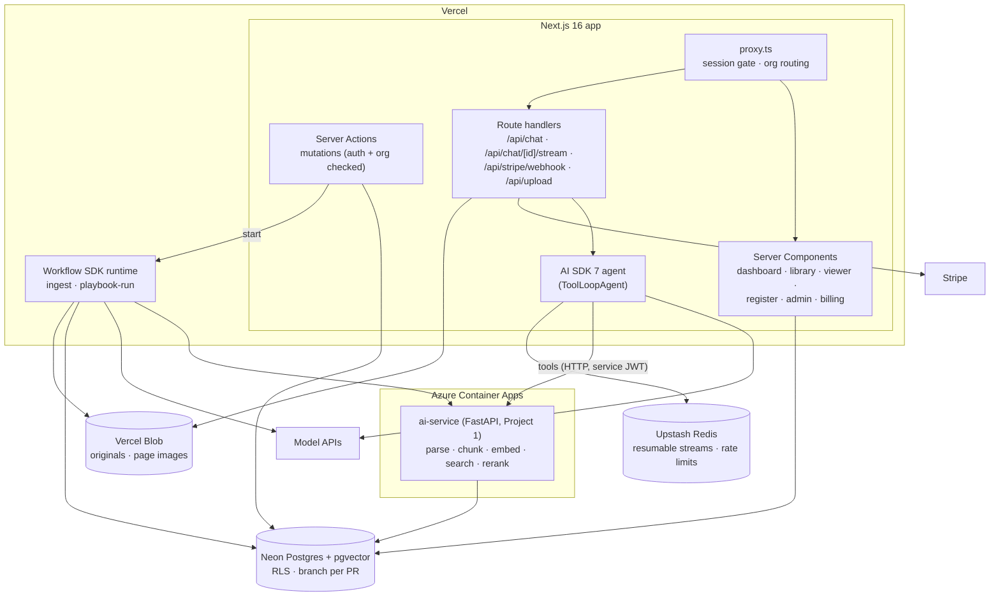
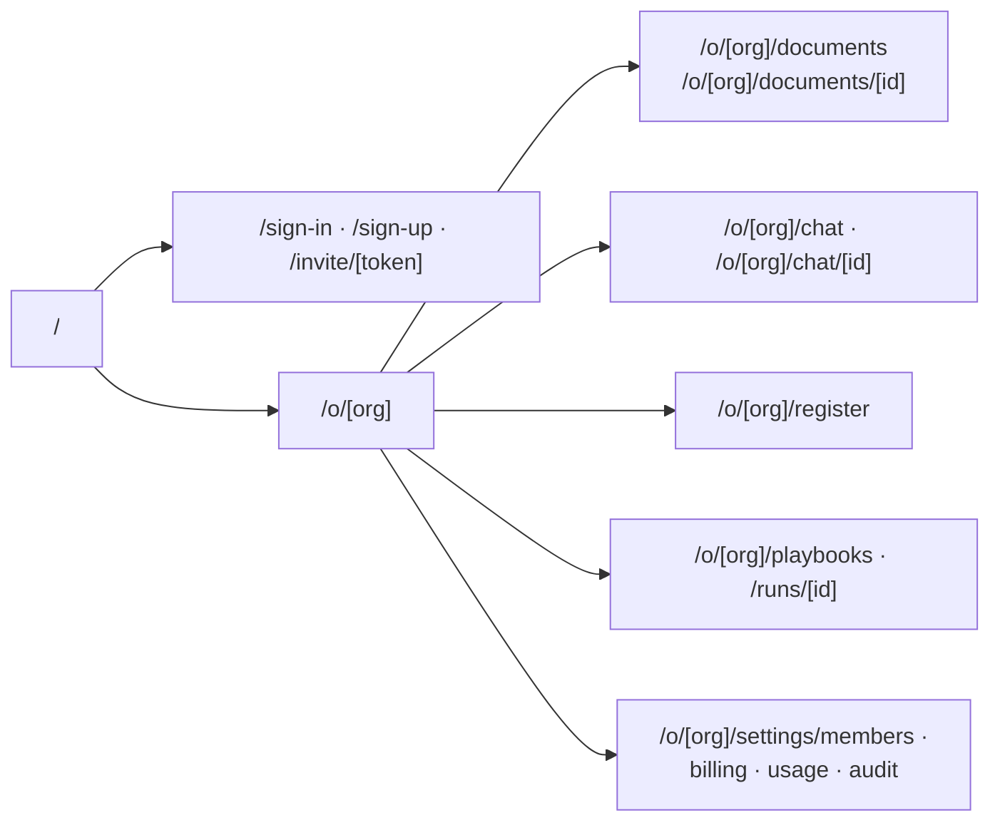
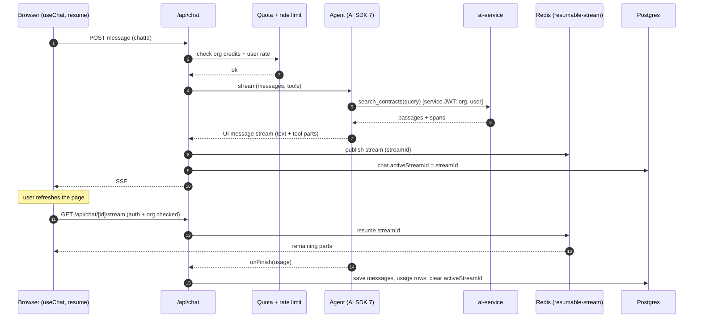
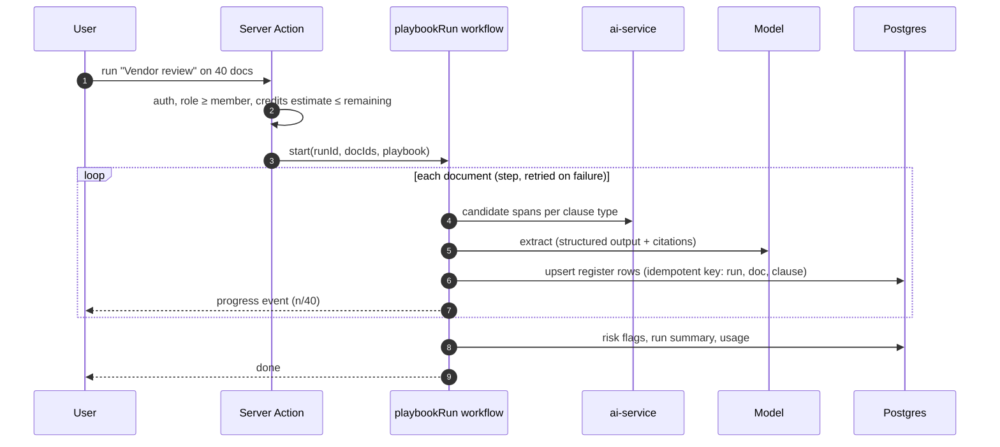
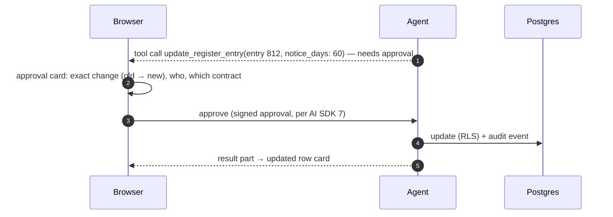
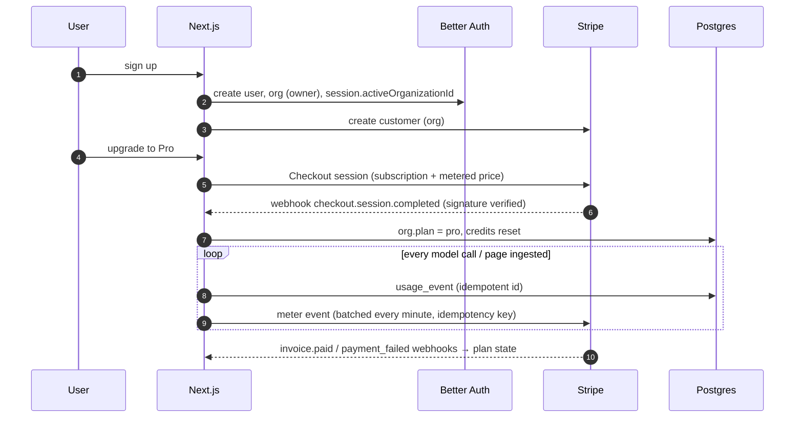
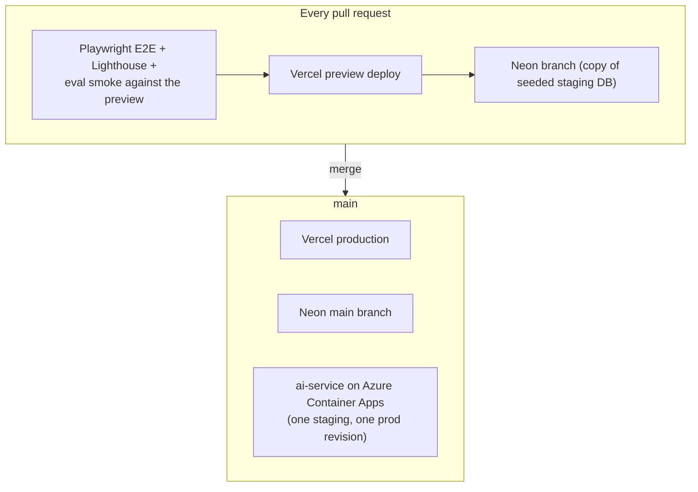

# 2. High-Level Architecture

## 2.1 Design principles

1. **The server renders; the client streams.** Pages are Server Components that read data directly.
   Client components exist only where interaction is needed (chat, viewer highlights, tables).
2. **Tenant isolation lives in the database.** RLS is the last line of defence, so a missed `where
   org_id = …` in app code still can't leak data.
3. **Anything longer than a request is a workflow.** Ingestion and playbook runs are durable workflows
   with steps, retries and resume. They never run as a fire-and-forget promise inside a request.
4. **Check before you spend.** Quotas and rate limits are checked before any model call or workflow
   start, and usage is recorded from the provider's own token counts.
5. **Structured over free text.** Extraction uses schemas, tool results are typed, and the UI renders
   typed parts.
6. **Python where it's strongest, TypeScript where the user is.** Document AI (parsing, retrieval)
   stays in Project 1's Python service. Product logic, agent orchestration and UI live in Next.js.
7. **Every PR is a working copy of production:** a preview deployment, a database branch and an E2E run.

## 2.2 System context (C4 level 1)



## 2.3 Containers (C4 level 2)



| Container | Responsibility |
|---|---|
| **Next.js app** | UI, auth, org switching, mutations, chat agent, Stripe integration, usage checks |
| **proxy.ts** | Redirect signed-out users; resolve the active org from the URL (`/o/[slug]/…`); security headers |
| **Workflow runtime** | Durable ingestion and playbook runs (steps, retries, sleep, progress streaming) |
| **ai-service** | Project 1's document AI behind an internal API; enforces the org from a signed service token |
| **Neon Postgres** | All relational data, embeddings (pgvector) and RLS; a database branch per preview |
| **Upstash Redis** | Resumable stream buffers; sliding-window rate limits |
| **Vercel Blob** | Uploaded files and rendered page images (private; signed, short-lived URLs) |

## 2.4 Route map



## 2.5 Data flow A: chat with citations and a resumable stream



The generation runs in `after()`, so tokens keep being produced after the first response closes. The
resume GET **checks the session and org** before re-attaching. The reference implementation leaves this
out, and it is attack T3 in the threat model.

## 2.6 Data flow B: playbook run as a durable workflow



Each document is one **step**:
- A crash or deploy resumes at the next unfinished document.
- Upserts keyed by `(run_id, document_id, clause_type)` make retries safe.
- Cancel sets a flag that the next step checks.

## 2.7 Data flow C: tool approval in chat



## 2.8 Data flow D: sign-up → org → subscription → metering



## 2.9 Deployment view



The ai-service is shared by previews (staging revision). Previews use their own Neon branch, and the
service token carries which database branch to use. If that proves awkward, previews fall back to a
staging database ([ADR-010](07-decisions.md)).

## 2.10 Proposed repository layout

```
clausedesk/
├─ apps/web/                       # Next.js 16
│  ├─ app/(marketing)/  app/(auth)/  app/o/[org]/…
│  ├─ app/api/chat/route.ts  app/api/chat/[id]/stream/route.ts  app/api/stripe/webhook/route.ts
│  ├─ proxy.ts
│  ├─ lib/ai/          # agent, tools, UI part types, prompts
│  ├─ lib/db/          # Drizzle schema, RLS helper (withOrg), migrations
│  ├─ lib/auth/        # Better Auth config (organization plugin)
│  ├─ lib/billing/     # Stripe, meters, quotas, rate limits
│  ├─ workflows/       # ingest.ts, playbook-run.ts
│  └─ components/      # AI Elements + shadcn/ui; register table; viewer
├─ services/ai/                    # Project 1 code as FastAPI (Python)
├─ evals/                          # CUAD extraction, chat citations, isolation, billing accuracy
├─ e2e/                            # Playwright
├─ infra/                          # Terraform (ai-service on Azure), Neon/Vercel config
└─ docs/
```
