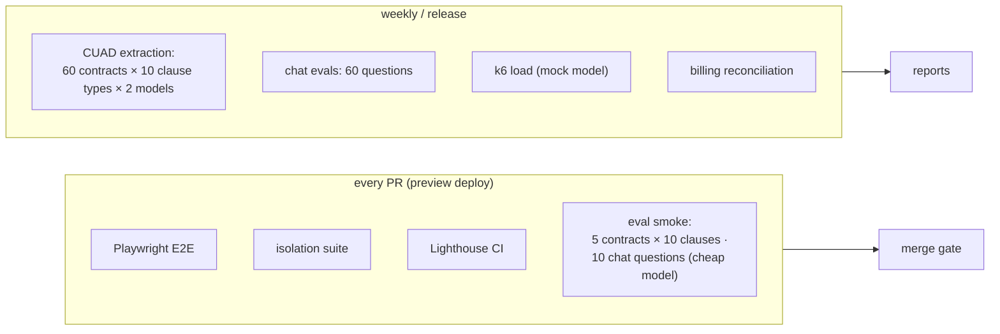

# 4. Evaluation Design

A SaaS is judged by more than answer quality. This project measures five things:

| # | Question | Suite |
|---|---|---|
| Q1 | Are extractions right? | CUAD extraction evals (§4.2) |
| Q2 | Are chat answers grounded and cited? | Chat evals, reusing Project 1 metrics (§4.3) |
| Q3 | Does the product work end to end, on every PR? | Playwright E2E on previews (§4.4) |
| Q4 | Is each tenant's data safe, and is billing right? | Isolation + billing suites (§4.5, §4.6) |
| Q5 | Is it fast? | Latency, Core Web Vitals, load (§4.7) |

## 4.1 Data

- **CUAD v1** (CC BY 4.0): 510 contracts with expert span labels for 41 clause types. The evals use a
  fixed **test set of 60 contracts** (not in the demo workspace) and the **10 clause types** in the
  built-in playbooks.
- Gold values are CUAD's labelled spans. For structured fields (like notice days), a small hand-labelled
  layer (≈ 200 values) is added on top of CUAD spans, because CUAD labels spans, not normalized values.

## 4.2 Extraction evals (CUAD)

| Metric | Definition |
|---|---|
| **Presence F1** | Did we correctly decide whether the clause exists? (per clause type) |
| **Span recall / precision** | Do our citations overlap CUAD's labelled spans? (token overlap ≥ 0.5 counts as a hit) |
| **Value accuracy** | For the hand-labelled structured fields: exact or tolerance match |
| **Risk-flag accuracy** | Flags computed from gold vs predicted values agree |
| **Cost per document** | Credits and $ per contract for a 10-clause playbook |

Statistics: bootstrap CIs over contracts, and paired comparisons between variants (Project 3's stats code).

**Experiments:**

| # | Question |
|---|---|
| X1 | Model A vs model B (quality and cost per document) |
| X2 | One call for all clauses vs one call per clause type (§3.5 trade-off) |
| X3 | Retrieval candidates (top-6 reranked) vs whole-document context for short contracts |
| X4 | Human review impact: how many entries reviewers change on a 10-contract sample, and of what kind |

## 4.3 Chat evals

60 questions over the demo workspace:
- **Single-document:** 20.
- **Cross-document register questions:** 20, e.g. "which contracts have uncapped liability?".
- **Unanswerable:** 10.
- **Injection-bearing documents:** 10 (§5).

These reuse Project 1's metrics: faithfulness, **citation precision/recall**, answer correctness against
gold answers, and abstention accuracy on unanswerable questions. For register questions, answers are
checked against a SQL-computed gold set.

## 4.4 End-to-end tests (Playwright, on every preview)

| Flow | Assertions |
|---|---|
| Sign up → create org → invite member → member accepts | Roles correct; member sees the org |
| Upload 2 contracts → ingestion completes | Status transitions streamed; viewer renders pages |
| Chat question → answer with citations → click citation | Viewer opens at the highlighted span |
| **Refresh mid-stream** | The answer resumes and completes; no duplicate message |
| Run playbook on 5 docs → cancel → rerun → complete | Progress updates; no duplicate register rows |
| Approval: agent proposes a register change → approve / reject | Row changes only on approve; audit event exists |
| Viewer role | Upload and run buttons absent; direct Server Action call returns 403 |
| Upgrade (Stripe test card) → metered usage visible | Plan changes after the webhook; usage page updates |

Models are **mocked** in E2E (the AI SDK's mock providers with recorded streams), so the tests are fast,
free and deterministic. A separate nightly job runs 3 flows with real models.

## 4.5 Tenant isolation suite

Two orgs (A and B) with seeded data. Every attempt below runs as a user of A against B's resources and
must fail:

| Path | Attempt |
|---|---|
| Pages | `/o/b-slug/documents/<B doc id>` |
| Server Actions | Call delete/rename/review with B's ids |
| Route handlers | `/api/chat` with B's chat id; `/api/chat/<B chat>/stream` resume |
| Blob | Guess/replay a B file URL after the signed URL expires |
| ai-service | Service token for A, search with B's document ids |
| Direct SQL (unit) | As `app_user` with `app.org_id = A`, select B's rows → 0 rows |
| Workflows | Start a playbook run with B's document ids |
| Chat retrieval | A's question whose best match is in B's documents → no B citations |

Target: **0 leaks**. Any failure blocks the merge.

## 4.6 Billing accuracy

A scripted "month" of usage (chat, uploads, playbooks) in Stripe test mode with a test clock. Checks:
- Credits recorded equal credits computed from the provider's token counts (± 1%).
- Meter events reported to Stripe equal the recorded credits (no double counting after retries, thanks
  to idempotency keys).
- Invoices match the plan and the overage.
- Webhooks replayed out of order still end in the correct state.

## 4.7 Performance

| Metric | Target | How |
|---|---|---|
| TTFT (chat) p95 | ≤ 1.5 s | Server timing + OTel, real models, 50 samples |
| Tool-result UI paint | ≤ 300 ms after tool output | Browser performance marks (Playwright) |
| LCP / INP / CLS (dashboard, viewer, register) | ≤ 2.5 s / ≤ 200 ms / ≤ 0.1 | Lighthouse CI on previews |
| Chat endpoint under load | 50 concurrent streams, error rate < 1% | k6 against a mock model provider |
| Register table with 5,000 rows | Filter < 100 ms | Server-side pagination + indexes |

## 4.8 CI gate

| Check | Blocks merge if |
|---|---|
| Typecheck, lint, unit tests (Vitest), Python tests | Any failure |
| Isolation suite | Any leak |
| E2E on preview | Any failure |
| Lighthouse CI | A budget in §4.7 is exceeded on a key page |
| Eval smoke | Presence F1 or citation precision drops > 10 points vs `main` |
