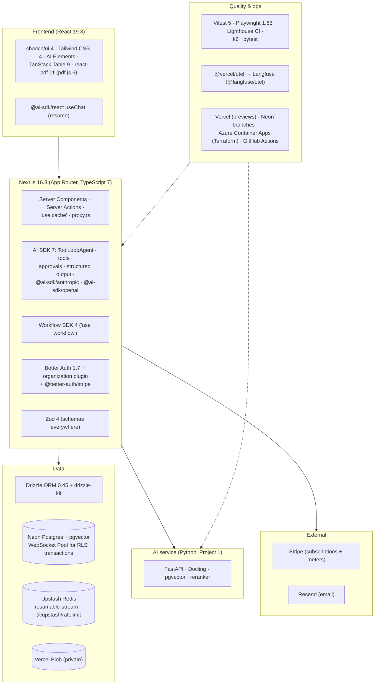

# 8. Tech Stack: What We Use and Why

For every technology in this project, this document answers five questions:
1. **What does it do in this system?**
2. **Why was it chosen?**
3. **What alternatives were considered, and why weren't they chosen?**
4. **What does it add to your profile?**
5. **When would we replace it?**

Selection criteria (same idea as Projects 1–4, adjusted for a product):

| # | Criterion | Meaning |
|---|---|---|
| C1 | **Market value** | What 2026 AI Full-stack JDs ask for (see [01-market-analysis](../../../01-market-analysis.md)) |
| C2 | **Gap-filling** | Covers the biggest gaps on your profile: Next.js, AI SDK, SaaS plumbing (see [00-profile-gap-analysis](../../../00-profile-gap-analysis.md)) |
| C3 | **Tenant safety** | Makes isolation enforceable and testable |
| C4 | **Product speed** | Gets a polished, working product out in weeks, not months |
| C5 | **Reuse** | Reuses Projects 1–4 (retrieval, evals, stats, Terraform, Langfuse) |
| C6 | **Low cost** | Demo ≈ $10–20/month; free tiers where they're enough |

---

## 8.1 The stack at a glance

## 8.2 Summary table

| Layer | Choice | One-line reason | Main alternative (not chosen) |
|---|---|---|---|
| Framework | **Next.js 16.3** (App Router) | The most requested React framework in AI full-stack JDs; Server Components/Actions, `"use cache"`, `proxy.ts` | Remix / React Router 7 (less JD demand), Vite SPA (no server rendering) |
| Language | **TypeScript 7** (native compiler) | Type safety across UI, server and schemas; much faster type-checking | — |
| UI library | **React 19.3** | Comes with Next.js 16; Actions, `useOptimistic` | — |
| Components | **shadcn/ui 4 + Tailwind CSS 4** | Owned, accessible components; the default in the Next.js + AI SDK ecosystem | MUI / Chakra (heavier, own theme systems) |
| AI chat UI | **AI Elements** | Ready components for messages, tool parts, approvals, sources, built on shadcn | Hand-built chat UI |
| Tables | **TanStack Table 9** | Headless, handles sorting/filtering for the register | AG Grid (heavy, licensing for some features) |
| PDF viewer | **react-pdf 11 (pdf.js 6)** + highlight overlay from Docling bounding boxes | Precise citation highlights on the real page | Rendering page images only (no text layer), commercial viewers |
| AI toolkit | **AI SDK 7** (`ai`, `@ai-sdk/react`, `@ai-sdk/anthropic`, `@ai-sdk/openai`) | Agents, typed UI parts, tool approval, structured outputs, streaming | Provider SDKs directly (more code); LangChain.js (less common here) |
| Resumable streams | **`resumable-stream` + Upstash Redis** | The AI SDK's documented path for resume | Ably/durable sessions (another vendor) |
| Durable workflows | **Workflow SDK 4** (`workflow`) | `"use workflow"`/`"use step"`, managed on Vercel, Postgres World for self-hosting | Inngest, Trigger.dev, Temporal |
| Auth | **Better Auth 1.7** + organization plugin | Self-hosted, orgs/roles/invitations built in; Auth.js is in maintenance | Clerk (hosted), Auth.js (maintenance only) |
| Billing | **Stripe** (SDK 22) + **@better-auth/stripe** for subscriptions; raw Stripe SDK for meter events | Plans and checkout with little code; our own ledger for usage | Autumn / Polar (extra layer), Stripe LLM-proxy billing |
| ORM | **Drizzle ORM 0.45** + drizzle-kit | Typed SQL, first-class RLS policies (`pgPolicy`), light client | Prisma (heavier; awkward with transaction-local settings) |
| Database | **Neon Postgres + pgvector** (via **WebSocket `Pool`**) | Branch per PR; serverless; same Postgres + pgvector as Project 1 | Supabase (auth/RLS overlap), Azure Postgres (no branching) |
| Validation | **Zod 4** | One schema for forms, Server Actions, tool inputs and structured outputs | Valibot (smaller, less ecosystem) |
| Cache / rate limit | **Upstash Redis + @upstash/ratelimit** | Serverless-friendly HTTP Redis; sliding windows | Vercel KV (now Upstash-backed anyway) |
| File storage | **Vercel Blob** (private, signed URLs) | Direct uploads from the browser; no server bandwidth | S3/R2 (fine; one more account) |
| Email | **Resend** (+ React Email) | Simple API; templates in React | SES (more setup) |
| AI service | **FastAPI** (Project 1 code), Docling, pgvector, reranker | Reuse of evaluated retrieval | Rewriting in TS |
| Observability | **@vercel/otel + @langfuse/otel**; AI SDK telemetry | One place for traces, same as Projects 1–4 | Vercel Observability only, LangSmith |
| Testing | **Vitest 5, Playwright 1.63, Lighthouse CI, k6, pytest** | Unit, E2E on previews, performance budgets, load | Cypress (fine; Playwright is the 2026 default) |
| Hosting | **Vercel** (web + workflows + blob) · **Azure Container Apps** (ai-service) | Previews per PR; reuse of Azure Terraform | All on Azure (loses previews/managed workflows) |
| CI/CD | **GitHub Actions** + Vercel Git integration + Neon branch action | Previews + DB branches + tests per PR | — |

---

## 8.3 Detailed rationale

### Framework and UI

#### Next.js 16.3 (App Router)
- **Role:**
  - Every page and layout.
  - Server Components for data pages.
  - Server Actions for mutations.
  - Route handlers for chat, stream resume, uploads and webhooks.
  - `proxy.ts` for the session gate and org routing.
  - `"use cache"` with org-scoped tags for lists.
- **Why:** It's the biggest gap on your profile and the most common framework in AI full-stack JDs
  (C1, C2). Version 16 changed the mental model:
  - caching is explicit (`"use cache"`), not implicit;
  - `proxy.ts` replaces middleware;
  - Turbopack is the default bundler.
  Knowing these differences is exactly what interviewers probe in 2026.
- **Watch:**
  - Server Actions are public endpoints: `requireRole` in each one ([03 §3.3](03-low-level-design.md#33-authorization-matrix)).
  - Every cache key includes the org id ([06 §6.2](06-non-functional.md#62-rendering-strategy)).
- **Not chosen:** React Router 7 / Remix (excellent, less demand); TanStack Start (young).
- **Revisit:** If you move off Vercel, the stable Build Adapters API (16.2) supports other platforms.

#### shadcn/ui 4 + Tailwind CSS 4 + AI Elements
- **Role:**
  - shadcn/ui: app components (forms, dialogs, data table shell, sidebar, auth pages from shadcn blocks).
  - AI Elements: the chat (messages, tool-call parts, sources, approvals, prompt input).
- **Why:** The components live in the repo (no black box), they're accessible (Radix primitives), and
  they are the de-facto standard with Next.js and the AI SDK (C1, C4).
- **Not chosen:** MUI/Chakra (heavier, their own styling systems); a fully custom design system (slow).

#### TanStack Table 9 and react-pdf 11
- **Register:**
  - TanStack Table with server-side pagination and filtering.
  - Column filters map to the same allow-listed filter DSL the agent uses (`query_register`), so the UI and the agent share one query path.
- **Viewer:**
  - react-pdf (pdf.js 6) renders pages with a text layer.
  - Citations are highlighted with an overlay built from **Docling's bounding boxes**, stored with each chunk by the ai-service.
  - DOCX files are converted to PDF during ingestion, so there's only one viewer.

### AI layer

#### AI SDK 7
- **Role:**
  - A `ToolLoopAgent` in `/api/chat`.
  - Typed tool parts rendered by AI Elements.
  - **Tool approval** for the two write tools.
  - **Structured outputs** (Zod schemas) for extraction inside workflow steps.
  - `useChat` with `resume` on the client.
  - Provider packages for Anthropic and OpenAI.
- **Why:** It's the TypeScript AI toolkit named in full-stack AI JDs (C1). Version 7 (June 2026) added
  first-class agents, approvals, durable agents (`@ai-sdk/workflow`) and telemetry. Those are the exact
  features this product needs.
- **Watch:**
  - v7 is new, so pin versions and read the migration notes.
  - Resumable streams and **abort** don't combine cleanly (a documented limitation). "Stop" ends the stream server-side, and resume then loads the saved partial message.
- **Not chosen:** Calling the provider SDKs directly (you'd rebuild streaming UI protocols); LangChain.js.
- **Revisit:** Project 7 adds a gateway in front (a provider change, not a rewrite).

#### `resumable-stream` + Upstash Redis
- **Role:** Buffers each chat stream under a `streamId`, and lets `GET /api/chat/[id]/stream` re-attach.
  Generation continues in `after()`.
- **Why:** It's the AI SDK's documented approach (C4).
- **Watch:** The reference resume endpoint has **no auth**. Ours checks the session and chat ownership (T3).
- **Not chosen:** Ably/durable sessions (another vendor); SSE without resume (fails the requirement).

#### Workflow SDK 4
- **Role:** The `ingest` and `playbookRun` workflows. Steps retry, progress is streamed, and runs resume
  after crashes and deploys.
- **Why:** Durable execution with plain TypeScript functions. The managed runtime on Vercel needs no queue
  infrastructure (C4). The same code runs locally (a dev world) and self-hosted (Postgres World with a
  long-lived worker).
- **Not chosen:**
  - Inngest / Trigger.dev (mature; an extra vendor and dashboard).
  - Temporal (heavier; covered as optional in Project 3).
  - `@ai-sdk/workflow`'s `WorkflowAgent` for playbooks: a playbook is a fixed pipeline, not an agent loop, so plain workflow steps are simpler. `WorkflowAgent` is noted as the path for long-running chat agents.
- **Revisit:** If the managed runtime's pricing or limits don't fit, move to the Postgres World on a
  container ([ADR-004](07-decisions.md)).

### Identity and billing

#### Better Auth 1.7 + organization plugin
- **Role:**
  - Email/password with verification, and Google OAuth.
  - Sessions with `activeOrganizationId`.
  - Organizations, members, invitations and roles.
  - Optional passkeys.
- **Why:** Auth.js is in maintenance mode, and its maintainers moved to Better Auth. The organization
  plugin gives the B2B primitives out of the box, and user data stays in our Postgres (C1, C3).
- **Watch:** You build the auth UI (shadcn blocks help), and keep it patched.
- **Not chosen:** Clerk (fastest, hosted; its org features are great, but user data and pricing are
  external, and there's less to learn); Supabase Auth.

#### Stripe (+ @better-auth/stripe for subscriptions)
- **Role:**
  - The Better Auth Stripe plugin handles customers, Checkout, the Customer Portal and subscription sync, with the **organization as the reference id**.
  - Our code handles **usage**: the `usage_event` ledger → batched **meter events** through the Stripe SDK with idempotency keys ([ADR-009](07-decisions.md)).
- **Why:** Less billing plumbing to write, while usage stays under our control for pre-call quotas.
- **Watch:** A 2026 Better Auth issue reports that subscriptions with **only** metered prices fail in the
  plugin. Our plans include a base price plus a metered price, which avoids it. Verify this in week 1, and
  if needed create the metered subscription item with the Stripe SDK directly.
- **Not chosen:** Autumn or Polar on top of Stripe (good products, one more abstraction); Stripe's
  LLM-proxy token billing (usage measured outside the app, pre-call quotas harder).

### Data

#### Neon Postgres + pgvector, through Drizzle with the WebSocket `Pool`
- **Role:** All relational data, embeddings and full-text search. RLS policies are defined in Drizzle
  (`pgPolicy`) and migrated with drizzle-kit (over a **direct**, non-pooled connection).
- **Why:**
  - A **database branch per preview deployment** gives real preview environments (C4).
  - It is the same engine as Project 1's retrieval.
- **Important driver choice:**
  - RLS needs a **transaction-local** `set_config('app.org_id', …)` followed by queries in the same transaction.
  - Neon's HTTP driver runs single non-interactive queries, so it can't do this.
  - The app therefore uses `drizzle-orm/neon-serverless` with the **WebSocket `Pool`** (or `pg` on Vercel's Node runtime) for tenant data.
  - HTTP is used only for non-tenant, single-statement reads (e.g. public pricing), if at all.
- **Not chosen:** Prisma (heavier; per-transaction session variables are awkward); Supabase (auth and
  RLS conventions overlap with Better Auth).
- **Revisit:** If a single large tenant needs it, partition `chunk` by org or move its vectors to a
  dedicated index.

#### Upstash Redis and Vercel Blob
- **Upstash:**
  - Resumable stream buffers (short TTL).
  - `@upstash/ratelimit` sliding windows (per user for chat, per org for runs and uploads).
- **Vercel Blob:**
  - Private uploads straight from the browser using a token issued after an org and role check.
  - Downloads through signed URLs that expire after 5 minutes or less.
  - Originals are never served inline.

### AI service (reused)

FastAPI, with Docling for parsing and bounding boxes, and Project 1's chunking, embeddings, hybrid
search and reranker. New endpoints: `/parse`, `/index`, `/search`, `/segment`. It verifies the service
JWT, sets `app.org_id` for RLS, and returns spans with page and bounding-box data. It is deployed on
Azure Container Apps with the existing Terraform.

### Quality and operations

- **Vitest 5:** unit tests (tools, quotas, filter DSL, risk evaluator, `withOrg`).
- **Playwright 1.63:** E2E against each preview URL, with mocked models (the AI SDK's mock providers).
- **Lighthouse CI:** Core Web Vitals budgets on key pages.
- **k6:** chat load against a mock model.
- **pytest:** for the ai-service.
- **Evals:** CUAD extraction and chat citation evals reuse Project 1's metrics and Project 3's
  statistics code (Python, reading app exports).
- **Observability:**
  - `@vercel/otel` registers OTel, and `@langfuse/otel` exports AI SDK spans to Langfuse.
  - `traceparent` is forwarded to the ai-service.
  - The Workflow SDK dashboard is used for runs.
- **CI/CD:**
  - The Vercel Git integration builds previews.
  - A GitHub Action creates a **Neon branch** per PR, runs migrations and seeds it, then runs the isolation suite, E2E and Lighthouse against the preview.
  - The branch is deleted when the PR closes.

---

## 8.4 What this stack adds to your profile

| New on your profile after this project | Evidence produced |
|---|---|
| Next.js 16 (App Router, Server Components/Actions, `"use cache"`, `proxy.ts`) | Deployed product; code |
| Vercel AI SDK 7 (agents, typed UI parts, tool approval, structured outputs, resumable streams) | Chat + extraction |
| Durable workflows (Workflow SDK) | Playbook runs surviving deploys (E2E) |
| Multi-tenant SaaS: Better Auth orgs/RBAC, Postgres RLS, isolation testing | Isolation report |
| Usage-based billing with Stripe meters and quotas | Billing reconciliation report |
| Preview environments with DB branching, Playwright E2E, Lighthouse CI | CI on every PR |
| Polyglot architecture (TS product + Python AI service) | Service boundary with tenancy enforcement |
| Contract AI evaluation on CUAD | Extraction report |

**Deliberately not in this project:**
- An LLM gateway and semantic caching (Project 7).
- Sandboxed code execution and chart-generating agents (Project 5, which reuses this app shell).
- Mobile.
- SSO/SAML (a Could; Better Auth supports it).

## 8.5 Version baseline (September 2026)

| Component | Version | Needed for |
|---|---|---|
| Next.js | 16.3 | `"use cache"`, `proxy.ts`, Turbopack default, Build Adapters |
| React | 19.3 | Server Components, Actions |
| TypeScript | 7.0 | Native compiler; check that editor/tooling support is complete |
| ai / @ai-sdk/react | 7.0 / 4.0 | Agents, approvals, resume |
| @ai-sdk/anthropic, @ai-sdk/openai | 4.0 | Providers |
| workflow | 4.8 | Durable workflows |
| resumable-stream | 2.2 | Stream resume |
| better-auth / @better-auth/stripe | 1.7 | Orgs, Stripe plugin |
| stripe (Node SDK) | 22 | Meter events |
| drizzle-orm / drizzle-kit | 0.45 / 0.31 | RLS policies, migrations |
| @neondatabase/serverless | 1.1 | WebSocket Pool |
| zod | 4.6 | Schemas |
| tailwindcss / shadcn | 4.3 / 4.21 | UI |
| @tanstack/react-table | 9.2 | Register |
| react-pdf / pdfjs-dist | 11 / 6.3 | Viewer |
| @upstash/redis / @upstash/ratelimit | 1.39 / 2.2 | Redis, rate limits |
| @vercel/blob / @vercel/otel | 2.8 / 2.1 | Storage, telemetry |
| @playwright/test / vitest | 1.63 / 5.0 | Tests |

## 8.6 Things to verify in the first week of building

| Item | Why | Fallback |
|---|---|---|
| `withOrg` transactions with RLS over the Neon WebSocket Pool on Vercel (connection reuse, latency) | Tenant isolation design | `pg` Pool on the Node runtime via Neon's pooled endpoint |
| AI SDK 7 tool approval + resumable streams together (approval pauses a resumable stream) | Chat UX | Approval ends the turn; the approved call runs in the next request |
| Better Auth Stripe plugin with a base + metered price on an **organization** reference | Billing | Create the metered item with the Stripe SDK directly |
| Workflow SDK steps calling the Azure ai-service (timeouts, retries) and per-org concurrency | Playbook runs | Smaller batches; a step-level timeout + retry |
| Docling bounding boxes → pdf.js coordinates for highlights | Citation UX | Page-level highlight + snippet only |
| TypeScript 7 compatibility with Next.js, ESLint and the editor | Tooling | TypeScript 6.x until the tools catch up |
| Neon branch per PR from the GitHub Action, and preview env vars wired automatically | Previews | A single staging DB for previews (weaker isolation) |
