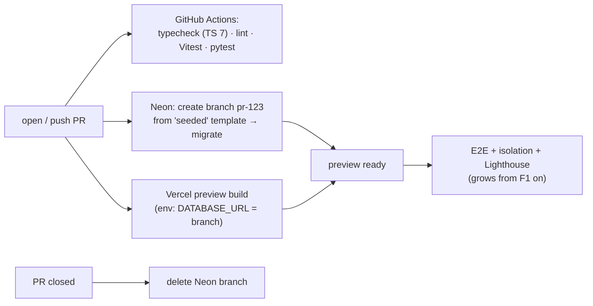
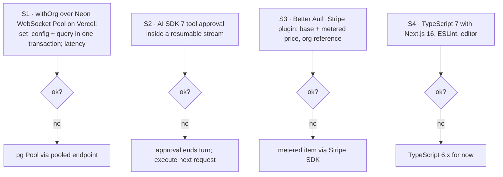

# F0: Foundation, CI, Previews & Spikes

| Milestone | Priority | Depends on | Effort | Unblocks |
|---|---|---|---|---|
| M1 | Must | — | 4 h | Everything |

**Goal:** A pnpm monorepo with the Next.js 16 app and the Python ai-service. Every PR gets a Vercel
preview **and** its own Neon database branch, and four spikes settle the risky assumptions.

## Diagram: per-PR pipeline



## Diagram: spikes (≈ 1 h total, results in `docs/notes/spikes.md`)



## Deliverables / files
```
pnpm-workspace.yaml   apps/web (create-next-app, App Router, Turbopack)   services/ai (from Project 1)
apps/web/components/ui (shadcn init)   apps/web/components/ai-elements (AI Elements add)
.github/workflows/ci.yml   .github/workflows/neon-branch.yml   vercel.json (if needed)
.env.example   docs/notes/spikes.md
```

## Tasks
- [ ] Monorepo, Next.js 16.3 app, Tailwind 4, shadcn/ui, AI Elements; strict TS; ESLint + Prettier
- [ ] Vercel project with Git integration; Neon project with a `seeded` template branch
- [ ] Neon branch workflow: create on PR, migrate, inject `DATABASE_URL` into the preview; delete on close
- [ ] CI jobs; Dependabot; secret scanning
- [ ] Spikes S1–S4 with decisions

## Acceptance criteria
- A PR produces a preview URL backed by its own database branch
- Spike notes committed

**Interview talking point:** *"Every pull request gets a full copy of the product: its own URL and its own
database branch, and the end-to-end tests run against it before merge."*
