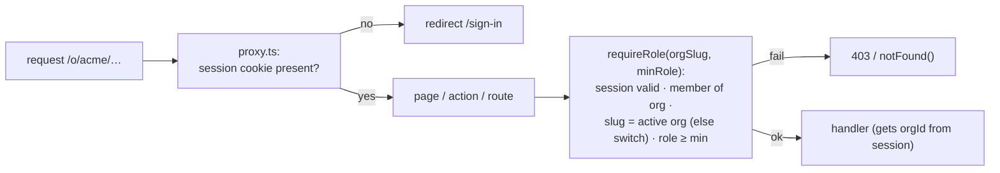

# F1: Auth & Organizations

| Milestone | Priority | Depends on | Effort | Unblocks |
|---|---|---|---|---|
| M1 | Must | F0 | 5 h | F2, F13, F15 |

**Goal:**
- Sign-up and sign-in (email + password with verification, Google).
- Organizations with roles and invitations.
- An active org on the session.
- `proxy.ts` routing by org slug.
- The `requireRole` helper used by every mutation.

## Diagram: request gate



## Deliverables / files
```
lib/auth/server.ts        # Better Auth config: email/password, Google, organization plugin, email verification (Resend)
lib/auth/client.ts        # auth client
lib/auth/require-role.ts  # the one authorization helper
proxy.ts                  # session gate, security headers (CSP with nonces, frame-ancestors)
app/(auth)/sign-in, sign-up, verify, invite/[token]
app/o/[org]/layout.tsx    # org switcher, sidebar
emails/*.tsx              # React Email: verify, invite
```

## Tasks
- [ ] Better Auth with the organization plugin; roles `owner/admin/member/viewer`
- [ ] Auth pages from shadcn blocks; invitation accept flow; org switcher
- [ ] `requireRole` + unit tests; a direct-call test harness for Server Actions
- [ ] `proxy.ts` with security headers (CSP nonces, `frame-ancestors 'none'`)
- [ ] Basic members list (invite, change role, remove) in the org layout (full settings in F15)

## Acceptance criteria
- Sign up → verify → create org → invite → accept on a preview deployment
- A viewer calling a member-only Server Action directly gets 403

## Tests
- Vitest for `requireRole`; Playwright: sign-up → org → invite flow (start of the E2E suite)

**Interview talking point:** *"Server Actions are just POST endpoints, so authorization lives in one helper
that every action calls, and the tests call actions directly to prove it."*
