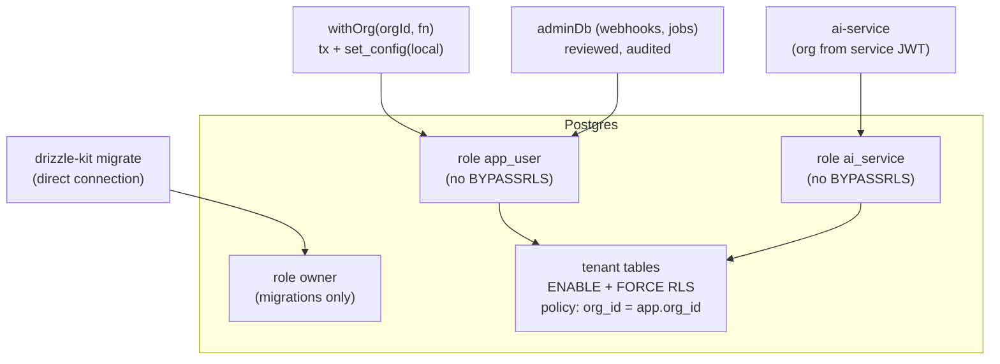

# F2: Schema, RLS & `withOrg`

| Milestone | Priority | Depends on | Effort | Unblocks |
|---|---|---|---|---|
| M1 | Must | F1 | 4 h | Everything with tenant data |

**Goal:** The Drizzle schema for all application tables with **RLS policies**, separate database roles,
the `withOrg` transaction helper, and a lint rule that makes it the only path to tenant data.

## Diagram: roles and access paths



## Deliverables / files
```
lib/db/schema/*.ts        # document, chunk, playbook, playbook_run, register_entry, chat, message, usage_event, subscription, audit_event
lib/db/policies.ts        # pgPolicy definitions
lib/db/with-org.ts        # the helper (03 §3.2)
lib/db/admin.ts           # narrow admin access for webhooks/cron
drizzle/migrations/*      # + roles and grants SQL
eslint-rules/no-raw-db.js # forbid importing lib/db/client outside lib/db
tests/isolation/sql.test.ts
```

## Tasks
- [ ] Tables from [03 §3.1](../03-low-level-design.md#31-data-model); indexes (org_id first); pgvector HNSW on `chunk.embedding`; GIN on `tsv`
- [ ] Roles and grants; RLS enabled **and forced** on every tenant table
- [ ] `withOrg` using the driver chosen in spike S1
- [ ] Lint rule; seed script for two test orgs
- [ ] First isolation tests at the SQL level

## Acceptance criteria
- As `app_user` with `app.org_id = A`, selecting B's rows returns 0; inserting with `org_id = B` fails
- CI fails if any file outside `lib/db` imports the raw client

## Tests
- SQL isolation tests (testcontainers or the PR's Neon branch)

**Interview talking point:** *"The database itself refuses cross-tenant reads. The app role can't bypass
RLS, the org is set per transaction from the session, and a lint rule stops anyone from reaching around
it."*
