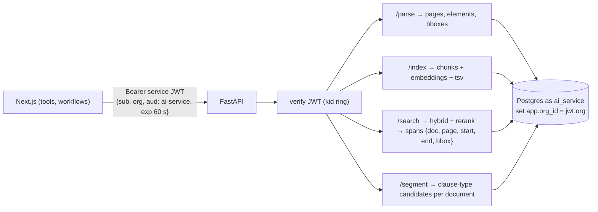

# F3: AI Service Adaptation

| Milestone | Priority | Depends on | Effort | Unblocks |
|---|---|---|---|---|
| M2 | Must | F2 | 4 h | F4, F7, F10 |

**Goal:** Turn Project 1's retrieval code into an internal multi-tenant FastAPI service:
- a service-JWT check;
- RLS through its own role;
- Docling bounding boxes in results;
- clause segmentation;
- a staging deployment on Azure Container Apps.

## Diagram: endpoints



## Deliverables / files
```
services/ai/app/main.py        # FastAPI app, JWT dependency, OTel
services/ai/app/tenancy.py     # per-request connection with set_config from the token
services/ai/app/routes/*.py    # parse, index, search, segment
services/ai/app/bbox.py        # Docling provenance → page-relative boxes for the viewer
infra/terraform/ai-service/    # staging + prod revisions on Container Apps (Project 1 modules)
```

## Tasks
- [ ] JWT verification (HS256 with `kid`), `aud`, `exp`; reject missing org
- [ ] Tenancy: every query runs in a transaction with `app.org_id` set from the token
- [ ] Return spans with bounding boxes; DOCX → PDF conversion at parse time
- [ ] Clause segmentation: candidate spans per CUAD clause type (retrieval + rerank)
- [ ] Deploy staging; health checks; `traceparent` propagation

## Acceptance criteria
- A token for org A searching with B's document ids returns nothing (isolation case)
- p95 `/search` ≤ 400 ms on the demo corpus

## Tests
- pytest for JWT, tenancy and endpoints; Project 1 retrieval tests still pass

**Interview talking point:** *"The Python service trusts nothing from the request body about tenancy. The
org comes from a signed, 60-second token, and the database enforces it again."*
